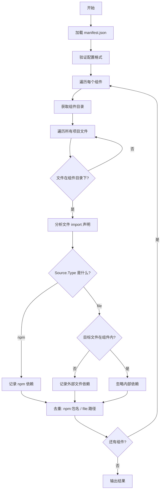

# Component Dependencies Analyzer

> 基于 manifest 配置文件的组件依赖关系分析插件

## 概述

`component-deps` 是 `analyzer-ts` 的一个分析器插件，用于分析 TypeScript/JavaScript 项目中组件之间的外部依赖关系。与原始的 `component-deps` 不同，本插件通过配置文件显式声明组件列表，并智能过滤掉组件内部依赖，只保留有价值的外部依赖信息。

### 核心特性

- ✅ **配置驱动**: 通过 `component-manifest.json` 显式声明组件
- ✅ **智能过滤**: 自动过滤组件内部依赖，只保留外部依赖
- ✅ **完整信息**: 保留原始 import 解析结果，包含导入的详细内容
- ✅ **自动去重**: 同一文件或 npm 包被多次引用时自动合并
- ✅ **跨平台**: 支持绝对路径和相对路径的智能匹配

---

## 架构设计

### 整体架构

```
┌─────────────────────────────────────────────────────────────┐
│                   component-deps 架构                      │
└─────────────────────────────────────────────────────────────┘

输入层
┌──────────────┐
│ manifest.json │ ← 组件配置文件（由业务方维护）
└──────────────┘
        ↓
解析层
┌───────────────────────────────────────────────────────────┐
│ 1. 解析 manifest.json                                   │
│    └── 验证配置格式                                       │
│                                                              │
│ 2. 获取组件目录（基于 path）                             │
│    └── 直接使用配置的 path 作为组件目录                        │
│                                                              │
│ 3. 分析组件外部依赖                                        │
│    └── 遍历组件文件，提取 import 声明                     │
│    └── 过滤组件内部依赖（路径前缀匹配）                    │
│    └── 保留外部依赖（跨组件 + npm 包）                     │
│    └── 自动去重（同一文件/包只记录一次）                   │
└───────────────────────────────────────────────────────────┘
        ↓
输出层
┌──────────────────────────────────────────────────────────┐
│ ComponentDepsV2Result                                     │
│ ├─ meta: 元数据（组件数）                                │
│ └─ components: 各组件的外部依赖列表                       │
│    └─ dependencies: ImportDeclarationResult[]            │
│       ├─ npm 包依赖（Source.Type = "npm"）                │
│       └─ 文件依赖（Source.Type = "file"）                 │
└───────────────────────────────────────────────────────────┘
```

### 核心算法流程



### 核心逻辑

#### 1. 路径匹配（简化版）

```go
// 判断文件是否在组件目录下
func isFileInComponent(filePath, compDir string) bool {
    // 标准化为正斜杠
    normalizedDir := filepath.ToSlash(compDir)      // "src/Button"
    normalizedPath := filepath.ToSlash(filePath)    // "/project/src/Button/xxx.tsx"

    // 精确前缀匹配
    if strings.HasPrefix(normalizedPath, normalizedDir+"/") {
        return true
    }

    // 支持绝对路径：提取相对部分后再匹配
    parts := strings.Split(normalizedPath, "/")
    for i := 0; i < len(parts); i++ {
        candidatePath := strings.Join(parts[i:], "/")
        if strings.HasPrefix(candidatePath, normalizedDir+"/") {
            return true
        }
    }
    return false
}
```

#### 2. 外部依赖判断

```go
// 判断是否为外部依赖
func isExternalDependency(importDecl, sourceCompDir) bool {
    // 1. npm 包 → 外部依赖
    if importDecl.Source.Type == "npm" {
        return true
    }

    // 2. 文件类型
    if importDecl.Source.Type == "file" {
        targetFile := importDecl.Source.FilePath
        // 目标文件在组件内 → 内部依赖
        if isFileInComponent(targetFile, sourceCompDir) {
            return false
        }
        // 目标文件在组件外 → 外部依赖
        return true
    }

    return false
}
```

#### 3. 自动去重

```go
// 使用 map 去重
seen := make(map[string]ImportDeclarationResult)

// 计算唯一 key
key := getDependencyKey(importDecl)
// npm: "npm:" + npmPkg      例如: "npm:react"
// file: "file:" + filePath  例如: "file:src/Input/index.ts"

if _, exists := seen[key]; !exists {
    seen[key] = importDecl  // 只保留第一次出现
}
```

---

## 配置说明

### 配置文件格式

```json
{
  "components": [
    {
      "name": "Button",
      "type": "component",
      "path": "src/components/Button"
    },
    {
      "name": "Input",
      "type": "component",
      "path": "src/components/Input"
    }
  ]
}
```

### 字段说明

| 字段 | 类型 | 必填 | 说明 |
|------|------|------|------|
| `components` | array | 是 | 组件定义数组 |
| `components[].name` | string | 是 | 组件名称（唯一标识） |
| `components[].type` | string | 是 | 资产类型，固定值 `"component"` |
| `components[].path` | string | 是 | 组件目录路径（相对于项目根目录） |

**组件作用域**：
- `path` = `src/components/Button`
- 作用域 = `src/components/Button/` 下的所有文件

---

## 使用方式

### 命令行使用

```bash
analyzer-ts analyze component-deps \
  -i /path/to/project \
  -p "component-deps.manifest=path/to/component-manifest.json"
```

### 参数说明

| 参数 | 说明 | 示例 |
|------|------|------|
| `-i` | 项目根目录 | `/Users/bird/project` |
| `-p` | 配置参数 | `component-deps.manifest=...` |

---

## 输出格式

### JSON 输出

```json
{
  "meta": {
    "componentCount": 2
  },
  "components": {
    "Button": {
      "name": "Button",
      "path": "src/components/Button",
      "dependencies": [
        {
          "importModules": [
            {"name": "useState", "type": "named", "identifier": "useState"}
          ],
          "raw": "import { useState } from 'react'",
          "source": {
            "type": "npm",
            "npmPkg": "react"
          }
        },
        {
          "importModules": [
            {"name": "Input", "type": "named", "identifier": "Input"}
          ],
          "raw": "import { Input } from '../Input'",
          "source": {
            "type": "file",
            "filePath": "src/components/Input/index.tsx"
          }
        }
      ]
    },
    "Input": {
      "name": "Input",
      "path": "src/components/Input",
      "dependencies": [
        {
          "importModules": [
            {"name": "useState", "type": "named", "identifier": "useState"}
          ],
          "raw": "import { useState } from 'react'",
          "source": {
            "type": "npm",
            "npmPkg": "react"
          }
        }
      ]
    }
  }
}
```

### 控制台输出

```
=====================================
组件依赖分析报告 (V2)
=====================================

组件总数: 2

▶ Button
  路径: src/components/Button
  外部依赖:
    - npm: react
    - file: src/components/Input/index.tsx

▶ Input
  路径: src/components/Input
  外部依赖:
    - npm: react
```

---

## 实现细节

### 文件结构

```
component_deps/
├── analyzer.go     # 主分析器，实现 Analyzer 接口
├── manifest.go     # 配置文件解析和验证
├── dependency.go   # 依赖分析逻辑（路径匹配 + 去重）
├── result.go       # 结果定义（实现 Result 接口）
└── analyzer_test.go # 测试
```

### 核心数据结构

```go
// ComponentInfo 组件信息
type ComponentInfo struct {
    Name         string                       // 组件名称
    Entry        string                       // 入口文件
    Dependencies []ImportDeclarationResult    // 外部依赖列表
}

// ImportDeclarationResult 直接复用解析结果
type ImportDeclarationResult struct {
    ImportModules []ImportModule  // 导入的模块详情
    Raw           string          // 原始语句
    Source        SourceData      // 来源信息（npm/file）
}
```

---

## 测试验证

### 运行测试

```bash
go test ./analyzer_plugin/project_analyzer/component_deps/... -v
```

### 测试覆盖

- ✅ 配置文件解析和验证
- ✅ 路径前缀匹配（组件内外判断）
- ✅ 外部依赖判断（npm / 跨组件 / 外部文件）
- ✅ 自动去重功能

---

## 相关文档

- [Project Analyzer 架构](../README.md)
- [技术方案概述](../../README.md)

---

## 版本历史

- **v2.0.0** (2025-01-31) - 完全重构
  - 移除复杂的 glob 模式匹配，改用简单的路径前缀匹配
  - 移除循环依赖检测和反向依赖图
  - 简化数据结构，直接复用 `ImportDeclarationResult`
  - 添加自动去重功能
- **v1.0.0** (2024-01-31) - 初始版本
