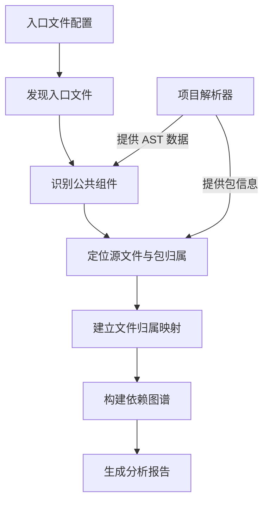
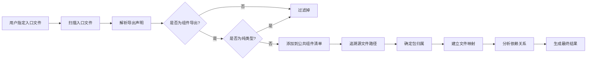
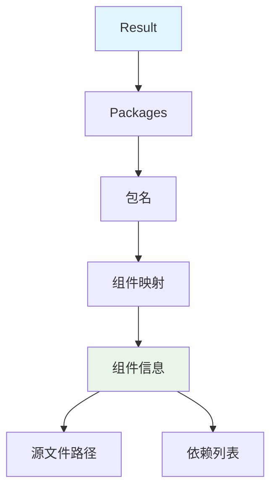

# 组件依赖分析器 (component-deps)

## 🎯 概述

`component-deps` 是一个高性能的 TypeScript/React 组件依赖分析器，专为现代化前端项目设计。它能够：

- 🔍 **精准识别公共组件**：从指定的入口文件出发，自动识别所有对外暴露的公共组件
- 📊 **构建依赖图谱**：生成清晰的组件依赖关系图，支持 Monorepo 架构
- 🚫 **智能过滤类型**：自动排除纯类型定义，只分析实际的组件依赖
- 📈 **多维度输出**：支持 JSON 格式和人类可读的控制台报告

## 🏗️ 架构设计

### 整体架构



### 核心分析流程



### 数据结构



## ⚡ 工作原理

### 四阶段分析流程

#### 🔍 第一阶段：入口文件发现
分析器根据用户提供的 Glob 模式，扫描项目并找到所有匹配的入口文件。每个入口文件都会被映射到其所属的包。

#### 🏷️ 第二阶段：公共组件识别
通过分析入口文件的导出声明，识别出符合以下条件的公共组件：
- **命名规范**：遵循帕斯卡命名法（PascalCase）
- **类型过滤**：排除纯类型定义（`interface`、`type`、`enum`）
- **实际存在**：能够追溯到真实的源文件位置

#### 📂 第三阶段：文件映射建立
为每个公共组件建立与其相关的文件集合，包括：
- 组件的主要源文件
- 组件目录下的所有相关文件
- 依赖文件与公共组件的映射关系

#### 🔗 第四阶段：依赖图谱构建
遍历所有文件，分析导入关系，构建完整的依赖图谱：
- 识别组件间的直接依赖
- 排除对自身的循环依赖
- 支持跨包依赖分析

### 核心算法

#### 组件识别算法
```go
// 组件识别的核心逻辑
if isComponentExport(name) && !isPureTypeRecursive(originalName, sourcePath, fileResults, visited) {
    // 添加到公共组件清单
    publicComponentSource[publicName] = finalSourcePath
}
```

#### 依赖分析算法
```go
// 依赖分析的核心逻辑
if depPublicNames, isPublic := sourceToPublicNamesMap[importedFilePath]; isPublic {
    for _, depPublicName := range depPublicNames {
        if depPublicName != publicName { // 排除自依赖
            currentDeps = append(currentDeps, depPublicName)
        }
    }
}
```

## 🛠️ 使用方法

### 基本用法

```bash
./analyzer-ts analyze component-deps \
  -i /path/to/your-project \
  -p "component-deps.entryPoint=packages/*/src/index.ts"
```

### 高级用法

#### 1. 分析单个组件库
```bash
./analyzer-ts analyze component-deps \
  -i /path/to/ui-library \
  -p "component-deps.entryPoint=src/index.ts"
```

#### 2. 分析 Monorepo 项目
```bash
./analyzer-ts analyze component-deps \
  -i /path/to/monorepo \
  -m \
  -p "component-deps.entryPoint=packages/*/src/index.ts"
```

#### 3. 指定多个入口模式
```bash
./analyzer-ts analyze component-deps \
  -i /path/to/project \
  -p "component-deps.entryPoint=components/*/index.ts,src/components/*/index.ts"
```

#### 4. 输出 JSON 格式结果
```bash
./analyzer-ts analyze component-deps \
  -i /path/to/project \
  -p "component-deps.entryPoint=packages/*/src/index.ts" \
  --json | jq .
```

## 📊 参数说明

### 必需参数

| 参数 | 说明 | 示例 |
|------|------|------|
| `component-deps.entryPoint` | 入口文件路径，支持 Glob 模式 | `packages/*/src/index.ts` |

### 全局参数

| 参数 | 说明 | 示例 |
|------|------|------|
| `-i, --input` | 项目根目录 | `/path/to/project` |
| `-m, --monorepo` | 启用 Monorepo 模式 | - |
| `--json` | 输出 JSON 格式 | - |
| `-o, --output` | 输出文件路径 | `/path/to/output.json` |

## 📋 输出示例

### JSON 格式输出

```json
{
  "packages": {
    "@sl/sc-product": {
      "ProductSetPicker": {
        "sourcePath": ".../Product/src/ProductSetPicker/index.tsx",
        "dependencies": [
          "AddProductSet"
        ]
      },
      "AddProductSet": {
        "sourcePath": ".../Product/src/AddProductSet/index.tsx",
        "dependencies": []
      }
    },
    "@sl/sc-base": {
      "AsyncButton": {
        "sourcePath": ".../Base/src/AsyncButton/index.tsx",
        "dependencies": []
      },
      "CustomerGroupPicker": {
        "sourcePath": ".../Base/src/CustomerGroupPicker/index.tsx",
        "dependencies": [
          "NovaTree"
        ]
      }
    }
  }
}
```

### 控制台格式输出

```
组件依赖分析报告:

=====================================
📦 包: @sl/sc-product (2 个组件)
=====================================

▶ 组件: ProductSetPicker
  - 源文件: .../Product/src/ProductSetPicker/index.tsx
  - 依赖的组件:
    - AddProductSet

▶ 组件: AddProductSet
  - 源文件: .../Product/src/AddProductSet/index.tsx
  - 依赖的组件: 无

=====================================
📦 包: @sl/sc-base (2 个组件)
=====================================

▶ 组件: AsyncButton
  - 源文件: .../Base/src/AsyncButton/index.tsx
  - 依赖的组件: 无

▶ 组件: CustomerGroupPicker
  - 源文件: .../Base/src/CustomerGroupPicker/index.tsx
  - 依赖的组件:
    - NovaTree
```

## 💡 最佳实践

### 1. 项目结构优化

```
my-component-library/
├── packages/
│   ├── components/
│   │   ├── src/
│   │   │   ├── index.ts          # 主入口文件
│   │   │   ├── Button/
│   │   │   │   ├── index.tsx     # 组件实现
│   │   │   │   └── types.ts      # 类型定义
│   │   │   ├── Modal/
│   │   │   │   ├── index.tsx
│   │   │   │   └── styles.css
│   │   │   └── utils/
│   │   │       └── index.ts      # 工具函数
│   │   └── package.json
│   └── hooks/
│       ├── src/
│       │   └── index.ts
│       └── package.json
└── package.json
```

### 2. 入口文件配置

```typescript
// packages/components/src/index.ts
export { Button } from './Button';
export { Modal } from './Modal';
export type ButtonProps from './Button/types';
export { useCustomHook } from './utils';

// ✅ 正确：明确导出公共 API
export { InternalComponent } from './InternalComponent'; // ❌ 避免：导出内部组件
```

### 3. 命名规范

```typescript
// ✅ 组件名称使用 PascalCase
export const Button = () => {};
export const ModalContainer = () => {};

// ✅ 类型名称使用 PascalCase
export type ButtonSize = 'small' | 'medium' | 'large';
export interface ModalProps {
  isOpen: boolean;
}

// ❌ 避免小写开头的导出（会被识别为工具函数）
export const buttonUtils = {};  // 不会被识别为组件
```

### 4. 依赖管理

```typescript
// ✅ 明确依赖关系
import { BaseButton } from '../base-components/Button';
import { useTheme } from '../hooks/useTheme';

// ❌ 避免循环依赖
// Button.tsx 依赖 Modal.tsx，同时 Modal.tsx 依赖 Button.tsx
```

## 🚨 故障排除

### 常见问题

#### 1. 找不到入口文件
```
错误: 未找到任何匹配的入口文件: packages/*/src/index.ts
```

**解决方案**：
- 检查路径是否正确
- 确认文件是否存在
- 验证 Glob 模式语法

#### 2. 组件识别错误
```typescript
// 问题：类型被误识别为组件
export type ComponentConfig = {};

// 解决方案：确保类型文件不包含可执行代码
// 或者使用明确的类型导出语法
export type { ComponentConfig };
```

#### 3. 依赖分析不准确
```typescript
// 问题：动态导入无法分析
const Component = dynamic(() => import('./Component'));

// 解决方案：使用静态导入
import { Component } from './Component';
```

### 调试技巧

#### 1. 启用详细日志
```bash
./analyzer-ts analyze component-deps \
  -i /path/to/project \
  -p "component-deps.entryPoint=packages/*/src/index.ts" \
  --verbose
```

#### 2. 检查 AST 数据
```bash
./analyzer-ts store-db \
  -i /path/to/project \
  -o /path/to/database.sqlite
```

#### 3. 验证项目配置
```bash
./analyzer-ts analyze npm-check \
  -i /path/to/project
```

## 🔧 扩展开发

### 添加新的分析规则

```go
// 在 component_deps.go 中扩展 isComponentExport 函数
func isComponentExport(name string) bool {
    if name == "" {
        return false
    }

    // 现有规则
    firstChar := []rune(name)[0]
    if !unicode.IsUpper(firstChar) {
        return false
    }

    // 新增规则：排除特定前缀
    if strings.HasPrefix(name, "_") {
        return false
    }

    return true
}
```

### 自定义输出格式

```go
// 在 result.go 中扩展 ToConsole 方法
func (r *Result) ToConsole() string {
    var buffer bytes.Buffer

    // 添加标题
    buffer.WriteString("📊 Component Dependency Analysis\n")
    buffer.WriteString("================================\n")

    // 现有内容...

    // 添加总结
    buffer.WriteString("\n📈 Analysis Summary:\n")
    buffer.WriteString(fmt.Sprintf("- Total packages: %d\n", len(r.Packages)))

    return buffer.String()
}
```

## 📈 性能优化

### 1. 大型项目优化

```bash
# 使用 exclude 参数排除不必要的文件
./analyzer-ts analyze component-deps \
  -i /path/to/large-project \
  -p "component-deps.entryPoint=packages/*/src/index.ts" \
  --exclude="**/*.test.ts,**/*.spec.ts,**/node_modules/**"
```

### 2. 增量分析

```bash
# 只分析特定的包
./analyzer-ts analyze component-deps \
  -i /path/to/project \
  -p "component-deps.entryPoint=packages/ui-components/src/index.ts"
```

### 3. 缓存利用

```bash
# 预解析项目到数据库
./analyzer-ts store-db \
  -i /path/to/project \
  -o /path/to/database.sqlite

# 从数据库读取进行分析
./analyzer-ts analyze component-deps \
  -i /path/to/project \
  -p "component-deps.entryPoint=packages/*/src/index.ts" \
  --database=/path/to/database.sqlite
```

## 🤝 贡献指南

欢迎提交 Issue 和 Pull Request！

### 开发环境设置

```bash
# 克隆项目
git clone https://github.com/your-username/analyzer-ts.git
cd analyzer-ts

# 安装依赖
go mod tidy

# 运行测试
go test ./analyzer_plugin/project_analyzer/component_deps/...
```

### 代码规范

- 遵循 Go 语言标准规范
- 添加详细的中文注释
- 确保测试覆盖率

## 📄 许可证

MIT License