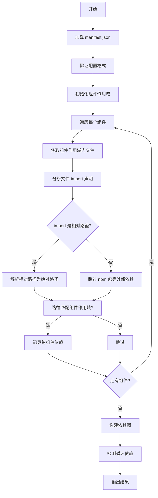

# Component Dependencies V2 Analyzer

> 基于 manifest 配置文件的组件依赖关系分析插件

## 📋 概述

`component-deps-v2` 是 `analyzer-ts` 的一个分析器插件，用于分析 TypeScript/JavaScript 项目中组件之间的依赖关系。与原始的 `component-deps` 不同，本插件通过配置文件显式声明组件列表，支持更灵活的组件定义。

### 核心特性

- ✅ **配置驱动**: 通过 `component-manifest.json` 显式声明组件
- ✅ **作用域自动推断**: 基于 entry 文件自动推断组件作用域
- ✅ **相对路径解析**: 正确处理跨组件的相对路径导入
- ✅ **循环依赖检测**: 自动检测并报告循环依赖
- ✅ **双向依赖图**: 生成正向和反向依赖关系图

---

## 🏗️ 架构设计

### 整体架构

```
┌─────────────────────────────────────────────────────────────┐
│                   component-deps-v2 架构                      │
└─────────────────────────────────────────────────────────────┘

输入层
┌──────────────┐
│ manifest.json │ ← 组件配置文件（由业务方维护）
└──────────────┘
        ↓
解析层
┌───────────────────────────────────────────────────────────┐
│ 1. 解析 manifest.json                                   │
│    └── 验证配置格式                                       │
│                                                              │
│ 2. 初始化组件作用域                                      │
│    └── 为每个组件创建 glob 模式（基于 entry 自动推断）     │
│                                                              │
│ 3. 分析组件依赖                                            │
│    └── 遍历组件文件，提取 import 声明                     │
│    └── 解析相对路径，匹配组件作用域                         │
│    └── 检测跨组件导入                                       │
│                                                              │
│ 4. 构建依赖图                                              │
│    └── 生成 depGraph（组件 → 它依赖的组件）                 │
│    └── 生成 revDepGraph（组件 → 依赖它的组件）              │
│    └── 循环依赖检测                                         │
└───────────────────────────────────────────────────────────┘
        ↓
输出层
┌──────────────────────────────────────────────────────────┐
│ ComponentDepsV2Result                                     │
│ ├─ meta: 元数据（版本、库名、组件数）                     │
│ ├─ components: 各组件详细信息                            │
│ ├─ depGraph: 正向依赖图                                   │
│ └─ revDepGraph: 反向依赖图                               │
└───────────────────────────────────────────────────────────┘
```

### 核心算法流程



---

## 🔧 配置说明

### 配置文件位置

```
project_root/
├── .analyzer/
│   └── component-manifest.json    # 配置文件（推荐）
└── component-manifest.json          # 或放在根目录
```

### 配置文件格式

```json
{
  "meta": {
    "version": "1.0.0",
    "libraryName": "@your-org/ui-components"
  },
  "components": [
    {
      "name": "Button",
      "entry": "src/components/Button/index.tsx"
      // scope 自动推断为: src/components/Button/**
    },
    {
      "name": "Input",
      "entry": "src/components/Input/index.tsx"
    }
  ]
}
```

### 字段说明

| 字段 | 类型 | 必填 | 说明 |
|------|------|------|------|
| `meta.version` | string | 是 | 配置协议版本 |
| `meta.libraryName` | string | 是 | 组件库名称 |
| `components` | array | 是 | 组件定义数组 |
| `components[].name` | string | 是 | 组件名称（唯一标识） |
| `components[].entry` | string | 是 | 组件入口文件路径（相对于项目根目录） |

**组件作用域自动推断**：
- `entry` = `src/components/Button/index.tsx`
- `scope` = `src/components/Button/**`（自动推断）

---

## 📊 使用方式

### 命令行使用

```bash
analyzer-ts analyze component-deps-v2 \
  -i /path/to/project \
  -p "component-deps-v2.manifest=/path/to/component-manifest.json"
```

### 参数说明

| 参数 | 说明 | 示例 |
|------|------|------|
| `-i` | 项目根目录（绝对路径） | `/Users/bird/Desktop/alalyzer-ts/testdata/test_project` |
| `-p` | 配置参数 | `component-deps-v2.manifest=...` |

### 输出示例

```json
{
  "component-deps-v2": {
    "meta": {
      "version": "1.0.0",
      "libraryName": "@test/ui-components",
      "componentCount": 3
    },
    "components": {
      "Button": {
        "name": "Button",
        "entry": "src/components/Button/index.tsx",
        "dependencies": []
      },
      "Input": {
        "name": "Input",
        "entry": "src/components/Input/index.tsx",
        "dependencies": ["Button"]
      },
      "Select": {
        "name": "Select",
        "entry": "src/components/Select/index.tsx",
        "dependencies": ["Button", "Input"]
      }
    },
    "depGraph": {
      "Button": [],
      "Input": ["Button"],
      "Select": ["Button", "Input"]
    },
    "revDepGraph": {
      "Button": ["Input", "Select"],
      "Input": ["Select"],
      "Select": []
    }
  }
}
```

---

## 🛠️ 实现细节

### 关键文件

```
component_deps_v2/
├── analyzer.go        # 主分析器，实现 Analyzer 接口
├── manifest.go         # 配置文件解析和验证
├── scope.go            # 组件作用域管理（自动推断）
├── dependency.go      # 依赖分析逻辑（相对路径解析）
├── graph.go            # 依赖图构建（循环检测）
└── result.go          # 结果定义（实现 Result 接口）
```

### 核心算法

#### 1. 相对路径解析

```go
// 解析 ../Input/Input 为 src/components/Input/Input
func resolveImportPath(importPath, sourceFilePath string) string {
    if isRelativePath(importPath) {
        sourceDir := filepath.Dir(sourceFilePath)
        resolved := filepath.Join(sourceDir, importPath)
        resolved = filepath.Clean(resolved)
        resolved = filepath.ToSlash(resolved)

        // 转换为相对于项目根的路径
        if filepath.IsAbs(resolved) && len(resolved) >= len(projectRoot) {
            relativeToRoot := resolved[len(projectRoot)+1:]
            return relativeToRoot
        }
        return resolved
    }
    return importPath
}
```

#### 2. 组件作用域匹配

```go
// 使用 glob 模式匹配文件到组件
// 例如: src/components/Button/** 匹配 Button 组件的所有文件
func (s *ComponentScope) Contains(filePath string) bool {
    absPath := s.toAbsolute(filePath)
    relPath := s.toRelativePath(absPath)
    return s.glob.Match(relPath)
}
```

#### 3. 循环依赖检测

```go
// 使用 DFS + 递归栈检测循环
func (gb *GraphBuilder) hasCycleDFS(
    component string,
    visited map[string]bool,
    recursionStack map[string]bool,
) bool {
    visited[component] = true
    recursionStack[component] = true

    for _, dep := range gb.depGraph[component] {
        if !visited[dep] {
            if gb.hasCycleDFS(dep, visited, recursionStack) {
                return true
            }
        } else if recursionStack[dep] {
            return true  // 发现循环
        }
    }

    recursionStack[component] = false
    return false
}
```

---

## 🧪 测试验证

### 运行测试

```bash
# 运行 component_deps_v2 单元测试
go test ./analyzer_plugin/project_analyzer/component_deps_v2/... -v

# 运行所有测试
go test ./analyzer_plugin/project_analyzer/... -v
```

### 测试覆盖

- ✅ 配置文件解析和验证
- ✅ 作用域匹配（glob 模式）
- ✅ 跨组件检测
- ✅ 依赖图构建
- ✅ 反向依赖图
- ✅ 循环依赖检测

---

## 🔗 相关文档

- [技术方案概述](../README.md)
- [实施计划](../IMPLEMENTATION_PLAN.md)
- [impact-analysis README](../impact_analysis/README.md)

---

## 📝 版本历史

- **v1.0.0** (2024-01-31) - 初始版本，支持基于 manifest 的组件依赖分析
