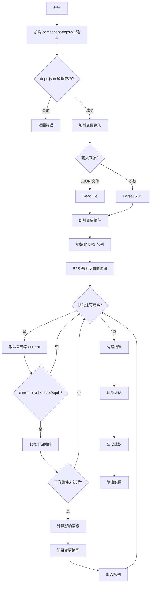

# Impact Analysis Analyzer

> 基于依赖图评估代码变更影响范围的插件

## 📋 概述

`impact-analysis` 是 `analyzer-ts` 的一个分析器插件，用于评估代码变更对项目的影响范围。该插件依赖于 `component-deps-v2` 生成的依赖数据，通过 BFS 算法传播影响，并自动评估风险等级。

### 核心特性

- ✅ **变更影响传播**: BFS 算法自动传播影响范围
- ✅ **风险评估**: 根据影响层级自动评估风险等级
- ✅ **依赖链路追踪**: 记录完整的影响传播路径
- ✅ **循环依赖检测**: 支持检测依赖图中的循环
- ✅ **多格式输入**: 支持 JSON 文件或参数方式输入变更

---

## 🏗️ 架构设计

### 整体架构

```
┌─────────────────────────────────────────────────────────────┐
│                   impact-analysis 架构                       │
└─────────────────────────────────────────────────────────────┘

输入层
┌──────────────┐    ┌──────────────┐
│ changes.json │    │ deps.json    │
│ (变更文件列表) │    │ (依赖关系图)  │
└──────┬────────┘    └──────┬────────┘
       │                    │
       ▼                    ▼
处理层
┌───────────────────────────────────────────────────────────┐
│ 1. 加载依赖数据                                          │
│    └── 解析 component-deps-v2 输出（包裹格式处理）          │
│                                                              │
│ 2. 识别变更组件                                            │
│    └── 匹配变更文件到组件                                  │
│    └── 标记直接变更的组件                                  │
│                                                              │
│ 3. BFS 影响传播 ★核心★                                     │
│    └── 初始化队列（变更组件，level=0）                     │
│    └── BFS 遍历反向依赖图                                │
│    └── 计算影响层级和路径                                  │
│                                                              │
│ 4. 风险评估                                                │
│    └── 根据影响层级评估风险等级                           │
│                                                              │
│ 5. 生成建议                                                │
│    └── 根据风险分布自动生成建议                             │
└───────────────────────────────────────────────────────────┘
        ↓
输出层
┌───────────────────────────────────────────────────────────┐
│ ImpactAnalysisResult                                     │
│ ├─ meta: 分析元数据                                         │
│ ├─ changes: 变更的组件列表                                  │
│ ├─ impact: 受影响的组件列表                                │
│ ├─ changePaths: 完整的变更路径                              │
│ └─ recommendations: 自动生成的建议                          │
└───────────────────────────────────────────────────────────┘
```

### BFS 影响传播算法

```
初始状态: Button 组件变更
━━━━━━━━━━━━━━━━━━━━━━━━━━━━━━━━━━━━━━━━━━━━━━━━━━━━━━━━━━━━━━━━━

Level 0: [Button]                  ← 变更组件
         ↓
Level 1: [Input, Select]           ← 直接依赖 Button 的组件
         ↓
Level 2: [Components]              ← 依赖 Level 1 的组件
         ↓
    ... (继续传播，直到达到最大深度)
```

### 风险评估模型

```
影响层级 → 风险等级映射
━━━━━━━━━━━━━━━━━━━━━━━━━━━━━━━━━━━━━━━━━━━━━━━━━━━━━━━━━━━━━━━

Level 0 (直接变更)     → low       ✅
Level 1 (一级间接)       → low       ✅
Level 2 (二级间接)       → medium    ⚠️
Level 3 (三级间接)       → high      ⚠️️
Level 4+ (四级及以上)     → critical  ❌
```

---

## 🔧 使用方式

### 命令行使用

#### 步骤 1: 生成依赖数据

```bash
analyzer-ts analyze component-deps-v2 \
  -i /Users/bird/Desktop/alalyzer/analyzer-ts/testdata/test_project \
  -p component-deps-v2.manifest=.analyzer/component-manifest.json \
  -o /tmp
```

#### 步骤 2: 创建变更文件

```json
{
  "modifiedFiles": ["src/components/Button/Button.tsx"],
  "addedFiles": [],
  "deletedFiles": []
}
```

#### 步骤 3: 运行影响分析

```bash
analyzer-ts analyze impact-analysis \
  -i /Users/bird/Desktop/alalyzer/analyzer-ts/testdata/test_project \
  -p impact-analysis.changeFile=/tmp/changes.json \
  -p impact-analysis.depsFile=/tmp/test_project_analyzer_data.json \
  -o /tmp
```

### 参数说明

| 参数 | 说明 | 示例 |
|------|------|------|
| `-i` | 项目根目录（绝对路径） | `/Users/bird/.../test_project` |
| `-p impact-analysis.changeFile` | 变更文件路径 | `/tmp/changes.json` |
| `-p impact-analysis.depsFile` | 依赖数据文件路径 | `/tmp/..._data.json` |
| `-p impact-analysis.maxDepth` | 最大传播深度（可选，默认 10） | `5` |

### 输出示例

```json
{
  "impact-analysis": {
    "meta": {
      "analyzedAt": "2024-01-31T22:06:35+08:00",
      "componentCount": 3,
      "changedFileCount": 1,
      "changeSource": "manual"
    },
    "changes": [
      {
        "name": "Button",
        "action": "modified",
        "changedFiles": ["src/components/Button/Button.tsx"]
      }
    ],
    "impact": [
      {
        "name": "Button",
        "impactLevel": 0,
        "riskLevel": "low",
        "changePaths": ["Button"]
      },
      {
        "name": "Input",
        "impactLevel": 1,
        "riskLevel": "low",
        "changePaths": ["Button → Input"]
      },
      {
        "name": "Select",
        "impactLevel": 1,
        "riskLevel": "low",
        "changePaths": ["Button → Select"]
      }
    ]
  }
}
```

---

## 🛠️ 实现细节

### 关键文件

```
impact_analysis/
├── analyzer.go        # 主分析器
├── types.go           # 输入类型定义
├── propagation.go     # BFS 影响传播算法
├── chain.go           # 依赖链路构建（循环检测）
├── result.go          # 结果定义
└── e2e_test.go        # 端到端测试
```

### 核心算法

#### 1. BFS 影响传播

```go
func (p *Propagator) PropagateImpact(
    changedComponents []string,
    depGraph map[string][]string,
    revDepGraph map[string][]string,
) map[string]*ImpactInfoInternal {
    impactMap := make(map[string]*ImpactInfoInternal)
    queue := make([]string, 0)

    // 初始化队列（变更组件，level=0）
    for _, comp := range changedComponents {
        impactMap[comp] = &ImpactInfoInternal{
            ComponentName: comp,
            ImpactLevel:   0,
            ChangePaths:   []ChangePath{{From: comp, To: comp, Path: []string{comp}}},
        }
        queue = append(queue, comp)
    }

    // BFS 遍历
    for len(queue) > 0 {
        current := queue[0]
        queue = queue[1:]
        currentInfo := impactMap[current]

        // 获取依赖当前组件的所有组件（下游）
        downstreamComps := revDepGraph[current]
        for _, downstream := range downstreamComps {
            if _, exists := impactMap[downstream]; !exists {
                // 计算影响层级
                newLevel := currentInfo.ImpactLevel + 1

                // 构建变更路径
                newPaths := make([]ChangePath, 0)
                for _, path := range currentInfo.ChangePaths {
                    newPath := ChangePath{
                        From: path.From,
                        To:   downstream,
                        Path: append(path.Path, downstream),
                    }
                    newPaths = append(newPaths, newPath)
                }

                impactMap[downstream] = &ImpactInfoInternal{
                    ComponentName: downstream,
                    ImpactLevel:   newLevel,
                    ChangePaths:   newPaths,
                }

                queue = append(queue, downstream)
            }
        }
    }

    return impactMap
}
```

#### 2. 风险评估

```go
func (r *RiskAssessor) AssessRisk(impactLevel int, impactType string) string {
    switch {
    case impactLevel >= 4:
        return "critical"
    case impactLevel >= 3:
        return "high"
    case impactLevel >= 2:
        return "medium"
    default:
        return "low"
    }
}
```

#### 3. 依赖链路构建

```go
// DFS 查找所有路径
func (cb *ChainBuilder) findAllPaths(
    start string,
    end string,
    visited map[string]bool,
    currentPath []string,
) [][]string {
    // ... DFS 实现
}

// 检测循环依赖
func (cb *ChainBuilder) hasCycleDFS(
    component string,
    visited map[string]bool,
    recursionStack map[string]bool,
) bool {
    // ... 使用递归栈检测循环
}
```

---

## 🧪 测试验证

### 运行测试

```bash
# 运行 impact_analysis 单元测试
go test ./analyzer_plugin/project_analyzer/impact_analysis/... -v

# 运行端到端测试
go test ./analyzer_plugin/project_analyzer/impact_analysis/... -v -run TestE2E
```

### 测试覆盖

- ✅ 传播算法测试（单个/多个组件变更、最大深度）
- ✅ 风险评估测试（各等级、影响类型）
- ✅ 链路构建测试（路径查找、循环检测）
- ✅ 输入类型测试（文件操作、空值处理）
- ✅ 结果接口测试（JSON 序列化、控制台输出）
- ✅ 端到端测试（完整工作流验证）

---

## 📊 工作流程图



---

## 🔗 相关文档

- [技术方案概述](../README.md)
- [实施计划](../IMPLEMENTATION_PLAN.md)
- [component_deps_v2 README](../component_deps_v2/README.md)

---

## 📝 版本历史

- **v1.0.0** (2024-01-31) - 初始版本，支持基于 BFS 的影响传播和风险评估
