# 组件库资产采集流程方案
## 一、核心设计理念
**一次扫描，多次复用**

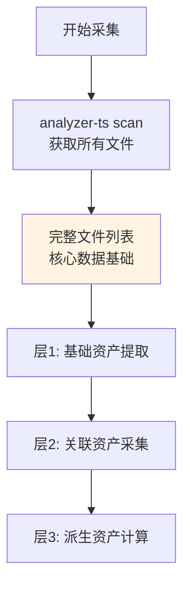

**关键点**：

+ `analyzer-ts scan` 是唯一的数据入口
+ 文件列表是所有后续采集的基础
+ 避免重复扫描，最大化数据复用

---

## 二、采集流程总览
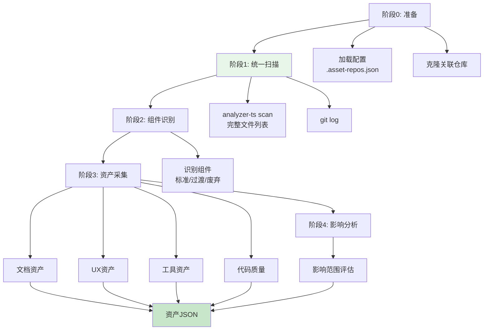

---

## 三、数据流转与关联
### 3.1 核心数据流
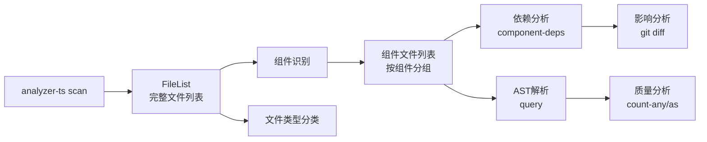

### 3.2 数据复用关系
| 基础数据 | 派生资产 | 复用方式 |
| --- | --- | --- |
| **FileList** | 所有资产 | 唯一数据源 |
| 组件文件列表 | 内部依赖、体积、Token、单测 | 基于组件名过滤 |
| AST 解析结果 | 依赖、API 文档、质量 | 复用解析缓存 |
| Git 日志 | Changelog、影响分析 | 复用 commit 列表 |


---

## 四、组件库维度采集
### 4.1 文档资产 (Markdown)
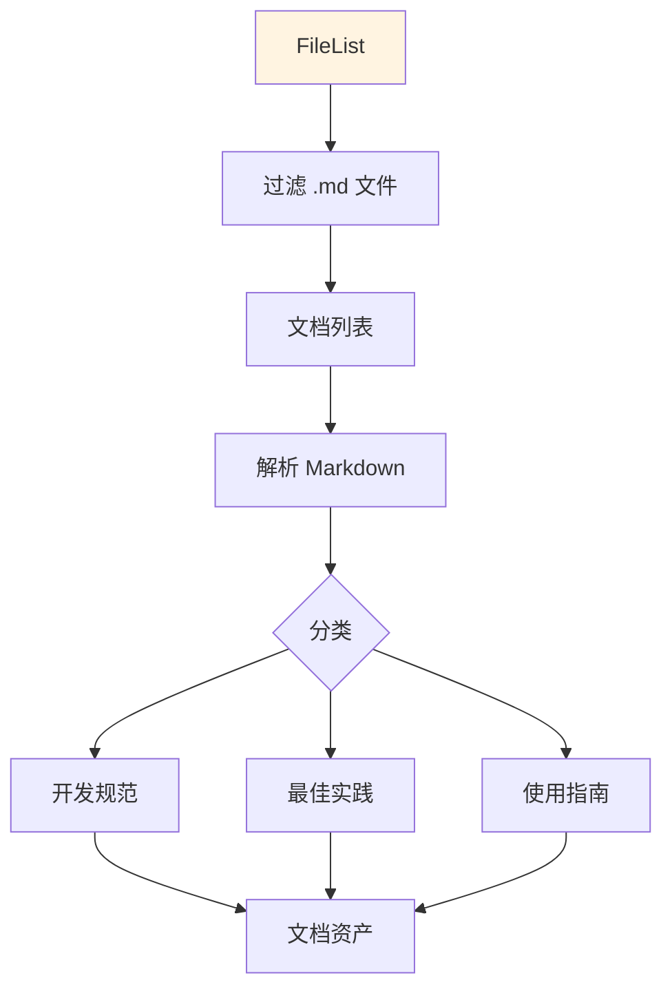

### 4.2 UX 规范资产 (语雀)
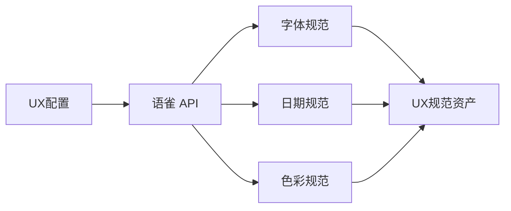

### 4.3 工具资产 (跨仓库)
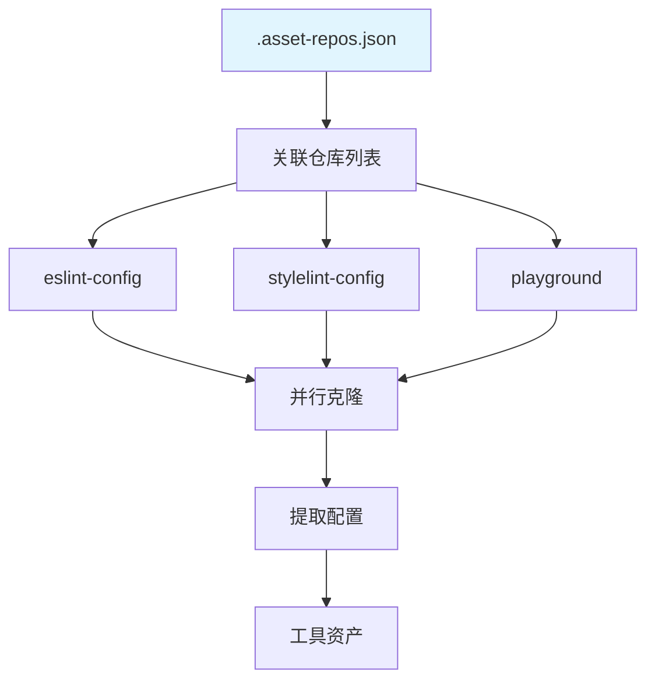

### 4.4 组件状态识别
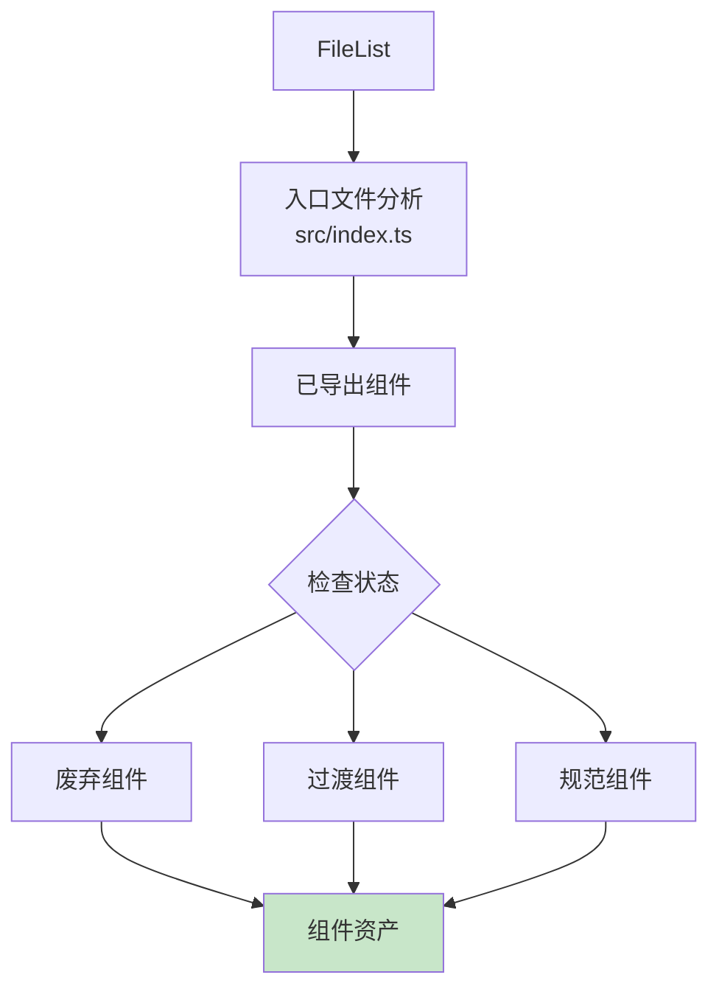

---

## 五、单组件维度采集
### 5.1 依赖采集 (基于文件列表)
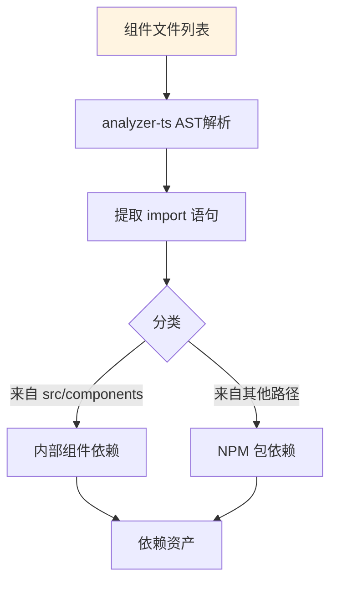

### 5.2 组件体积 (基于文件列表)
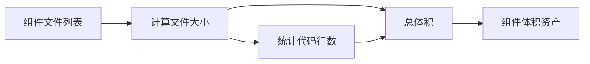

**复用逻辑**：

+ 组件文件列表已包含所有相关文件
+ 直接遍历累加大小和行数
+ 无需再次扫描

### 5.3 Figma 链接 (配置关联)
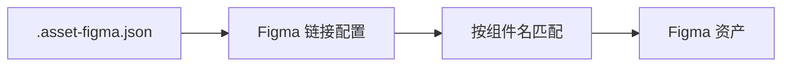

### 5.4 CSS Token (基于文件列表 + 样式文件)
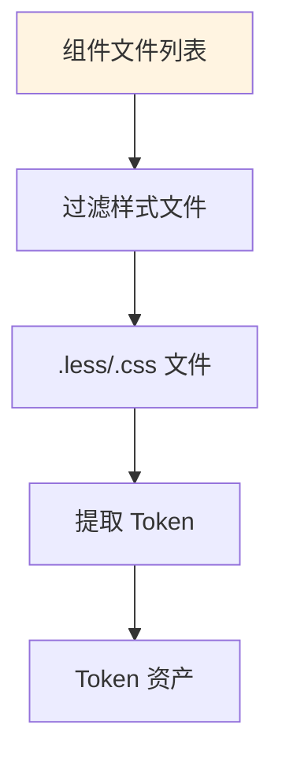

**复用逻辑**：

+ 从组件文件列表中筛选样式文件
+ 只解析组件相关的样式
+ 无需扫描全项目

### 5.5 单测 + 质量 (基于文件列表)
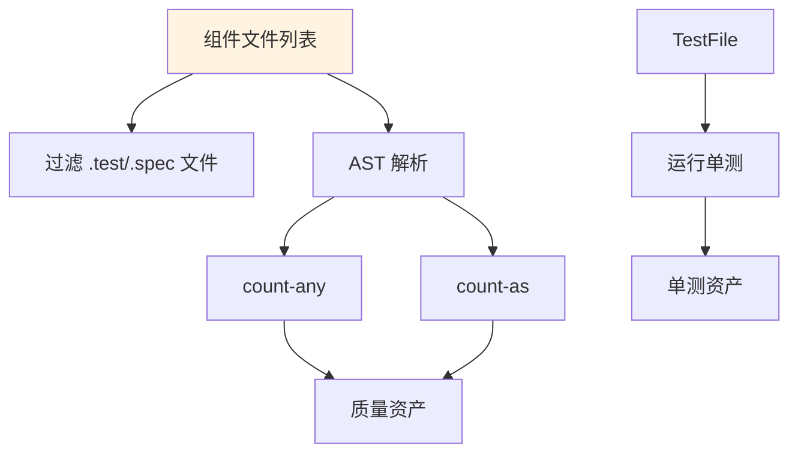

**复用逻辑**：

+ 组件文件列表直接定位测试文件
+ AST 结果复用于质量分析
+ 避免全量扫描

---

## 六、影响分析 (基于 Changelog)
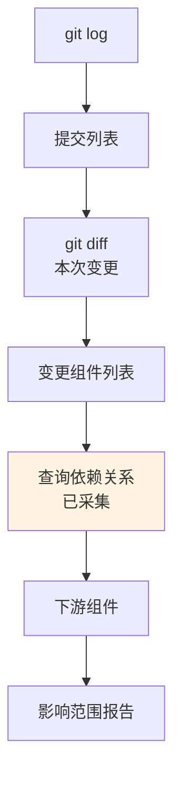

**复用逻辑**：

+ 复用已采集的依赖关系图
+ 变更组件 → 依赖查询 → 下游组件
+ 无需重新解析依赖

---

## 七、执行顺序
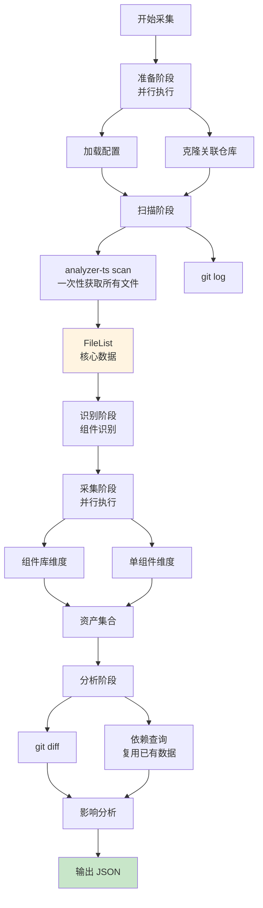

---

## 八、资产清单
### 组件库维度
| 资产类型 | 数据源 | 采集方式 | 依赖 |
| --- | --- | --- | --- |
| 文档资产 | .md 文件 | FileList 过滤 | FileList |
| UX 规范 | 语雀 API | 配置驱动 | - |
| 工具资产 | 关联仓库 | Git Clone + 解析 | 配置 |
| 组件状态 | 入口文件 | AST 分析 | FileList |
| 依赖信息 | package.json | JSON 解析 | - |
| Changelog | git log | 日志解析 | - |
| 影响分析 | git diff + 依赖图 | 差异计算 | 依赖资产 |


### 单组件维度
| 资产类型 | 数据源 | 采集方式 | 依赖 |
| --- | --- | --- | --- |
| 内部依赖 | 组件文件 | AST import 分析 | 组件文件列表 |
| 组件体积 | 组件文件 | 大小累加 | 组件文件列表 |
| Figma 链接 | 配置文件 | 配置匹配 | - |
| CSS Token | 样式文件 | Token 提取 | 组件文件列表 |
| 单测情况 | 测试文件 | Vitest 报告 | 组件文件列表 |
| 代码质量 | 组件文件 | count-any/count-as | 组件文件列表 |


---

## 九、配置文件
### .asset-repos.json (关联仓库)
```json
{
  "relatedRepos": [
    {
      "name": "eslint-config",
      "url": "git@gitlab.com:yy/eslint-config.git",
      "branch": "master",
      "assets": ["TOOL_ESLINT"]
    },
    {
      "name": "stylelint-config",
      "url": "git@gitlab.com:yy/stylelint-config.git",
      "branch": "master",
      "assets": ["TOOL_STYLELINT"]
    },
    {
      "name": "playground",
      "url": "git@gitlab.com:yy/playground.git",
      "branch": "develop",
      "assets": ["TOOL_PLAYGROUND"]
    }
  ]
}
```

### .asset-figma.json (Figma 配置)
```json
{
  "mappings": {
    "Button": "https://figma.com/file/xxx/Button",
    "Form": "https://figma.com/file/xxx/Form",
    "Table": "https://figma.com/file/xxx/Table"
  }
}
```

### .asset-yuque.json (语雀配置)
```json
{
  "baseUrl": "https://www.yuque.com/api/v2",
  "token": "${YUQUE_TOKEN}",
  "repos": [
    {
      "name": "字体规范",
      "id": "xxx/wiki/yyy",
      "type": "font"
    },
    {
      "name": "日期规范",
      "id": "xxx/wiki/zzz",
      "type": "date"
    }
  ]
}
```

---

## 十、输出格式
```json
{
  "collectedAt": "2024-01-28T10:00:00Z",
  "version": "1.0.0",

  "library": {
    "文档资产": [...],
    "UX规范资产": [...],
    "工具资产": [...],
    "依赖信息": {...},
    "changelog": {...},
    "影响分析": {...}
  },

  "components": {
    "Button": {
      "status": "standard",
      "内部依赖": ["Icon"],
      "组件体积": { "files": 3, "size": 15360, "lines": 245 },
      "Figma链接": "https://figma.com/...",
      "CSS Token": ["--color-primary", "--spacing-base"],
      "单测情况": { "覆盖": "95%", "通过": 48, "失败": 0 },
      "代码质量": { "anyCount": 0, "asCount": 2 }
    },
    "Form": {
      "status": "standard",
      "内部依赖": ["Button", "Input", "Icon"],
      "组件体积": { "files": 5, "size": 25600, "lines": 420 },
      "Figma链接": "https://figma.com/...",
      "CSS Token": ["--color-primary", "--border-radius"],
      "单测情况": { "覆盖": "88%", "通过": 120, "失败": 2 },
      "代码质量": { "anyCount": 5, "asCount": 8 }
    }
  },

  "impactAnalysis": {
    "changedComponents": ["Button"],
    "affectedComponents": ["Form", "Table", "Modal"],
    "riskLevel": "low"
  }
}
```

---

## 十一、关键优化点
### 11.1 最小化扫描次数
```plain
analyzer-ts scan (1次) → FileList → 所有后续采集
```

### 11.2 最大化数据复用
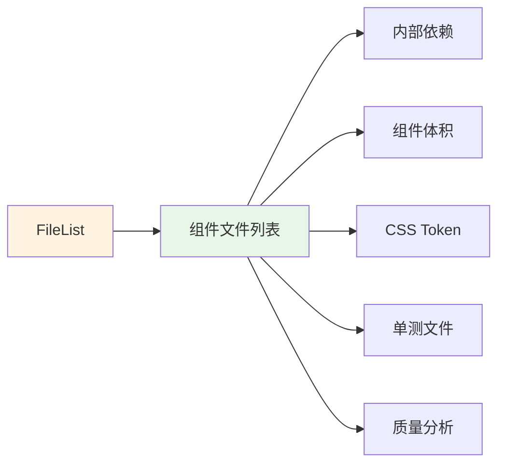

### 11.3 并行化执行
+ 仓库克隆：并行
+ 采集器执行：并行（无依赖情况下）
+ Git 操作：批量调用

---

## 十二、CLI 命令
```bash
# 完整采集
asset-collector collect --project-root /path/to/project

# 仅组件库维度
asset-collector collect --scope library

# 仅单组件维度
asset-collector collect --scope component --component Button

# 包含影响分析
asset-collector collect --with-impact --base-ref HEAD~1

# 输出路径
asset-collector collect --output ./assets/assets.json
```
