# 资产采集框架技术设计
> **版本**: v1.0.0  
**状态**: 技术设计  
**目标**: 设计并实现可发布为 npm 包的资产采集框架
>

---

## 一、项目概述
### 1.1 项目目标
实现一个可复用的资产采集框架，作为 npm 包发布，用于组件库资产的自动采集。

**核心价值**：

+ 统一采集接口，支持多种资产类型
+ 数据复用优先，最小化重复扫描
+ 可扩展架构，新增资产类型无需修改核心
+ CI 友好，支持在流水线中自动运行

### 1.2 核心架构
本框架采用**采集 + 可选存储**的架构：

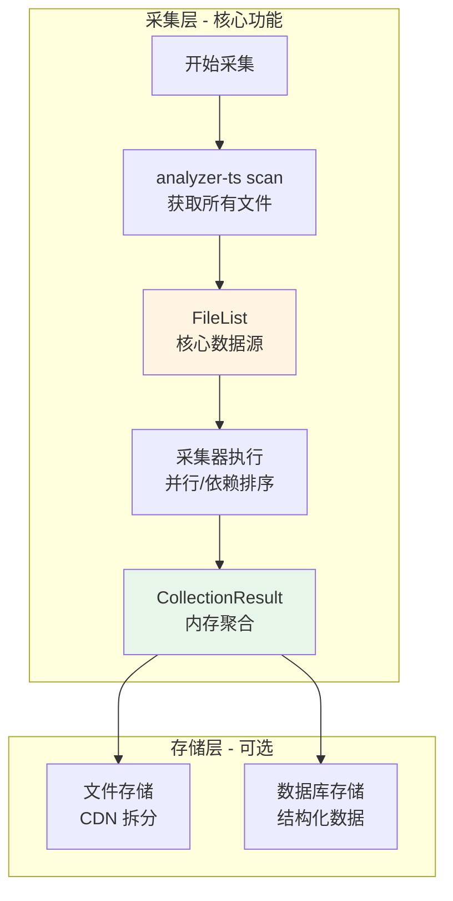

**核心原则**：

1. **采集优先**：框架核心是采集能力和数据结构
2. **存储可选**：提供多种存储适配器，也可直接使用内存结果
3. **一次采集，多种输出**：同一份采集结果可以选择不同存储方式

### 1.3 数据流转
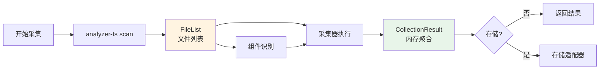

---

## 二、数据模型设计
### 2.1 资产分类
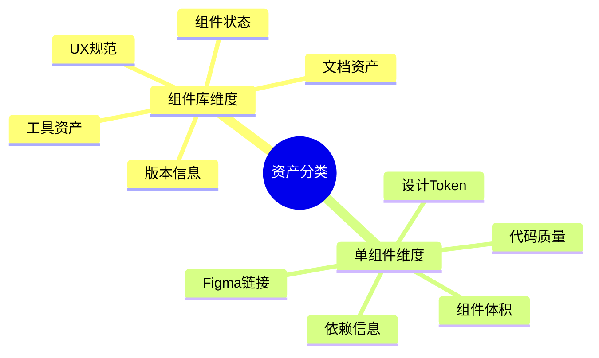

### 2.2 核心接口
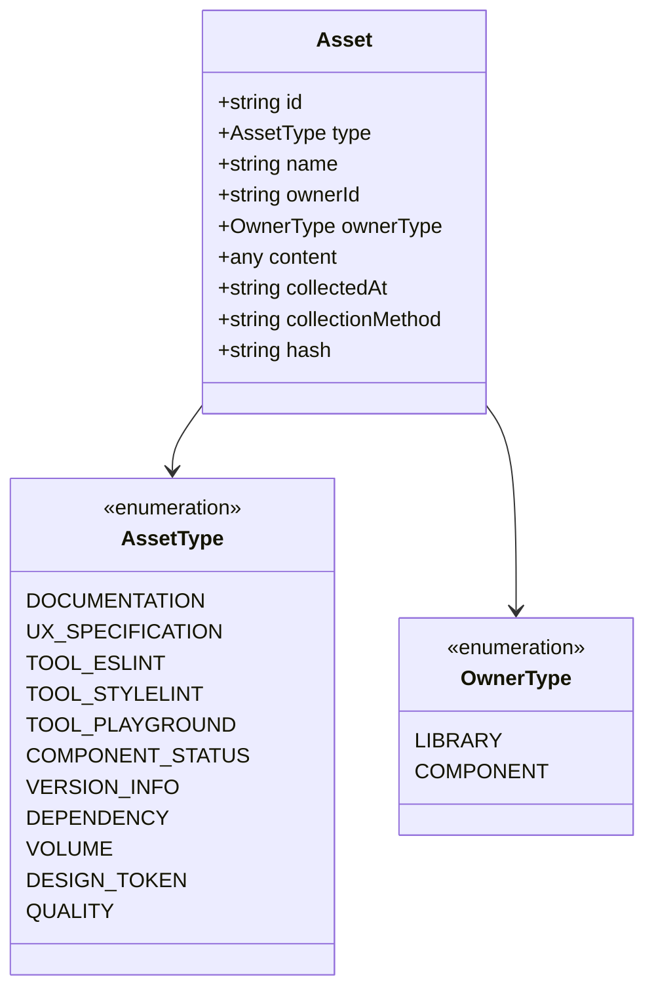

### 2.3 TypeScript 接口定义
```typescript
/**
 * 资产类型枚举
 */
enum AssetType {
  // 组件库维度 (7 种)
  DOCUMENTATION = 'documentation',
  UX_SPECIFICATION = 'ux_specification',
  TOOL_ESLINT = 'tool_eslint',
  TOOL_STYLELINT = 'tool_stylelint',
  TOOL_PLAYGROUND = 'tool_playground',
  COMPONENT_STATUS = 'component_status',
  VERSION_INFO = 'version_info',

  // 单组件维度 (5 种)
  DEPENDENCY = 'dependency',
  VOLUME = 'volume',
  DESIGN_TOKEN = 'design_token',
  FIGMA = 'figma',
  QUALITY = 'quality',
}

/**
 * 所属类型枚举
 */
enum OwnerType {
  LIBRARY = 'library',
  COMPONENT = 'component',
}

/**
 * 核心资产接口
 */
interface Asset {
  // 核心标识
  id: string;
  type: AssetType;
  name: string;

  // 所属关系
  ownerId: string;
  ownerType: OwnerType;

  // 资产内容
  content: any;

  // 采集信息
  collectedAt: string;
  collectionMethod: string;

  // 可选字段
  hash?: string;
  location?: AssetLocation;
}

interface AssetLocation {
  type: 'git' | 'ast' | 'build' | 'config' | 'external';
  url: string;
}
```

### 2.4 采集结果（CollectionResult）
```typescript
/**
 * 采集结果（内存中，临时）
 *
 * 这是采集流程的输出，可以：
 * - 直接使用（不持久化）
 * - 传入存储适配器进行持久化
 */
interface CollectionResult {
  // 全局元数据
  lib: string;
  ver: string;
  collectedAt: string;

  // CI 信息
  ci: {
    buildId: number;
    sha: string;
    branch: string;
  };

  // 核心数据：扁平化的资产数组
  assets: Asset[];

  // 便捷访问（可选）
  byType?: {
    [type: string]: Asset[];
  };
  byComponent?: {
    [componentId: string]: Asset[];
  };
}
```

### 2.5 资产内容模型
#### 2.5.1 文档资产
```typescript
interface DocumentationContent {
  files: Array<{
    path: string;
    content: string;
  }>;
}
```

#### 2.5.2 组件状态
```typescript
interface ComponentStatusContent {
  components: Array<{
    name: string;
    status: 'standard' | 'experimental' | 'deprecated';
    exported: boolean;
    hasDocs: boolean;
    figmaLink?: string;         // Figma 设计链接（从 JSDoc 注释提取）
    subComponents?: string[];
  }>;
  summary: {
    standard: number;
    experimental: number;
    deprecated: number;
    total: number;
  };
}
```

#### 2.5.3 依赖信息
```typescript
interface DependencyContent {
  componentName: string;
  internalDependencies: Array<{
    component: string;
    strength: number;
  }>;
  externalPackages: Array<{
    name: string;
    version: string;
  }>;
}
```

#### 2.5.4 组件体积
```typescript
interface VolumeContent {
  componentName: string;
  files: {
    count: number;
    totalBytes: number;
  };
  lines: {
    total: number;
  };
}
```

#### 2.5.5 代码质量
```typescript
interface QualityContent {
  componentName: string;
  typeSafety: {
    anyCount: number;
    asAssertionCount: number;
  };
  testCoverage: {
    percentage: number;
    passed: number;
    failed: number;
  };
}
```

#### 2.5.6 Figma 链接
```typescript
interface FigmaContent {
  url: string;                    // Figma 文件/组件链接
  description?: string;           // 设计说明（来自 JSDoc）
}
```

**采集方式**：从组件导出的 JSDoc 注释中提取 `@figma` 标签

**示例代码**：

```typescript
/**
 * Button 组件
 *
 * @description 这是一个通用按钮组件
 * @figma https://figma.com/file/xxx/Button
 */
export const Button = (props: ButtonProps) => { ... };
```

#### 2.5.7 设计 Token (DESIGN_TOKEN)
```typescript
interface DesignTokenContent {
  componentName: string;
  tokens: Array<{
    name: string;                 // Token 名称，如 "--color-primary"
    fallback?: string;            // 备选值
    sourceFile: string;           // 来源文件
    usage: string[];              // 使用位置
  }>;
  summary: {
    total: number;                // 总数量
    unique: number;               // 唯一数量
    withFallback: number;         // 有备选值的数量
  };
}
```

**采集方式**：从组件样式文件（.less/.css/.scss）中提取 CSS 变量引用

**数据来源**：组件文件列表中的样式文件

**示例**：

```less
// src/components/Button/style.less
.button {
  color: var(--color-primary, #1890ff);
  border-radius: var(--border-radius, 2px);
  padding: var(--spacing-base, 8px);
}
```

提取结果：

```json
{
  "componentName": "Button",
  "tokens": [
    {
      "name": "--color-primary",
      "fallback": "#1890ff",
      "sourceFile": "src/components/Button/style.less",
      "usage": [".button", ".button:hover"]
    },
    {
      "name": "--border-radius",
      "fallback": "2px",
      "sourceFile": "src/components/Button/style.less",
      "usage": [".button"]
    },
    {
      "name": "--spacing-base",
      "fallback": "8px",
      "sourceFile": "src/components/Button/style.less",
      "usage": [".button"]
    }
  ],
  "summary": {
    "total": 3,
    "unique": 3,
    "withFallback": 3
  }
}
```

#### 2.5.8 UX 规范资产
```typescript
interface UXSpecificationContent {
  specifications: Array<{
    type: string;                 // 'font' | 'color' | 'date' | 'spacing' 等
    name: string;                 // 规范名称，如"字体规范"
    yuqueId: string;              // 语雀文档 ID
    url: string;                  // 语雀文档链接
    content: string;              // 文档内容（markdown）
    updatedAt: string;            // 更新时间
  }>;
}
```

**采集方式**：通过语雀 API 获取配置的规范文档

**数据来源**：`.asset-yuque.json` 配置文件

#### 2.5.8 工具资产
```typescript
interface ToolAssetContent {
  toolType: 'TOOL_ESLINT' | 'TOOL_STYLELINT' | 'TOOL_PLAYGROUND';
  repoName: string;               // 仓库名称
  repoUrl: string;                // 仓库 URL
  branch: string;                 // 分支
  configPath: string;             // 配置文件路径
  config: any;                    // 配置内容（ESLint 规则、Stylelint 规则等）
  files?: Array<{                 // 相关文件列表（playground）
    path: string;
    content: string;
  }>;
}
```

**采集方式**：Git 克隆关联仓库 + 解析配置文件

**数据来源**：`.asset-repos.json` 配置的关联仓库

#### 2.5.9 版本信息 (VERSION_INFO / Changelog)
```typescript
interface VersionInfoContent {
  currentVersion: string;         // 当前版本号
  releaseDate: string;            // 发布日期
  changelog: ChangelogEntry[];    // 变更记录列表
  impactAnalysis?: {              // 影响分析（基于依赖关系）
    changedComponents: string[];  // 本次变更的组件
    affectedComponents: string[]; // 受影响的下游组件
    riskLevel: 'low' | 'medium' | 'high';  // 风险等级
  };
}

interface ChangelogEntry {
  version: string;
  date: string;
  type: 'major' | 'minor' | 'patch';
  changes: Array<{
    type: 'added' | 'changed' | 'fixed' | 'removed' | 'deprecated';
    component?: string;           // 关联的组件
    description: string;
    breaking?: boolean;           // 是否破坏性变更
  }>;
}
```

**采集方式**：解析 Git 日志 + 依赖关系分析

**数据来源**：

+ `git log` 获取提交记录
+ 依赖关系图（DEPENDENCY 资产）评估影响范围

**影响分析流程**：

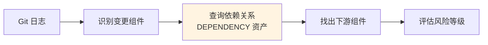

**示例**：

```json
{
  "currentVersion": "2.60.2",
  "releaseDate": "2024-01-28",
  "changelog": [
    {
      "version": "2.60.2",
      "date": "2024-01-28",
      "type": "minor",
      "changes": [
        {
          "type": "changed",
          "component": "Button",
          "description": "优化 Button 组件的 onClick 类型定义",
          "breaking": false
        },
        {
          "type": "added",
          "component": "Form",
          "description": "新增 Form.List 组件",
          "breaking": false
        }
      ]
    }
  ],
  "impactAnalysis": {
    "changedComponents": ["Button", "Form"],
    "affectedComponents": ["Form", "Modal", "Table"],
    "riskLevel": "low"
  }
}
```

---

## 三、采集流程设计
### 3.1 完整采集流程
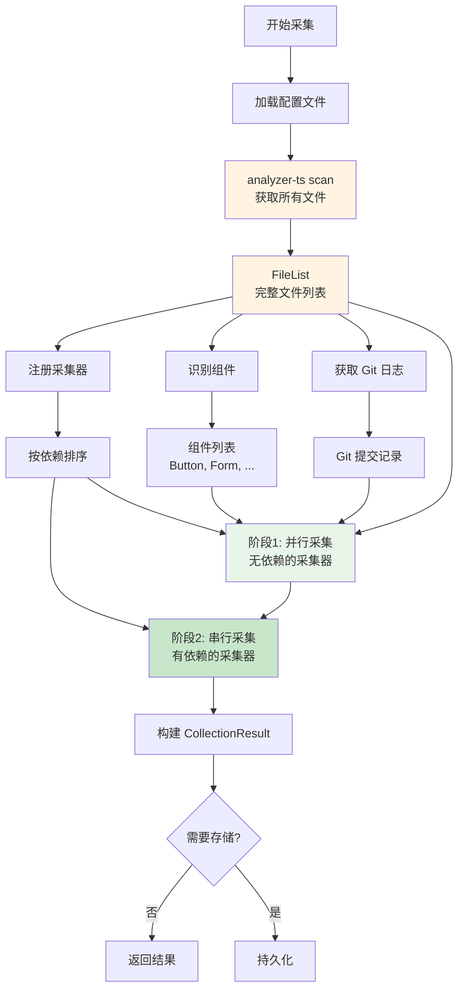

### 3.2 分步详解
#### 步骤 1：扫描文件（所有采集的基础）
```bash
# 使用 analyzer-ts 扫描项目
analyzer-ts scan -i /path/to/project -o /tmp/scan-result
```

**输出**：FileList（完整文件列表）

```json
{
  "root": "/path/to/project",
  "fileList": {
    "src/Button/index.tsx": { "size": 2048, "extension": ".tsx" },
    "src/Button/style.less": { "size": 1024, "extension": ".less" },
    "src/Form/index.tsx": { "size": 3584, "extension": ".tsx" },
    "docs/guide.md": { "size": 512, "extension": ".md" }
  }
}
```

#### 步骤 2：识别组件
```typescript
// 从 FileList 中提取组件列表
function identifyComponents(fileList: FileList): ComponentInfo[] {
  // 1. 查找所有 src/components/*/index.tsx
  const componentDirs = fileList.filterByPath('src/components/*/');

  // 2. 从 src/index.ts 获取导出的组件名
  const exports = analyzer.query('exports.*.name', fileList);

  // 3. 匹配生成组件列表
  return componentDirs.files.map(dir => ({
    name: path.basename(dir.path),
    status: getComponentStatus(dir, exports),
    hasDocs: fileList.files.some(f => f.path.includes(`docs/${dir.name}`))
  }));
}
```

**输出**：ComponentList（组件列表）

```json
[
  { "name": "Button", "status": "standard", "hasDocs": true },
  { "name": "Form", "status": "standard", "hasDocs": true },
  { "name": "Table", "status": "experimental", "hasDocs": false }
]
```

#### 步骤 3：执行采集器（并行 + 串行）
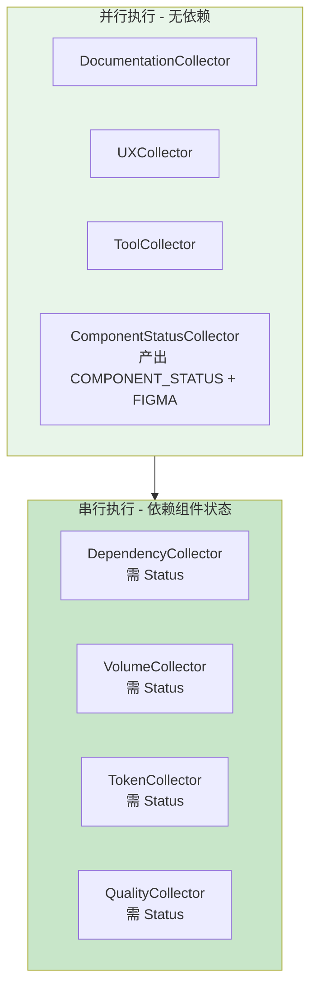

**实现代码**：

```typescript
// Coordinator 中的采集执行逻辑
async collect(options: CollectionOptions): Promise<CollectionResult> {
  // 1. 准备上下文
  const context = await this.prepareContext(options);

  // 2. 获取排序后的采集器
  const collectors = this.registry.sortTopologically();

  // 3. 分批执行（有依赖关系的串行，无依赖的并行）
  const allAssets: Asset[] = [];

  // 第一批：并行执行无依赖的采集器
  const batch1 = collectors.filter(c => !c.dependencies || c.dependencies.length === 0);
  const results1 = await Promise.all(
    batch1.map(c => c.collect(context))
  );
  allAssets.push(...results1.flat());

  // 第二批：串行执行有依赖的采集器
  const batch2 = collectors.filter(c => c.dependencies && c.dependencies.length > 0);
  for (const collector of batch2) {
    const assets = await collector.collect(context);
    allAssets.push(...assets);
  }

  // 4. 构建结果
  return {
    lib: context.libraryName,
    ver: context.version,
    collectedAt: new Date().toISOString(),
    ci: context.config.ci,
    assets: allAssets
  };
}
```

### 3.3 采集器实现详解
#### 3.3.1 文档采集器（DocumentationCollector）
**流程**：

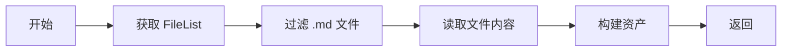

**实现**：

```typescript
class DocumentationCollector extends BaseCollector {
  readonly name = 'documentation';
  readonly assetTypes = [AssetType.DOCUMENTATION];
  readonly dimension = 'library' as const;

  async collect(context: CollectionContext): Promise<Asset[]> {
    // 1. 从 FileList 过滤出 .md 文件
    const mdFiles = context.fileList.filterByExtension('.md');

    // 2. 并发读取所有文件内容
    const files = await Promise.all(
      mdFiles.files.map(async (file) => ({
        path: file.path,
        content: await fs.readFile(file.absolutePath, 'utf-8'),
      }))
    );

    // 3. 构建资产
    return [
      this.createAsset(
        AssetType.DOCUMENTATION,
        '文档资产',
        'library',
        OwnerType.LIBRARY,
        { files },
        'markdown_parse'
      ),
    ];
  }
}
```

#### 3.3.2 组件状态采集器（ComponentStatusCollector）
> **说明**：此采集器同时产出两种资产 - COMPONENT_STATUS（组件库维度）和 FIGMA（单组件维度）。Figma 链接从组件导出的 JSDoc `@figma` 标签中提取。
>

**流程**：

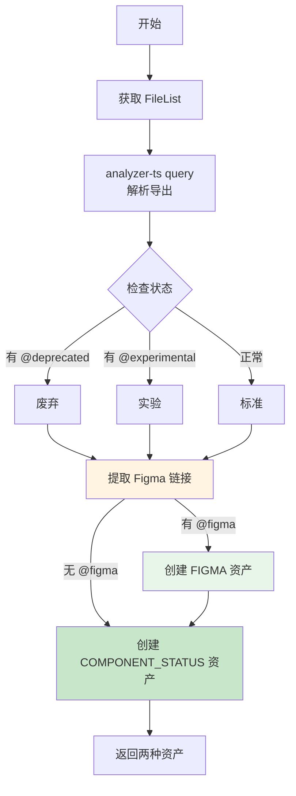

**实现**：

```typescript
class ComponentStatusCollector extends BaseCollector {
  readonly name = 'component-status';
  readonly assetTypes = [AssetType.COMPONENT_STATUS, AssetType.FIGMA];  // 同时产出两种资产
  readonly dimension = 'library' as const;

  async collect(context: CollectionContext): Promise<Asset[]> {
    const assets: Asset[] = [];

    // 1. 从 FileList 获取入口文件
    const entryFile = context.fileList.files.find(f => f.path === 'src/index.ts');

    // 2. 使用 analyzer-ts 解析导出
    const exports = await context.adapters.analyzer.query(
      'exports.*',
      [entryFile]
    );

    // 3. 检查每个组件的状态（同时提取 Figma 链接）
    const components = exports.map(exp => {
      const jsDoc = exp.jsDoc || {};
      let status = 'standard';

      // 检查状态标记
      if (jsDoc.tags?.some(t => t.tagName === 'deprecated')) {
        status = 'deprecated';
      } else if (jsDoc.tags?.some(t => t.tagName === 'experimental')) {
        status = 'experimental';
      }

      // 提取 Figma 链接（从 @figma 标签）
      const figmaTag = jsDoc.tags?.find(t => t.tagName === 'figma');
      const figmaLink = figmaTag ? figmaTag.value : undefined;

      const componentInfo = {
        name: exp.name,
        status,
        exported: true,
        hasDocs: context.fileList.files.some(f =>
          f.path.includes(`docs/${exp.name.toLowerCase()}`)
        ),
        figmaLink  // Figma 链接作为组件状态的一部分
      };

      // 如果有 Figma 链接，创建独立的 FIGMA 资产
      if (figmaLink) {
        assets.push(
          this.createAsset(
            AssetType.FIGMA,
            `${exp.name} Figma 链接`,
            exp.name,
            OwnerType.COMPONENT,
            {
              url: figmaLink,
              description: jsDoc.description || ''
            },
            'jsdoc_extract'
          )
        );
      }

      return componentInfo;
    });

    // 4. 构建组件状态资产
    assets.push(
      this.createAsset(
        AssetType.COMPONENT_STATUS,
        '组件状态',
        'library',
        OwnerType.LIBRARY,
        {
          components,
          summary: {
            standard: components.filter(c => c.status === 'standard').length,
            experimental: components.filter(c => c.status === 'experimental').length,
            deprecated: components.filter(c => c.status === 'deprecated').length,
            total: components.length
          }
        },
        'ast_parse'
      )
    );

    return assets;
  }
}
```

#### 3.3.3 依赖采集器（DependencyCollector）
**流程**：

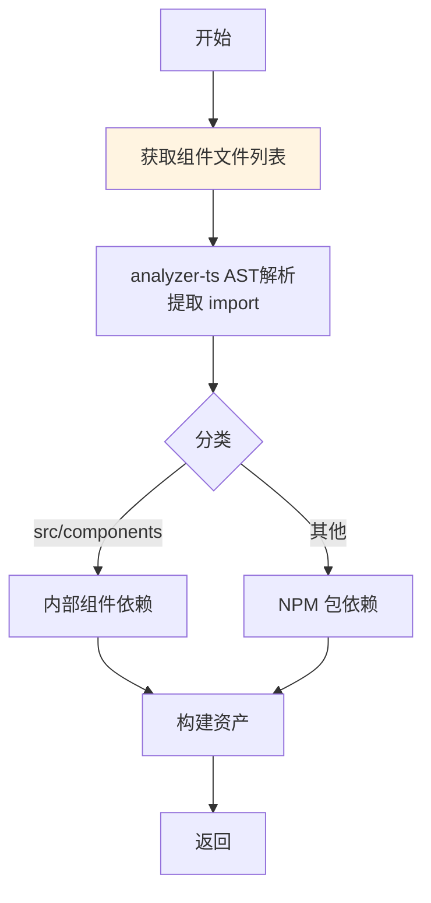

**实现**：

```typescript
class DependencyCollector extends BaseCollector {
  readonly name = 'dependency';
  readonly assetTypes = [AssetType.DEPENDENCY];
  readonly dimension = 'component' as const;
  readonly dependencies = [AssetType.COMPONENT_STATUS];

  async collect(context: CollectionContext): Promise<Asset[]> {
    const assets: Asset[] = [];

    for (const component of context.componentList) {
      // 1. 获取该组件的所有文件
      const compFiles = context.fileList.getComponentFiles(component.name);

      // 2. 使用 analyzer-ts 分析依赖
      const deps = await context.adapters.analyzer.componentDeps(compFiles);

      // 3. 分类：内部依赖 vs 外部依赖
      const internalDependencies = [];
      const externalPackages = [];

      for (const dep of deps.imports) {
        if (dep.from.startsWith('src/components')) {
          // 内部组件依赖
          const depComponent = this.extractComponentName(dep.from);
          internalDependencies.push({
            component: depComponent,
            strength: this.calculateStrength(dep)
          });
        } else {
          // NPM 包依赖
          externalPackages.push({
            name: dep.package,
            version: dep.version
          });
        }
      }

      // 4. 构建资产
      assets.push(
        this.createAsset(
          AssetType.DEPENDENCY,
          `${component.name} 依赖信息`,
          component.name,
          OwnerType.COMPONENT,
          { componentName: component.name, internalDependencies, externalPackages },
          'ast_parse'
        )
      );
    }

    return assets;
  }

  private extractComponentName(importPath: string): string {
    // src/components/Button/index.tsx -> Button
    const match = importPath.match(/src\/components\/([^/]+)/);
    return match ? match[1] : importPath;
  }

  private calculateStrength(dep: Import): number {
    // 根据导入次数和类型计算耦合强度
    return dep.usageCount * (dep.type === 'default' ? 1 : 0.8);
  }
}
```

#### 3.3.4 版本信息采集器（VersionInfoCollector）
> **说明**：采集 Git 提交记录生成 Changelog，并基于依赖关系分析影响范围。
>

**流程**：

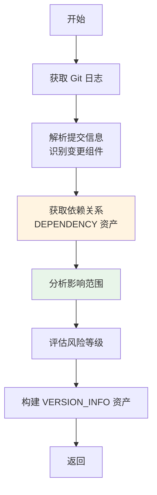

**实现**：

```typescript
class VersionInfoCollector extends BaseCollector {
  readonly name = 'version-info';
  readonly assetTypes = [AssetType.VERSION_INFO];
  readonly dimension = 'library' as const;
  readonly dependencies = [AssetType.DEPENDENCY];  // 需要依赖关系

  async collect(context: CollectionContext): Promise<Asset[]> {
    // 1. 获取 Git 日志（从上一次发布到当前）
    const lastTag = await this.getLastReleaseTag(context);
    const commits = await context.adapters.git.getLog(lastTag, 'HEAD');

    // 2. 解析提交信息，识别变更的组件
    const changedComponents = this.parseChangedComponents(commits);

    // 3. 获取依赖关系资产
    const depAssets = context.assets.filter(
      a => a.type === AssetType.DEPENDENCY
    );

    // 4. 构建依赖图（用于查询下游组件）
    const depGraph = this.buildDependencyGraph(depAssets);

    // 5. 分析影响范围
    const affectedComponents = this.analyzeImpact(changedComponents, depGraph);

    // 6. 评估风险等级
    const riskLevel = this.assessRiskLevel(changedComponents, affectedComponents);

    // 7. 生成 Changelog
    const changelog = this.generateChangelog(commits, changedComponents);

    return [
      this.createAsset(
        AssetType.VERSION_INFO,
        '版本信息',
        'library',
        OwnerType.LIBRARY,
        {
          currentVersion: context.version,
          releaseDate: new Date().toISOString().split('T')[0],
          changelog,
          impactAnalysis: {
            changedComponents,
            affectedComponents,
            riskLevel
          }
        },
        'git_log'
      ),
    ];
  }

  private parseChangedComponents(commits: GitLogEntry[]): string[] {
    const components = new Set<string>();

    for (const commit of commits) {
      // 从提交信息的文件路径中提取组件名
      // 例如: "src/components/Button/index.tsx" -> "Button"
      const matches = commit.files.map(f =>
        f.match(/src\/components\/([^\/]+)/)
      ).filter(Boolean);

      matches.forEach(match => components.add(match[1]));
    }

    return Array.from(components);
  }

  private buildDependencyGraph(depAssets: Asset[]): Map<string, string[]> {
    const graph = new Map<string, string[]>();

    for (const asset of depAssets) {
      const comp = asset.content.componentName;
      const internalDeps = asset.content.internalDependencies.map(d => d.component);

      // 记录谁依赖了谁（反向依赖图）
      for (const dep of internalDeps) {
        if (!graph.has(dep)) {
          graph.set(dep, []);
        }
        graph.get(dep)!.push(comp);
      }
    }

    return graph;
  }

  private analyzeImpact(
    changedComponents: string[],
    depGraph: Map<string, string[]>
  ): string[] {
    const affected = new Set<string>();

    for (const changed of changedComponents) {
      // 查找依赖此组件的所有下游组件
      const downstream = depGraph.get(changed) || [];
      downstream.forEach(comp => affected.add(comp));
    }

    return Array.from(affected);
  }

  private assessRiskLevel(
    changed: string[],
    affected: string[]
  ): 'low' | 'medium' | 'high' {
    // 如果变更的基础组件被很多组件依赖，风险较高
    const totalAffected = changed.length + affected.length;

    if (totalAffected === 0) return 'low';
    if (totalAffected <= 3) return 'low';
    if (totalAffected <= 10) return 'medium';
    return 'high';
  }

  private generateChangelog(
    commits: GitLogEntry[],
    changedComponents: string[]
  ): ChangelogEntry[] {
    // 按提交类型分组
    const changes = {
      added: [] as string[],
      changed: [] as string[],
      fixed: [] as string[],
      deprecated: [] as string[]
    };

    for (const commit of commits) {
      const type = this.inferChangeType(commit.message);
      const component = this.extractComponentFromCommit(commit);

      if (component) {
        changes[type].push(`${component}: ${commit.message}`);
      }
    }

    return [{
      version: context.version,  // 假设 context 可访问
      date: new Date().toISOString().split('T')[0],
      type: this.inferVersionType(changes),
      changes: Object.entries(changes).flatMap(([type, messages]) =>
        messages.map(msg => ({
          type: type as ChangeType,
          description: msg
        }))
      )
    }];
  }

  private inferChangeType(message: string): 'added' | 'changed' | 'fixed' | 'deprecated' {
    const lower = message.toLowerCase();
    if (lower.startsWith('feat') || lower.startsWith('add')) return 'added';
    if (lower.startsWith('fix')) return 'fixed';
    if (lower.startsWith('deprecate')) return 'deprecated';
    return 'changed';
  }

  private inferVersionType(changes: Record<string, string[]>): 'major' | 'minor' | 'patch' {
    if (changes.deprecated.length > 0) return 'major';
    if (changes.added.length > 0) return 'minor';
    return 'patch';
  }

  private extractComponentFromCommit(commit: GitLogEntry): string | null {
    const match = commit.files.find(f =>
      f.includes('src/components/')
    );

    if (match) {
      const result = match.match(/src\/components\/([^\/]+)/);
      return result ? result[1] : null;
    }

    return null;
  }

  private async getLastReleaseTag(context: CollectionContext): Promise<string> {
    // 使用 git tag 获取最后一个发布标签
    const tags = await context.adapters.git.getTags();
    const releaseTags = tags
      .filter(t => t.startsWith('v'))
      .sort()
      .reverse();

    return releaseTags[0] || 'HEAD~10';  // 默认返回近10次提交
  }
}
```

### 3.4 采集器依赖关系图
```plain

### 3.4 采集器依赖关系图
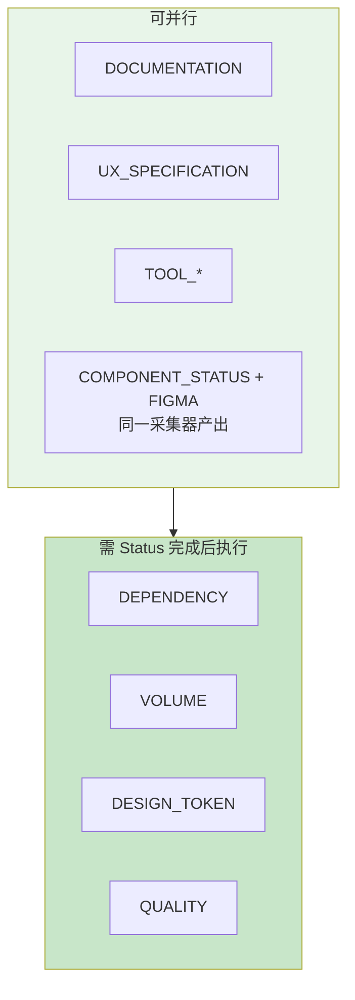

### 3.5 完整采集示例
```typescript
// 使用示例
const coordinator = new CollectionCoordinator();
coordinator.registerAll([
  new DocumentationCollector(),
  new UXCollector(),
  new ToolCollector(),
  new ComponentStatusCollector(),  // 同时产出 COMPONENT_STATUS 和 FIGMA
  new DependencyCollector(),
  new VolumeCollector(),
  new TokenCollector(),
  new QualityCollector(),
]);

// 执行采集
const result = await coordinator.collect({
  projectRoot: '/path/to/sl-admin-components',
  libraryName: '@yy/sl-admin-components',
  version: '2.60.2',
  config: {
    ci: { buildId: 123, sha: 'abc123', branch: 'main' }
  }
});

console.log(`采集完成，共 ${result.assets.length} 个资产`);
// 输出: 采集完成，共 450 个资产

// 直接使用结果
const buttonAssets = result.assets.filter(a => a.ownerId === 'Button');
console.log('Button 组件的资产:', buttonAssets.map(a => a.type));
// 输出: ['dependency', 'volume', 'design_token', 'figma', 'quality', 'usage']

// 或存储到文件
await storageAdapter.store(result, '2.60.2');
```

### 3.6 采集器总览
#### 组件库维度采集器（4 种）
| 采集器 | 资产类型 | 数据来源 | 依赖 | 采集方式 |
| --- | --- | --- | --- | --- |
| DocumentationCollector | DOCUMENTATION | FileList (.md) | 无 | 并发读取文件内容 |
| UXCollector | UX_SPECIFICATION | 语雀 API | 无 | HTTP 请求 |
| ToolCollector | TOOL_* | 关联仓库 | 无 | Git Clone + 配置解析 |
| ComponentStatusCollector | COMPONENT_STATUS, FIGMA | FileList + AST | 无 | analyzer-ts query + JSDoc 提取 |


#### 单组件维度采集器（4 种）
| 采集器 | 资产类型 | 数据来源 | 依赖 | 采集方式 |
| --- | --- | --- | --- | --- |
| DependencyCollector | DEPENDENCY | 组件文件列表 | COMPONENT_STATUS | analyzer-ts component-deps |
| VolumeCollector | VOLUME | 组件文件列表 | COMPONENT_STATUS | 文件统计 |
| TokenCollector | DESIGN_TOKEN | 样式文件 | COMPONENT_STATUS | 正则/PostCSS |
| QualityCollector | QUALITY | 组件文件 + 测试 | COMPONENT_STATUS | analyzer-ts + Vitest |


**说明**：FIGMA 资产由 ComponentStatusCollector 在采集组件状态时一并提取（从 JSDoc 的 `@figma` 标签），无需单独的采集器。

---

## 四、工具适配层设计
### 4.1 AnalyzerAdapter
```typescript
interface AnalyzerAdapter {
  // 基础扫描（获取完整文件列表）
  scan(projectRoot: string): Promise<FileList>;

  // AST 解析
  query(jmesPath: string): Promise<any>;

  // 依赖分析
  componentDeps(files: FileList): Promise<DependencyResult>;

  // 类型安全检查
  countAny(): Promise<AnyCountResult>;
  countAs(): Promise<AsCountResult>;
}
```

**调用方式**：CLI 封装

### 4.2 GitAdapter
```typescript
interface GitAdapter {
  getLog(from: string, to: string): Promise<GitLogEntry[]>;
  getDiff(from: string, to: string): Promise<GitDiffResult>;
  clone(url: string, targetPath: string): Promise<void>;
  pull(repoPath: string): Promise<void>;
}
```

### 4.3 TokenAdapter
```typescript
interface TokenAdapter {
  extractWithRegex(content: string): DesignToken[];
  extractWithPostCSS(filePath: string): Promise<DesignToken[]>;
}
```

---

## 五、存储方案设计（可选）
> **说明**：存储层是可选的。采集流程生成 `CollectionResult` 后，你可以：
>
> + 直接使用内存中的结果
> + 使用以下任一存储适配器
> + 自己实现存储适配器
>

### 5.1 存储适配器接口
```typescript
interface StorageAdapter {
  store(result: CollectionResult, version: string): Promise<StorageOutput>;
}

interface StorageOutput {
  type: string;
  urls: string[];
  metadata: Record<string, any>;
}
```

### 5.2 方案 A：CDN 拆分存储
#### 目录结构
```plain
assets/
├── versions/
│   ├── v2.0.0/
│   │   ├── index.json              # 索引（~5KB）
│   │   ├── library/                # 组件库维度
│   │   │   ├── documentation.json
│   │   │   ├── component-status.json
│   │   │   └── ...
│   │   └── components/             # 单组件维度
│   │       ├── Button.json
│   │       ├── Form.json
│   │       └── ...
│   └── latest -> v2.0.0
└── versions.json
```

#### 实现要点
+ 按维度和组件拆分文件
+ 支持按需加载
+ 版本化管理

### 5.3 方案 B：数据库存储
#### 表结构
```sql
CREATE TABLE assets (
  id TEXT PRIMARY KEY,
  type TEXT NOT NULL,
  name TEXT NOT NULL,
  owner_id TEXT NOT NULL,
  owner_type TEXT NOT NULL,
  content JSON NOT NULL,
  collected_at TEXT NOT NULL,
  collection_method TEXT NOT NULL,
  hash TEXT,
  version TEXT NOT NULL
);

CREATE INDEX idx_assets_type ON assets(type);
CREATE INDEX idx_assets_owner ON assets(owner_id, owner_type);
CREATE INDEX idx_assets_version ON assets(version);
```

#### 实现要点
+ 单表存储，content 字段使用 JSON 类型
+ 支持复杂查询和事务

### 5.4 方案对比
| 对比项 | CDN 拆分存储 | 数据库存储 |
| --- | --- | --- |
| 查询能力 | 简单 | 强大 |
| 事务支持 | ❌ | ✅ |
| 扩展性 | 需上传新文件 | 直接插入新记录 |
| 复杂度 | 低 | 中 |
| 适用场景 | 静态数据、前端直用 | 动态查询、复杂关联 |


---

## 六、配置文件设计
// 待定

### 6.1 .asset-repos.json
```json
{
  "relatedRepos": [
    {
      "name": "eslint-config",
      "url": "git@gitlab.com:yy/eslint-config.git",
      "branch": "master",
      "assets": ["TOOL_ESLINT"]
    },
    {
      "name": "stylelint-config",
      "url": "git@gitlab.com:yy/stylelint-config.git",
      "branch": "master",
      "assets": ["TOOL_STYLELINT"]
    }
  ]
}
```

### 6.2 .asset-yuque.json
```json
{
  "baseUrl": "https://www.yuque.com/api/v2",
  "token": "${YUQUE_TOKEN}",
  "repos": [
    {
      "name": "字体规范",
      "id": "xxx/wiki/yyy",
      "type": "font"
    }
  ]
}
```

### 6.3 .asset-collector.config.json
```json
{
  "projectRoot": ".",
  "collectors": {
    "enabled": ["*"],
    "disabled": []
  },
  "adapters": {
    "analyzer": {
      "command": "analyzer-ts",
      "timeout": 30000
    }
  },
  "includeRelated": true,
  "parallel": true
}
```

---

## 七、CLI 命令设计
### 7.1 命令结构
```bash
# 完整采集
asset-collector collect

# 指定版本
asset-collector collect --version 2.0.0

# 仅采集组件库维度
asset-collector collect --scope library

# 仅采集单组件维度
asset-collector collect --scope component

# 采集特定组件
asset-collector collect --component Button

# 指定输出路径
asset-collector collect --output ./assets/assets.json

# 清除缓存
asset-collector cache-clear

# 初始化配置
asset-collector init
```

### 7.2 命令选项
```typescript
interface CollectOptions {
  projectRoot?: string;
  version?: string;
  scope?: 'library' | 'component' | 'all';
  component?: string;
  output?: string;
  parallel?: boolean;
  includeRelated?: boolean;
  noCache?: boolean;
}
```

---

## 八、NPM 包设计
### 8.1 包信息
```json
{
  "name": "@yy/asset-collector",
  "version": "1.0.0",
  "description": "组件库资产自动采集框架",
  "main": "dist/index.js",
  "types": "dist/index.d.ts",
  "bin": {
    "asset-collector": "dist/cli.js"
  },
  "files": ["dist", "README.md"],
  "keywords": ["asset", "collector", "component-library"]
}
```

### 8.2 项目结构
```plain
@yy/asset-collector/
├── src/
│   ├── core/
│   │   ├── interfaces.ts
│   │   ├── coordinator.ts
│   │   └── types.ts
│   ├── collectors/
│   │   ├── base-collector.ts
│   │   ├── library/
│   │   └── component/
│   ├── adapters/
│   │   ├── analyzer-adapter.ts
│   │   ├── git-adapter.ts
│   │   └── token-adapter.ts
│   ├── storage/
│   │   ├── interface.ts
│   │   ├── cdn-adapter.ts
│   │   └── database-adapter.ts
│   └── cli/
├── package.json
├── tsconfig.json
└── README.md
```

### 8.3 核心导出
```typescript
export {
  // 核心
  AssetCollector,
  CollectorRegistry,
  CollectionCoordinator,
  CollectionContext,
  CollectionResult,

  // 模型
  Asset,
  AssetType,
  OwnerType,

  // 采集器
  DocumentationCollector,
  DependencyCollector,

  // 适配器
  AnalyzerAdapter,
  GitAdapter,

  // 存储
  StorageAdapter,
  CdnStorageAdapter,
  DatabaseStorageAdapter,
} from './dist/index.js';
```

---

## 九、执行顺序与依赖关系
### 9.1 数据复用策略
| 基础数据 | 派生资产 | 复用方式 |
| --- | --- | --- |
| **FileList** | 所有资产 | 唯一数据源 |
| 组件文件列表 | 内部依赖、体积、Token | 按组件名过滤 |
| AST 解析结果 | 依赖、API 文档、质量 | 复用解析缓存 |


### 9.2 并行化策略
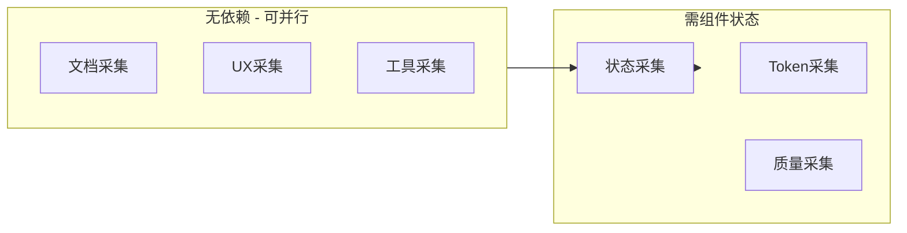

---
