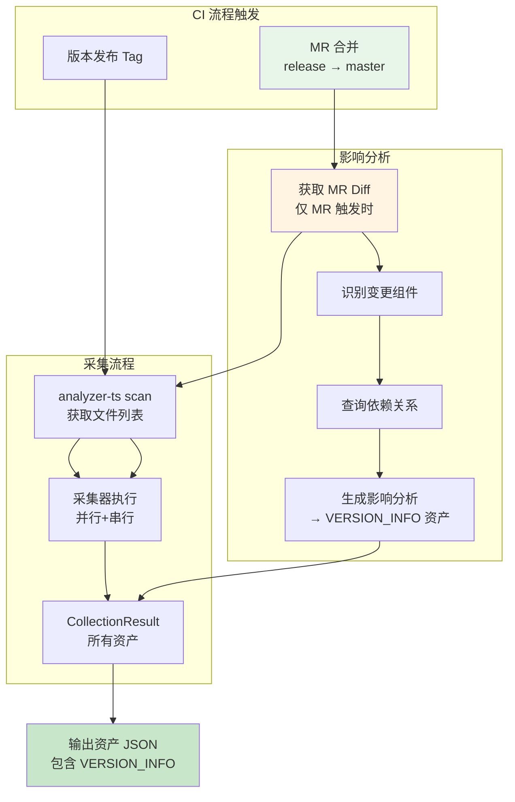
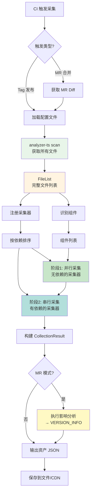
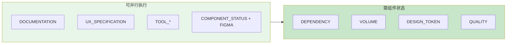
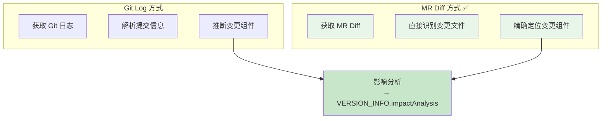
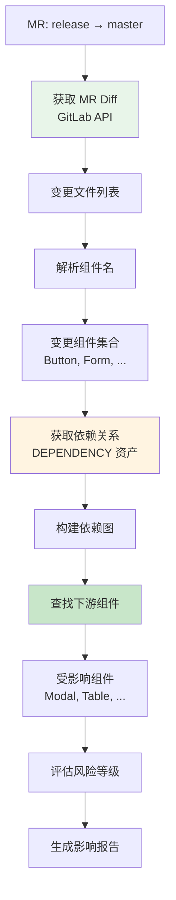
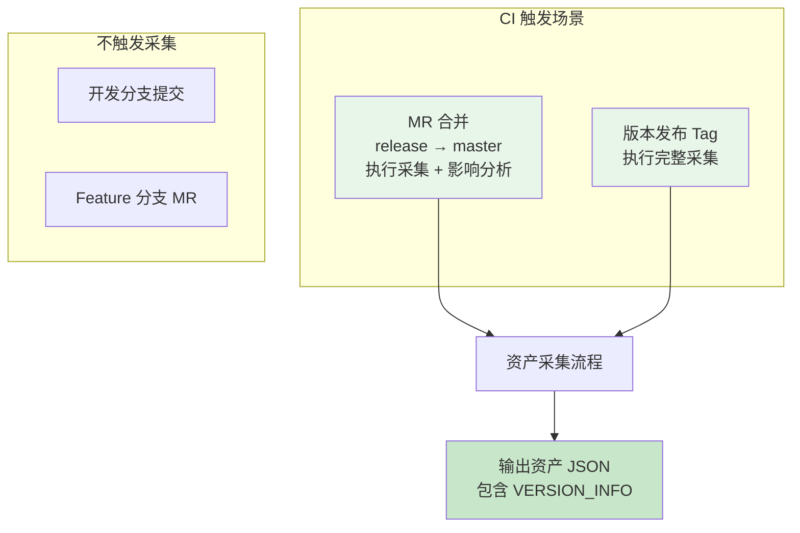

# 资产采集框架实施计划
> **目标**: 创建 `@yy/asset-collector` npm 包，实现组件库资产的自动采集  
**状态**: 实施计划  
**版本**: v1.0.0
>

---

## 一、项目概述
### 1.1 目标
创建一个可复用的资产采集框架 npm 包，用于组件库资产的自动采集，支持：

+ ✅ 组件库维度资产：文档、UX规范、工具配置、组件状态、版本信息
+ ✅ 单组件维度资产：依赖、体积、Design Token、Figma 链接、代码质量
+ ✅ 基于 MR 的影响范围评估
+ ✅ CI/CD 自动化集成

### 1.2 核心流程


**关键点**：

1. 所有资产采集都由 CI 流程触发，无需手动执行
2. MR 触发时会额外执行影响分析，结果存入 VERSION_INFO 资产
3. 最终输出统一的资产 JSON，包含所有采集的资产类型

---

## 二、NPM 仓库创建
### 2.1 初始化项目
```bash
# 1. 创建项目目录
mkdir @yy/asset-collector
cd @yy/asset-collector

# 2. 初始化 npm 项目
npm init -y

# 3. 安装核心依赖
npm install --save-dev typescript @types/node
npm install --save-dev @microsoft/tsdoc

# 4. 初始化 TypeScript
npx tsc --init
```

### 2.2 package.json 配置
```json
{
  "name": "@yy/asset-collector",
  "version": "1.0.0",
  "description": "组件库资产自动采集框架",
  "main": "dist/index.js",
  "types": "dist/index.d.ts",
  "bin": {
    "asset-collector": "dist/cli.js"
  },
  "files": ["dist", "README.md"],
  "scripts": {
    "build": "tsc",
    "dev": "tsc --watch",
    "prepublishOnly": "npm run build"
  },
  "keywords": ["asset", "collector", "component-library", "analyzer-ts"],
  "license": "MIT",
  "peerDependencies": {
    "@yy/analyzer-ts": ">=1.0.0"
  },
  "devDependencies": {
    "typescript": "^5.0.0",
    "@types/node": "^20.0.0"
  }
}
```

### 2.3 tsconfig.json 配置
```json
{
  "compilerOptions": {
    "target": "ES2020",
    "module": "commonjs",
    "lib": ["ES2020"],
    "outDir": "./dist",
    "rootDir": "./src",
    "declaration": true,
    "declarationMap": true,
    "sourceMap": true,
    "strict": true,
    "esModuleInterop": true,
    "skipLibCheck": true,
    "forceConsistentCasingInFileNames": true,
    "resolveJsonModule": true,
    "moduleResolution": "node"
  },
  "include": ["src/**/*"],
  "exclude": ["node_modules", "dist"]
}
```

### 2.4 项目目录结构
```plain
@yy/asset-collector/
├── src/
│   ├── core/
│   │   ├── interfaces.ts           # 核心接口定义
│   │   ├── coordinator.ts          # 采集协调器
│   │   ├── registry.ts             # 采集器注册表
│   │   └── types.ts                # 类型定义
│   ├── collectors/
│   │   ├── base-collector.ts       # 采集器基类
│   │   ├── library/
│   │   │   ├── documentation.ts    # 文档采集器
│   │   │   ├── ux.ts               # UX 规范采集器
│   │   │   ├── tool.ts             # 工具资产采集器
│   │   │   ├── status.ts           # 组件状态采集器
│   │   │   └── version.ts          # 版本信息采集器
│   │   └── component/
│   │       ├── dependency.ts       # 依赖采集器
│   │       ├── volume.ts           # 体积采集器
│   │       ├── token.ts            # Token 采集器
│   │       └── quality.ts          # 质量采集器
│   ├── adapters/
│   │   ├── analyzer-adapter.ts     # analyzer-ts 适配器
│   │   ├── git-adapter.ts          # Git 适配器
│   │   └── token-adapter.ts        # Token 提取适配器
│   ├── storage/
│   │   ├── interface.ts            # 存储接口
│   │   ├── cdn-adapter.ts          # CDN 存储适配器
│   │   └── database-adapter.ts     # 数据库存储适配器
│   ├── utils/
│   │   ├── hash.ts                 # 哈希工具
│   │   └── logger.ts               # 日志工具
│   ├── cli.ts                      # CLI 入口
│   └── index.ts                    # 库入口
├── templates/
│   └── .asset-collector.config.json  # 默认配置模板
├── package.json
├── tsconfig.json
├── README.md
└── LICENSE
```

---

## 三、采集流程详解
### 3.1 完整采集流程


### 3.2 分步执行说明
#### 步骤 1：加载配置
```typescript
// 1. 读取配置文件 .asset-collector.config.json
// 2. 合并默认配置
// 3. 验证配置有效性
const config = await loadConfig(configPath);
```

#### 步骤 2：扫描文件
```bash
# 调用 analyzer-ts 获取完整文件列表
analyzer-ts scan -i /path/to/project -o /tmp/scan-result.json
```

**输出示例**：

```json
{
  "root": "/path/to/project",
  "fileList": {
    "src/Button/index.tsx": { "size": 2048, "extension": ".tsx" },
    "src/Button/style.less": { "size": 1024, "extension": ".less" },
    "docs/guide.md": { "size": 512, "extension": ".md" }
  }
}
```

#### 步骤 3：识别组件
```typescript
// 从 FileList + 入口文件解析
// 识别所有导出的组件及其状态
const components = identifyComponents(fileList, entryFile);
```

#### 步骤 4：执行采集器
```typescript
// 第一批：并行执行无依赖的采集器
const batch1 = [
  'DocumentationCollector',   // 文档资产
  'UXCollector',              // UX 规范
  'ToolCollector',            // 工具资产
  'ComponentStatusCollector'  // 组件状态 + Figma
];

// 第二批：串行执行有依赖的采集器
const batch2 = [
  'DependencyCollector',  // 依赖 COMPONENT_STATUS
  'VolumeCollector',      // 依赖 COMPONENT_STATUS
  'TokenCollector',       // 依赖 COMPONENT_STATUS
  'QualityCollector'      // 依赖 COMPONENT_STATUS
];
```

#### 步骤 5：构建结果
```typescript
const result: CollectionResult = {
  lib: '@yy/sl-admin-components',
  ver: '2.60.2',
  collectedAt: new Date().toISOString(),
  ci: { buildId, sha, branch },
  assets: allAssets  // 扁平化的资产数组
};
```

### 3.3 采集器依赖关系


---

## 四、配置文件设计
### 4.1 主配置文件：.asset-collector.config.json
```json
{
  "$schema": "https://raw.githubusercontent.com/yy/asset-collector/main/schema/config.schema.json",

  "project": {
    "name": "@yy/sl-admin-components",
    "root": ".",
    "entryFile": "src/index.ts",
    "componentsRoot": "src/components"
  },

  "collectors": {
    "enabled": ["*"],
    "disabled": [],
    "options": {
      "documentation": {
        "includePaths": ["docs/**/*.md", "*.md"],
        "excludePaths": ["node_modules/**", "dist/**"]
      },
      "ux": {
        "configFile": ".asset-yuque.json"
      },
      "tool": {
        "configFile": ".asset-repos.json",
        "cacheDir": ".asset-cache/repos"
      },
      "quality": {
        "testCommand": "npm test",
        "coverageThreshold": 80
      }
    }
  },

  "adapters": {
    "analyzer": {
      "command": "analyzer-ts",
      "timeout": 30000,
      "scanOptions": {
        "include": ["src/**/*", "docs/**/*"],
        "exclude": ["node_modules/**", "dist/**", "**/*.test.ts"]
      }
    },
    "git": {
      "defaultBranch": "master"
    }
  },

  "output": {
    "format": "json",
    "path": "./assets/assets.json",
    "indent": 2
  },

  "storage": {
    "type": "file",
    "cdn": {
      "enabled": false,
      "url": "",
      "uploadCommand": ""
    }
  }
}
```

### 4.2 关联仓库配置：.asset-repos.json
```json
{
  "relatedRepos": [
    {
      "name": "eslint-config",
      "url": "git@gitlab.com:yy/eslint-config.git",
      "branch": "master",
      "assets": ["TOOL_ESLINT"],
      "configPath": "index.js"
    },
    {
      "name": "stylelint-config",
      "url": "git@gitlab.com:yy/stylelint-config.git",
      "branch": "master",
      "assets": ["TOOL_STYLELINT"],
      "configPath": "index.js"
    },
    {
      "name": "playground",
      "url": "git@gitlab.com:yy/playground.git",
      "branch": "develop",
      "assets": ["TOOL_PLAYGROUND"],
      "configPath": "vite.config.ts"
    }
  ]
}
```

### 4.3 语雀配置：.asset-yuque.json
```json
{
  "baseUrl": "https://www.yuque.com/api/v2",
  "token": "${YUQUE_TOKEN}",
  "repos": [
    {
      "name": "字体规范",
      "id": "yy/team/wiki/font-guide",
      "type": "font"
    },
    {
      "name": "色彩规范",
      "id": "yy/team/wiki/color-guide",
      "type": "color"
    },
    {
      "name": "日期规范",
      "id": "yy/team/wiki/date-guide",
      "type": "date"
    },
    {
      "name": "间距规范",
      "id": "yy/team/wiki/spacing-guide",
      "type": "spacing"
    }
  ]
}
```

---

## 五、analyzer-ts 能力扩展需求
### 5.1 现有能力评估
| 能力 | 现有支持 | 需求 |
| --- | --- | --- |
| `scan` | ✅ 支持 | 扫描所有文件类型 |
| `query` | ✅ 支持 | AST 查询 |
| `component-deps` | ✅ 支持 | 组件依赖分析 |
| `count-any` | ✅ 支持 | 类型安全检查 |
| `count-as` | ✅ 支持 | 类型断言统计 |
| JSDoc 解析 | ⚠️ 部分支持 | 需要提取自定义标签 |


### 5.2 需要扩展的能力
#### 5.2.1 JSDoc 自定义标签解析
**需求**：支持提取 `@figma`、`@deprecated`、`@experimental` 等自定义标签

**期望输出**：

```json
// 输入：Button/index.tsx
/**
 * Button 组件
 * @deprecated 请使用 ButtonV2
 * @figma https://figma.com/file/xxx/Button
 */
export const Button = (props: ButtonProps) => { ... };

// 期望输出
{
  "name": "Button",
  "jsDoc": {
    "description": "Button 组件",
    "tags": [
      { "tagName": "deprecated", "value": "请使用 ButtonV2" },
      { "tagName": "figma", "value": "https://figma.com/file/xxx/Button" }
    ]
  }
}
```

**实现方式**：

```go
// 在 analyzer-ts 中扩展 JSDoc 解析器
type JSDocTag struct {
    TagName string `json:"tagName"`
    Value   string `json:"value"`
}

type JSDoc struct {
    Description string      `json:"description"`
    Tags        []JSDocTag `json:"tags"`
}

// 扩展 query 命令支持
analyzer-ts query 'exports.*.{name,jsDoc{tags}}' -o result.json
```

#### 5.2.2 文件列表扩展属性
**需求**：scan 输出需要包含更多信息

**期望输出**：

```json
{
  "root": "/path/to/project",
  "fileList": {
    "src/Button/index.tsx": {
      "size": 2048,
      "extension": ".tsx",
      "lines": 85,           // 新增：行数
      "hash": "sha256:..."   // 新增：内容哈希
    }
  }
}
```

#### 5.2.3 导出关系查询
**需求**：查询组件的所有导出（包括命名导出、默认导出）

```bash
# 新增命令
analyzer-ts exports --entry src/index.ts --format json
```

**输出**：

```json
{
  "exports": [
    {
      "name": "Button",
      "type": "named",
      "source": "src/components/Button/index.tsx",
      "jsDoc": { ... }
    },
    {
      "name": "Form",
      "type": "named",
      "source": "src/components/Form/index.tsx",
      "jsDoc": { ... }
    }
  ]
}
```

### 5.3 扩展实现优先级
| 优先级 | 能力 | 复杂度 | 重要性 |
| --- | --- | --- | --- |
| P0 | JSDoc 自定义标签解析 | 中 | 🔴 必需 |
| P0 | 文件列表扩展属性 | 低 | 🔴 必需 |
| P1 | 导出关系查询 | 中 | 🟡 重要 |
| P2 | 样式文件 Token 提取 | 高 | 🟢 可选 |


---

## 六、MR 触发的影响范围评估
> **说明**：影响分析结果作为 VERSION_INFO 资产的 `impactAnalysis` 字段存储，不是独立的输出。
>

### 6.1 设计思路
**传统方式 vs MR 方式**：



**优势**：

+ ✅ 不需要解析 Git 日志
+ ✅ 直接获取变更的文件列表
+ ✅ 更准确，不会遗漏
+ ✅ 支持按 MR 维度追溯历史
+ ✅ 影响分析作为资产的一部分，可统一管理和查询

### 6.2 触发方式
#### GitLab CI 配置
```yaml
# .gitlab-ci.yml
stages:
  - collect
  - impact

# MR 合并到 master 时触发
assets:collect:
  stage: collect
  only:
    - merge_requests
  variables:
    MR_TARGET_BRANCH: $CI_MERGE_REQUEST_TARGET_BRANCH_NAME
    MR_SOURCE_BRANCH: $CI_MERGE_REQUEST_SOURCE_BRANCH_NAME
    MR_IID: $CI_MERGE_REQUEST_IID
  script:
    - npm install -g @yy/asset-collector
    - asset-collector collect --mode mr --mr-iid $MR_IID
  artifacts:
    paths:
      - assets/
    reports:
      # 影响分析作为 VERSION_INFO 资产的一部分
      version_info: assets/assets.json
```

### 6.3 影响分析流程


### 6.4 实现代码
```typescript
class MRImpactAnalyzer {
  async analyzeImpact(mrIid: number): Promise<ImpactReport> {
    // 1. 获取 MR Diff（通过 GitLab API 或 git 命令）
    const diff = await this.getMRDiff(mrIid);

    // 2. 解析变更文件，识别组件
    const changedComponents = this.parseChangedComponents(diff.changedFiles);

    // 3. 获取依赖关系资产
    const depAssets = await this.getDependencyAssets();

    // 4. 构建依赖图
    const depGraph = this.buildDependencyGraph(depAssets);

    // 5. 查找下游组件
    const affectedComponents = this.findAffectedComponents(
      changedComponents,
      depGraph
    );

    // 6. 评估风险等级
    const riskLevel = this.assessRisk(changedComponents, affectedComponents);

    return {
      mr: {
        iid: mrIid,
        targetBranch: 'master',
        sourceBranch: 'release/2.60.2'
      },
      changedFiles: diff.changedFiles,
      changedComponents,
      affectedComponents,
      riskLevel,
      recommendations: this.generateRecommendations(riskLevel)
    };
  }

  private async getMRDiff(mrIid: number): Promise<MRDiff> {
    // 方式1: 通过 GitLab API
    // const response = await gitlabApi.getMergeRequestChanges(mrIid);

    // 方式2: 通过 git 命令（本地执行）
    const { execSync } = require('child_process');
    const diffOutput = execSync(
      `git diff origin/master...HEAD --name-only`,
      { encoding: 'utf-8' }
    );

    return {
      changedFiles: diffOutput.split('\n').filter(Boolean)
    };
  }

  private parseChangedComponents(files: string[]): string[] {
    const components = new Set<string>();

    for (const file of files) {
      // 解析路径: src/components/Button/index.tsx -> Button
      const match = file.match(/src\/components\/([^\/]+)/);
      if (match) {
        components.add(match[1]);
      }
    }

    return Array.from(components);
  }

  private findAffectedComponents(
    changed: string[],
    depGraph: Map<string, string[]>
  ): string[] {
    const affected = new Set<string>();

    for (const component of changed) {
      // 查找依赖此组件的所有组件
      const downstream = depGraph.get(component) || [];
      downstream.forEach(comp => affected.add(comp));
    }

    return Array.from(affected);
  }

  private assessRisk(
    changed: string[],
    affected: string[]
  ): 'low' | 'medium' | 'high' {
    const total = changed.length + affected.length;

    if (total === 0) return 'low';
    if (total <= 3) return 'low';
    if (total <= 10) return 'medium';
    return 'high';
  }
}
```

### 6.5 输出格式
影响分析结果作为 VERSION_INFO 资产的一部分：

```typescript
// VERSION_INFO 资产内容
interface VersionInfoContent {
  currentVersion: string;
  releaseDate: string;
  changelog: ChangelogEntry[];

  // MR 触发时包含此字段
  impactAnalysis?: {
    mr: {
      iid: number;
      targetBranch: string;
      sourceBranch: string;
      url: string;
    };
    changedFiles: string[];
    changedComponents: string[];
    affectedComponents: string[];
    riskLevel: 'low' | 'medium' | 'high';
    recommendations: {
      reviewAreas: string[];
      testSuggestions: string[];
      notifyTeams: string[];
    };
  };
}
```

**示例输出**：

```json
{
  "assets": [
    {
      "id": "asset-version-info-001",
      "type": "version_info",
      "name": "版本信息",
      "ownerId": "library",
      "ownerType": "library",
      "content": {
        "currentVersion": "2.60.2",
        "releaseDate": "2024-01-29",
        "changelog": [
          {
            "version": "2.60.2",
            "date": "2024-01-29",
            "type": "minor",
            "changes": [
              {
                "type": "changed",
                "component": "Button",
                "description": "优化 Button 组件的 onClick 类型定义"
              },
              {
                "type": "added",
                "component": "Form",
                "description": "新增 Form.List 组件"
              }
            ]
          }
        ],
        "impactAnalysis": {
          "mr": {
            "iid": 1234,
            "targetBranch": "master",
            "sourceBranch": "release/2.60.2",
            "url": "https://gitlab.com/yy/sl-admin-components/-/merge_requests/1234"
          },
          "changedFiles": [
            "src/components/Button/index.tsx",
            "src/components/Form/index.tsx",
            "docs/button.md"
          ],
          "changedComponents": ["Button", "Form"],
          "affectedComponents": ["Modal", "Table", "DataPicker"],
          "riskLevel": "medium",
          "recommendations": {
            "reviewAreas": [
              "Button 组件 API 变更",
              "Form 组件表单验证逻辑"
            ],
            "testSuggestions": [
              "回归测试: Modal 组件（依赖 Button）",
              "回归测试: Table 组件（依赖 Form）",
              "回归测试: DataPicker 组件（依赖 Form）"
            ],
            "notifyTeams": ["@frontend-team", "@ux-team"]
          }
        }
      },
      "collectedAt": "2024-01-29T10:30:00Z",
      "collectionMethod": "mr_impact_analysis"
    }
  ]
}
```

---

## 七、CLI 命令设计
> **说明**：CLI 主要用于本地开发和调试，生产环境通过 CI 流程触发
>

### 7.1 命令结构
```bash
# 本地开发：完整采集（模拟 CI 行为）
asset-collector collect

# 本地开发：MR 模式（模拟 MR 触发）
asset-collector collect --mode mr --mr-iid 1234

# 本地开发：指定输出路径
asset-collector collect --output ./assets/result.json

# 本地开发：仅采集组件库维度
asset-collector collect --scope library

# 本地开发：仅采集特定组件
asset-collector collect --component Button

# 初始化配置文件
asset-collector init

# 验证配置文件
asset-collector validate

# 查看采集器列表
asset-collector list-collectors

# 查看采集器详情
asset-collector info component-status
```

### 7.2 命令选项
```typescript
interface CollectOptions {
  // 基础选项
  projectRoot?: string;        // 项目根目录
  config?: string;             // 配置文件路径

  // 采集范围
  scope?: 'library' | 'component' | 'all';
  component?: string;          // 特定组件

  // MR 模式（本地调试用）
  mode?: 'full' | 'mr';
  mrIid?: number;              // MR IID（本地调试时模拟）

  // 输出选项
  output?: string;
  format?: 'json' | 'yaml';

  // 调试选项
  verbose?: boolean;
  dryRun?: boolean;
  debug?: boolean;
}
```

### 7.3 本地开发 vs CI 环境
| 场景 | 触发方式 | 输出位置 | 影响分析 |
| --- | --- | --- | --- |
| **本地开发** | CLI 命令 | 本地文件系统 | 可选（--mode mr） |
| **CI 环境** | GitLab CI | Artifacts / CDN | MR 自动执行，Tag 不执行 |


---

## 八、CI/CD 集成方案
### 8.1 触发场景


**关键点**：

+ ✅ 只有 `release → master` 的 MR 才触发采集
+ ✅ 只有版本 Tag 才触发完整采集
+ ❌ 普通开发分支、Feature MR 不触发

### 8.2 GitLab CI 配置
```yaml
# .gitlab-ci.yml
stages:
  - install
  - collect
  - deploy

variables:
  npm_config_cache: "/tmp/npm-cache"

# 安装依赖
install:
  stage: install
  script:
    - npm ci --cache /tmp/npm-cache --prefer-offline
  cache:
    paths:
      - node_modules/
      - .asset-cache/
  only:
    - master
    - /^release\/.*$/

# 资产采集（MR 触发）
assets:collect:mr:
  stage: collect
  dependencies:
    - install
  only:
    - merge_requests
  variables:
    MR_MODE: "true"
  script:
    - npm install -g @yy/asset-collector
    - asset-collector collect --mode mr --mr-iid $CI_MERGE_REQUEST_IID
  artifacts:
    paths:
      - assets/
    reports:
      # 影响分析作为 VERSION_INFO 资产的一部分
      version_info: assets/assets.json
    expire_in: 1 week

# 资产采集（Tag 发布触发）
assets:collect:tag:
  stage: collect
  dependencies:
    - install
  only:
    - tags
  script:
    - npm install -g @yy/asset-collector
    - asset-collector collect
  artifacts:
    paths:
      - assets/
    expire_in: 1 week

# 部署到 CDN
assets:deploy:
  stage: deploy
  dependencies:
    - assets:collect:mr
    - assets:collect:tag
  only:
    - master
    - tags
  script:
    - ./scripts/upload-to-cdn.sh assets/
```

### 8.3 GitHub Actions 配置
```yaml
# .github/workflows/asset-collector.yml
name: Asset Collector

on:
  push:
    tags:
      - 'v*'
  pull_request:
    branches: [master]
    types: [closed]

jobs:
  # PR 合并到 master 时触发
  collect-on-pr:
    if: github.event.pull_request.merged == true
    runs-on: ubuntu-latest
    steps:
      - uses: actions/checkout@v3
        with:
          fetch-depth: 0

      - name: Setup Node.js
        uses: actions/setup-node@v3
        with:
          node-version: '18'

      - name: Install dependencies
        run: npm ci

      - name: Install asset-collector
        run: npm install -g @yy/asset-collector

      - name: Collect assets with impact analysis
        run: asset-collector collect --mode mr --mr-iid ${{ github.event.pull_request.number }}

      - name: Upload artifacts
        uses: actions/upload-artifact@v3
        with:
          name: assets
          path: assets/

  # Tag 发布时触发
  collect-on-tag:
    if: startsWith(github.ref, 'refs/tags/')
    runs-on: ubuntu-latest
    steps:
      - uses: actions/checkout@v3

      - name: Setup Node.js
        uses: actions/setup-node@v3
        with:
          node-version: '18'

      - name: Install dependencies
        run: npm ci

      - name: Install asset-collector
        run: npm install -g @yy/asset-collector

      - name: Collect assets
        run: asset-collector collect

      - name: Upload artifacts
        uses: actions/upload-artifact@v3
        with:
          name: assets
          path: assets/

      - name: Deploy to CDN
        run: ./scripts/upload-to-cdn.sh assets/
```

### 8.4 影响报告作为 VERSION_INFO 资产
MR 触发采集时，影响分析结果会作为 `VERSION_INFO` 资产的 `impactAnalysis` 字段存储：

```json
{
  "lib": "@yy/sl-admin-components",
  "ver": "2.60.2",
  "collectedAt": "2024-01-29T10:30:00Z",
  "ci": {
    "buildId": 12345,
    "sha": "abc123",
    "branch": "release/2.60.2"
  },
  "assets": [
    {
      "id": "asset-version-info-001",
      "type": "version_info",
      "name": "版本信息",
      "ownerId": "library",
      "ownerType": "library",
      "content": {
        "currentVersion": "2.60.2",
        "releaseDate": "2024-01-29",
        "changelog": [...],
        "impactAnalysis": {           // MR 触发时包含此字段
          "mr": {
            "iid": 1234,
            "url": "https://gitlab.com/..."
          },
          "changedComponents": ["Button", "Form"],
          "affectedComponents": ["Modal", "Table"],
          "riskLevel": "medium",
          "recommendations": {...}
        }
      },
      "collectedAt": "2024-01-29T10:30:00Z",
      "collectionMethod": "mr_impact_analysis"
    },
    // ... 其他资产
  ]
}
```

---

## 九、开发步骤
### 9.1 第一阶段：核心框架（Week 1-2）
- [ ] 初始化 npm 项目
- [ ] 定义核心接口和类型
- [ ] 实现 BaseCollector 基类
- [ ] 实现 CollectorRegistry 注册表
- [ ] 实现 CollectionCoordinator 协调器
- [ ] 实现 CLI 入口
- [ ] 编写单元测试

### 9.2 第二阶段：适配器层（Week 2-3）
- [ ] 实现 AnalyzerAdapter
- [ ] 实现 GitAdapter
- [ ] 实现 TokenAdapter
- [ ] 编写集成测试

### 9.3 第三阶段：采集器实现（Week 3-4）
**组件库维度**：

- [ ] DocumentationCollector
- [ ] UXCollector
- [ ] ToolCollector
- [ ] ComponentStatusCollector（含 Figma）
- [ ] VersionInfoCollector

**单组件维度**：

- [ ] DependencyCollector
- [ ] VolumeCollector
- [ ] TokenCollector
- [ ] QualityCollector

### 9.4 第四阶段：MR 影响分析（Week 4-5）
- [ ] 实现 MRImpactAnalyzer
- [ ] 集成 GitLab API
- [ ] 实现风险等级评估
- [ ] 生成影响报告

### 9.5 第五阶段：CI 集成（Week 5-6）
- [ ] GitLab CI 配置
- [ ] GitHub Actions 配置
- [ ] 自动化测试
- [ ] 文档完善

### 9.6 第六阶段：发布（Week 6）
- [ ] 代码审查
- [ ] 性能测试
- [ ] 发布到 npm
- [ ] 编写使用文档

---

## 十、验收标准
### 10.1 功能验收
- [ ] 支持采集所有 11 种资产类型
- [ ] 支持 MR 触发的影响分析
- [ ] 支持配置文件驱动
- [ ] CLI 命令正常工作

### 10.2 质量验收
- [ ] 代码覆盖率 > 80%
- [ ] TypeScript 编译无错误
- [ ] 所有采集器有错误处理

### 10.3 性能验收
- [ ] 单个组件采集 < 30 秒
- [ ] 全量采集 < 5 分钟
- [ ] MR 影响分析 < 1 分钟

---
