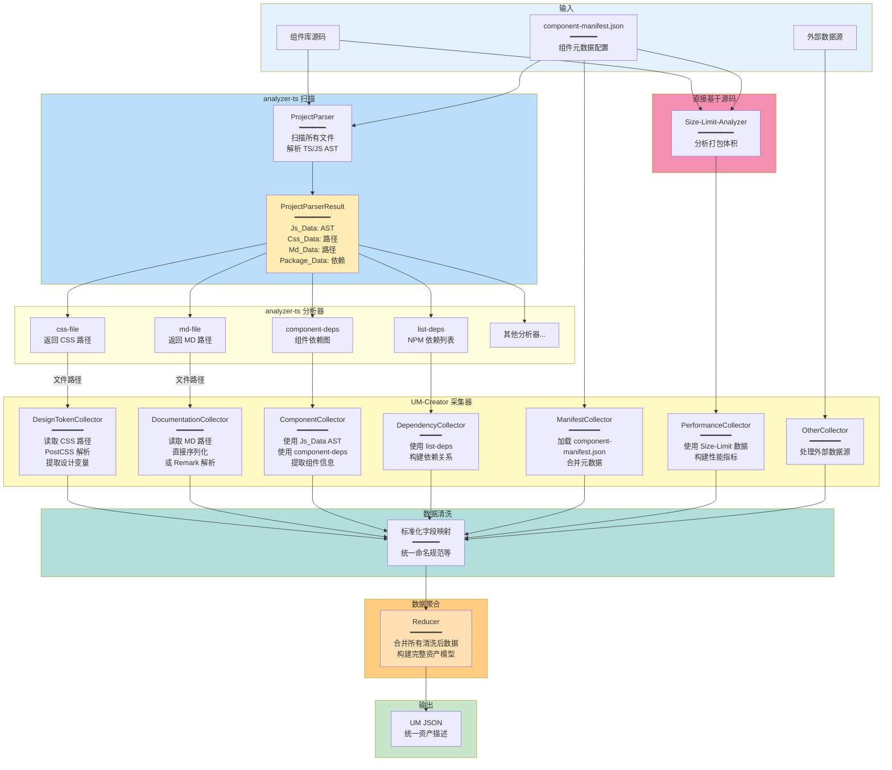
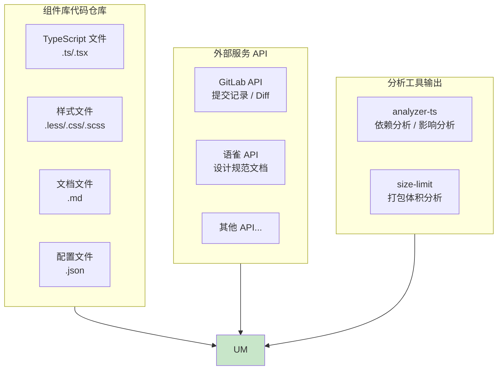
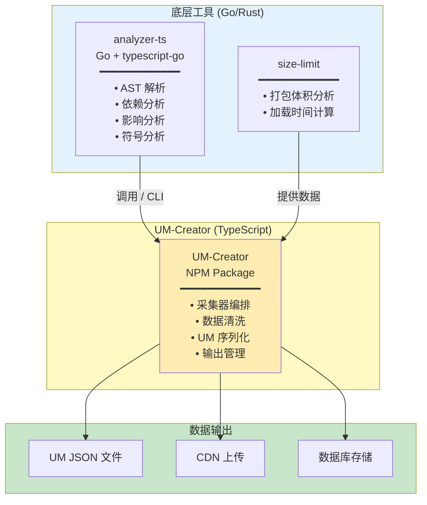
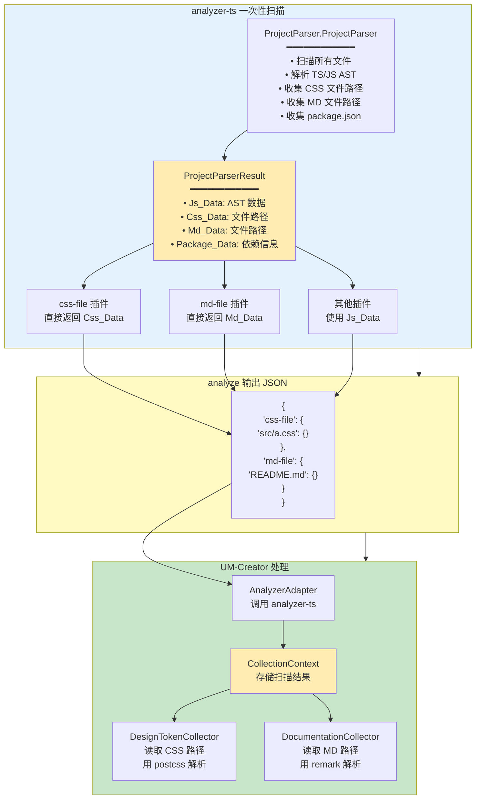
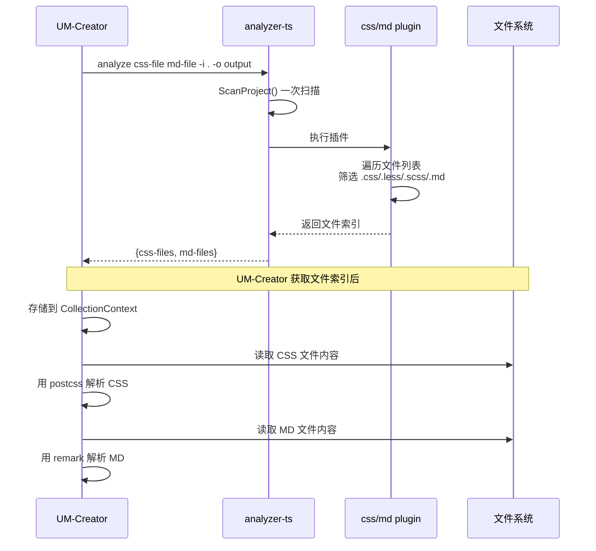
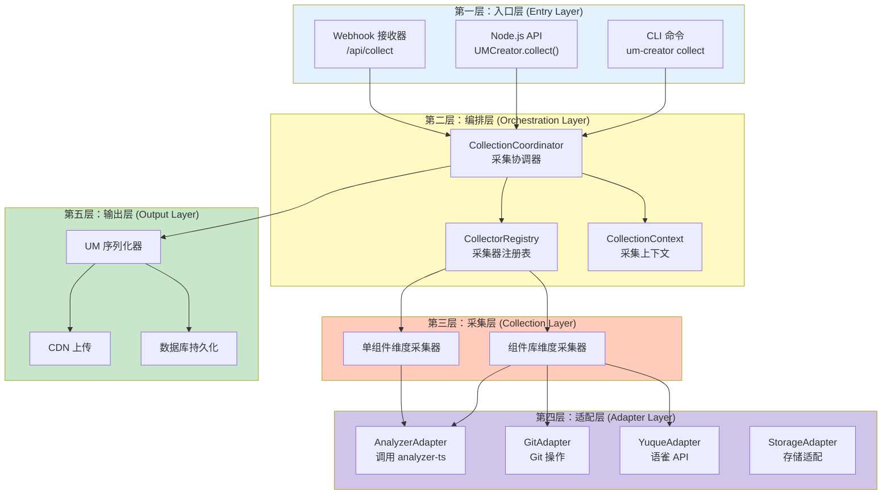
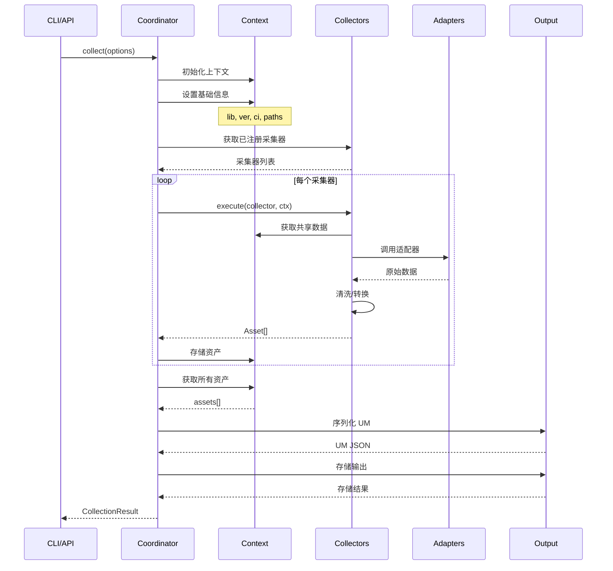
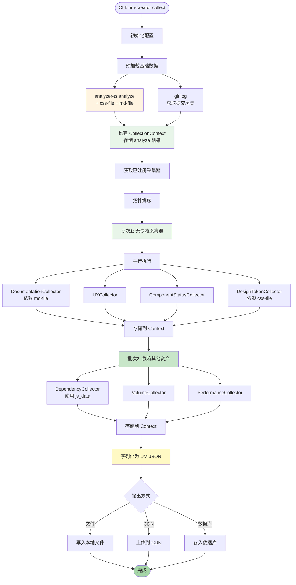
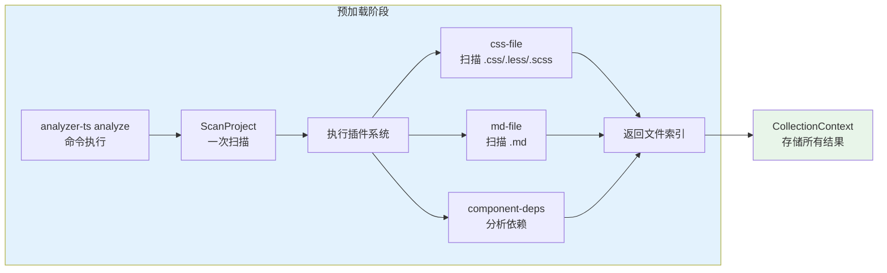
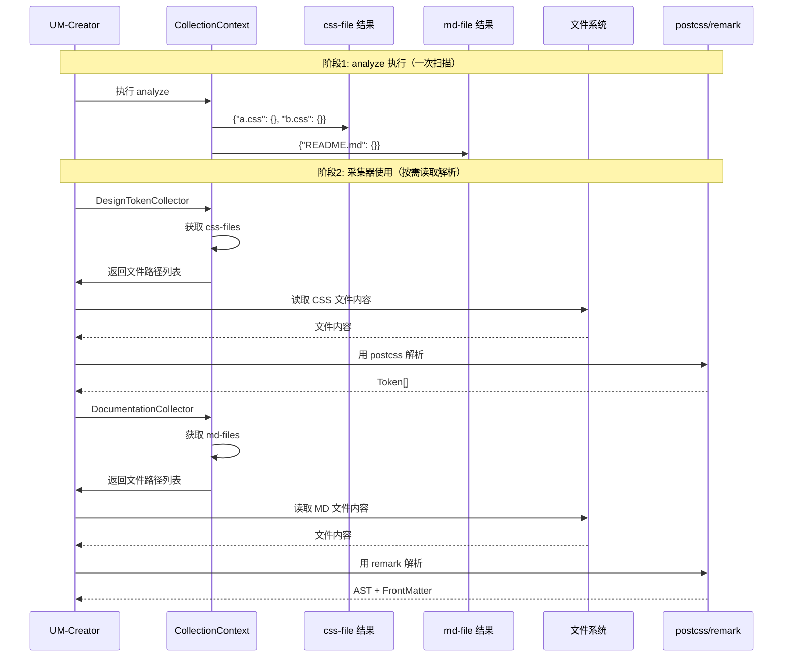

# UM-Creator 架构设计

> **版本**: v1.0.0
> **状态**: 技术设计
> **目标**: 设计并实现资产统一模型（UM）的构建器

---

## 一、设计概述

### 1.1 核心定位

**UM-Creator** 是一个独立的资产构建工具，负责从多种数据源采集资产信息，并将其转换为统一的 **UM（Unified Model）** JSON 格式。

#### 数据处理流程



#### 数据源详解



### 1.2 设计原则

| 原则             | 说明                           | 实现方式                |
| ---------------- | ------------------------------ | ----------------------- |
| **零侵入** | 不依赖组件库代码或构建配置     | 独立扫描、自包含依赖    |
| **可组合** | 采集器可独立开发、测试、组合   | 插件化架构 + 标准接口   |
| **可追溯** | 支持历史版本重建               | Git checkout + 全量构建 |
| **可扩展** | 新增资产类型无需修改核心       | 注册机制 + 工厂模式     |
| **高性能** | 最大化数据复用，最小化重复扫描 | 共享上下文 + 缓存机制   |

### 1.3 与现有工具的关系



**架构说明**：

| 层级             | 技术栈                  | 职责                      |
| ---------------- | ----------------------- | ------------------------- |
| **工具层** | Go (analyzer-ts)        | 提供底层代码分析能力      |
| **构建层** | TypeScript (UM-Creator) | 编排采集流程，输出标准 UM |
| **输出层** | JSON / CDN / DB         | 存储和分发资产数据        |

### 1.4 插件化架构（CSS/MD 处理）

UM-Creator 通过 **analyzer-ts** 一次性扫描获取所有文件索引，包括 CSS/MD 文件路径。



**关键设计**：

- **一次扫描，多次使用**：`ProjectParser` 执行一次文件系统扫描，同时收集所有文件类型
- **路径占位**：`Css_Data` 和 `Md_Data` 只存储文件路径（空结构体），实际内容由 UM-Creator 按需解析
- **零重复扫描**：`css-file` 和 `md-file` 插件直接从 `ProjectParserResult` 读取数据，不重复扫描文件系统

#### 关键交互



#### analyze 输出示例

```json
{
  "css-file": {
    "src/components/Button/style.css": {},
    "src/Form/style.less": {}
  },
  "md-file": {
    "README.md": {},
    "docs/guide.md": {}
  }
}
```

---

## 二、整体架构设计

### 2.1 分层架构



### 2.2 核心数据流



---

## 三、核心模块设计

### 3.1 目录结构

```
@yy/um-creator/
├── src/
│   ├── core/                           # 核心模块
│   │   ├── types.ts                    # 核心类型定义
│   │   ├── um-model.ts                 # UM 模型定义
│   │   ├── coordinator.ts              # 采集协调器
│   │   ├── registry.ts                 # 采集器注册表
│   │   └── context.ts                  # 采集上下文
│   │
│   ├── collectors/                     # 采集器
│   │   ├── base-collector.ts           # 基础采集器
│   │   ├── collector-interface.ts      # 采集器接口
│   │   ├── library/                    # 组件库维度采集器
│   │   │   ├── documentation.collector.ts
│   │   │   ├── ux-specification.collector.ts
│   │   │   ├── tool-asset.collector.ts
│   │   │   ├── component-status.collector.ts
│   │   │   └── version-info.collector.ts
│   │   └── component/                  # 单组件维度采集器
│   │       ├── dependency.collector.ts
│   │       ├── volume.collector.ts
│   │       ├── design-token.collector.ts
│   │       ├── quality.collector.ts
│   │       └── performance.collector.ts
│   │
│   ├── adapters/                       # 适配器层
│   │   ├── analyzer.adapter.ts         # analyzer-ts 适配器
│   │   ├── git.adapter.ts              # Git 操作适配器
│   │   ├── yuque.adapter.ts            # 语雀 API 适配器
│   │   ├── size-limit.adapter.ts       # size-limit 适配器
│   │   └── storage.adapter.ts          # 存储适配器
│   │
│   ├── serializers/                    # 序列化器
│   │   ├── um-serializer.ts            # UM 序列化器
│   │   └── cdn-uploader.ts             # CDN 上传器
│   │
│   ├── utils/                          # 工具函数
│   │   ├── file-utils.ts               # 文件操作
│   │   ├── hash-utils.ts               # 哈希计算
│   │   └── logger.ts                   # 日志工具
│   │
│   └── cli/                            # CLI 入口
│       ├── index.ts                    # CLI 主入口
│       ├── commands/
│       │   ├── collect.ts              # collect 命令
│       │   └── validate.ts             # validate 命令
│       └── utils/
│           └── progress.ts             # 进度显示
│
├── templates/                          # 配置模板
│   └── um-creator.config.template.json
│
├── package.json
├── tsconfig.json
├── README.md
└── LICENSE
```

### 3.2 核心类型定义

```typescript
// src/core/types.ts

/**
 * 资产类型枚举
 */
export enum AssetType {
  // 组件库维度
  DOCUMENTATION = 'doc',
  UX_SPECIFICATION = 'design',
  TOOL_ESLINT = 'tool',
  TOOL_STYLELINT = 'tool',
  TOOL_PLAYGROUND = 'tool',
  COMPONENT_STATUS = 'component',

  // 单组件维度
  DEPENDENCY = 'deps',
  VOLUME = 'perf',
  DESIGN_TOKEN = 'design',
  QUALITY = 'test',
  PERFORMANCE = 'perf',

  // 版本相关
  CHANGELOG = 'changelog',
}

/**
 * 所属类型
 */
export enum OwnerType {
  LIBRARY = 'library',
  COMPONENT = 'component',
}

/**
 * UM 统一模型
 *
 * 这是所有资产输出的标准格式
 */
export interface UnifiedModel {
  // 核心标识
  id: string;                    // 唯一标识，格式：{assetType}:{ownerId}:{name}
  lib: string;                   // 组件库包名，如 @yy/sl-admin-components
  ver: string;                   // 语义化版本

  // 资产分类
  assetType: AssetType;          // 资产类型
  subType?: string;              // 子类型，可选的细化分类

  // 元信息
  mime: string;                  // MIME 类型
  size: number;                  // 内容大小（字节）
  hash: string;                  // 内容哈希，格式：sha256:xxx

  // CI 信息
  ci: {
    buildId: number;             // 构建 ID
    sha: string;                 // Git 提交 SHA
    branch: string;              // 分支名称
  };

  // 资源定位
  urls: {
    dev?: string;                // 开发环境 URL
    test?: string;               // 测试环境 URL
    prod: string;                // 生产环境 URL
  };

  // 扩展元数据
  meta: Record<string, any>;
}

/**
 * 采集选项
 */
export interface CollectionOptions {
  // 项目信息
  projectRoot: string;           // 项目根目录
  libraryName: string;           // 组件库名称
  version: string;               // 版本号

  // CI 信息
  buildId?: number;
  gitSha?: string;
  gitBranch?: string;

  // 采集范围
  scope?: 'library' | 'component' | 'all';
  components?: string[];         // 指定采集的组件

  // 输出配置
  output?: {
    format: 'json' | 'yaml';
    path: string;
    upload?: boolean;
  };

  // 高级选项
  parallel?: boolean;            // 是否并行执行
  cache?: boolean;               // 是否使用缓存
  verbose?: boolean;             // 详细输出
}
```

### 3.3 采集器接口

```typescript
// src/collectors/collector-interface.ts

import { CollectionContext, CollectionResult } from '../core/context';

/**
 * 采集器接口
 *
 * 所有采集器必须实现此接口
 */
export interface ICollector {
  /**
   * 采集器名称，用于日志和标识
   */
  readonly name: string;

  /**
   * 此采集器产出的资产类型
   */
  readonly assetTypes: AssetType[];

  /**
   * 采集维度：library 或 component
   */
  readonly dimension: 'library' | 'component';

  /**
   * 依赖的资产类型
   * 用于确定采集器的执行顺序
   */
  readonly dependencies?: AssetType[];

  /**
   * 判断是否应该跳过此采集器
   */
  shouldSkip?(ctx: CollectionContext): boolean | Promise<boolean>;

  /**
   * 验证执行条件
   */
  validate?(ctx: CollectionContext): boolean | Promise<boolean>;

  /**
   * 执行采集
   */
  collect(ctx: CollectionContext): Promise<Asset[]>;
}

/**
 * 基础采集器抽象类
 *
 * 提供通用功能实现
 */
export abstract class BaseCollector implements ICollector {
  abstract readonly name: string;
  abstract readonly assetTypes: AssetType[];
  abstract readonly dimension: 'library' | 'component';
  readonly dependencies?: AssetType[] = [];

  /**
   * 创建标准资产对象
   */
  protected createAsset(
    type: AssetType,
    name: string,
    ownerId: string,
    ownerType: OwnerType,
    content: any,
    method: string,
    ctx: CollectionContext
  ): Asset {
    const contentStr = JSON.stringify(content);
    const hash = this.computeHash(contentStr);

    return {
      id: this.generateId(type, ownerId, name),
      lib: ctx.libraryName,
      ver: ctx.version,
      assetType: type,
      name,
      ownerId,
      ownerType,
      content,
      mime: this.inferMimeType(type, content),
      size: Buffer.byteLength(contentStr, 'utf8'),
      hash,
      collectedAt: new Date().toISOString(),
      collectionMethod: method,
    };
  }

  /**
   * 生成资产 ID
   */
  protected generateId(type: AssetType, ownerId: string, name: string): string {
    return `${type}:${ownerId}:${name}`;
  }

  /**
   * 计算内容哈希
   */
  protected computeHash(content: string): string {
    return `sha256:${createHash('sha256').update(content).digest('hex')}`;
  }

  /**
   * 推断 MIME 类型
   */
  protected inferMimeType(type: AssetType, content: any): string {
    const mimeMap: Record<AssetType, string> = {
      [AssetType.DOCUMENTATION]: 'application/json',
      [AssetType.UX_SPECIFICATION]: 'application/json',
      [AssetType.TOOL_ESLINT]: 'application/json',
      [AssetType.COMPONENT_STATUS]: 'application/json',
      [AssetType.DEPENDENCY]: 'application/json',
      [AssetType.VOLUME]: 'application/json',
      [AssetType.DESIGN_TOKEN]: 'application/json',
      [AssetType.QUALITY]: 'application/json',
      [AssetType.PERFORMANCE]: 'application/json',
      [AssetType.CHANGELOG]: 'application/json',
    };
    return mimeMap[type] || 'application/json';
  }
}
```

### 3.4 采集协调器

```typescript
// src/core/coordinator.ts

import { CollectorRegistry } from './registry';
import { CollectionContext, CollectionResult } from './context';
import { ICollector } from '../collectors/collector-interface';
import { UMSerializer } from '../serializers/um-serializer';

/**
 * 采集协调器
 *
 * 负责编排所有采集器的执行流程
 */
export class CollectionCoordinator {
  private registry: CollectorRegistry;
  private serializer: UMSerializer;

  constructor() {
    this.registry = new CollectorRegistry();
    this.serializer = new UMSerializer();
  }

  /**
   * 注册采集器
   */
  register(collector: ICollector): void {
    this.registry.register(collector);
  }

  /**
   * 批量注册采集器
   */
  registerAll(collectors: ICollector[]): void {
    collectors.forEach(c => this.register(c));
  }

  /**
   * 执行采集
   */
  async collect(options: CollectionOptions): Promise<CollectionResult> {
    console.log(`🚀 开始采集 ${options.libraryName}@${options.version}`);

    // 1. 初始化上下文
    const ctx = await this.initializeContext(options);

    // 2. 获取排序后的采集器
    const collectors = this.registry.getSortedCollectors();
    console.log(`📋 已注册 ${collectors.length} 个采集器`);

    // 3. 分批执行
    const allAssets: Asset[] = [];
    const batches = this.groupByDependencies(collectors);

    for (let i = 0; i < batches.length; i++) {
      const batch = batches[i];
      console.log(`\n[批次 ${i + 1}/${batches.length}] 执行 ${batch.length} 个采集器`);

      const batchAssets = await this.executeBatch(batch, ctx);
      allAssets.push(...batchAssets);

      // 将批次结果存入上下文，供下一批使用
      ctx.storeAssets(batchAssets);
    }

    console.log(`\n✅ 采集完成，共生成 ${allAssets.length} 个资产`);

    // 4. 序列化为 UM
    const umList = this.serializer.serialize(allAssets, ctx);

    // 5. 返回结果
    return {
      meta: {
        lib: ctx.libraryName,
        ver: ctx.version,
        collectedAt: new Date().toISOString(),
        assetCount: allAssets.length,
        ci: ctx.ci,
      },
      assets: umList,
    };
  }

  /**
   * 初始化上下文
   */
  private async initializeContext(options: CollectionOptions): Promise<CollectionContext> {
    const ctx = new CollectionContext({
      libraryName: options.libraryName,
      version: options.version,
      projectRoot: options.projectRoot,
      ci: {
        buildId: options.buildId ?? 0,
        sha: options.gitSha ?? '',
        branch: options.gitBranch ?? '',
      },
      options,
    });

    // 预加载基础数据
    await ctx.preload();

    return ctx;
  }

  /**
   * 按依赖关系分组
   */
  private groupByDependencies(collectors: ICollector[]): ICollector[][] {
    const groups: ICollector[][] = [];
    const processed = new Set<string>();

    let remaining = [...collectors];

    while (remaining.length > 0) {
      // 找出无依赖或依赖已满足的采集器
      const ready = remaining.filter(c =>
        !c.dependencies ||
        c.dependencies.length === 0 ||
        c.dependencies.every(dep => processed.has(dep))
      );

      if (ready.length === 0) {
        throw new Error('Circular dependency detected in collectors');
      }

      groups.push(ready);
      ready.forEach(c => processed.add(c.name));
      remaining = remaining.filter(c => !ready.includes(c));
    }

    return groups;
  }

  /**
   * 执行一批采集器
   */
  private async executeBatch(
    collectors: ICollector[],
    ctx: CollectionContext
  ): Promise<Asset[]> {
    const results = await Promise.allSettled(
      collectors.map(c => this.executeCollector(c, ctx))
    );

    const assets: Asset[] = [];

    for (let i = 0; i < results.length; i++) {
      const result = results[i];
      const collector = collectors[i];

      if (result.status === 'fulfilled') {
        assets.push(...result.value);
        console.log(`  ✅ ${collector.name}: ${result.value.length} 个资产`);
      } else {
        console.error(`  ❌ ${collector.name}: ${result.reason}`);
        // 根据配置决定是否继续
        if (!ctx.options.continueOnError) {
          throw result.reason;
        }
      }
    }

    return assets;
  }

  /**
   * 执行单个采集器
   */
  private async executeCollector(
    collector: ICollector,
    ctx: CollectionContext
  ): Promise<Asset[]> {
    // 检查是否跳过
    if (collector.shouldSkip && await collector.shouldSkip(ctx)) {
      console.log(`  ⊘ ${collector.name}: 跳过`);
      return [];
    }

    // 验证条件
    if (collector.validate && !await collector.validate(ctx)) {
      throw new Error(`${collector.name} validation failed`);
    }

    // 执行采集
    return collector.collect(ctx);
  }
}
```

---

## 四、采集器实现

### 4.1 组件状态采集器

```typescript
// src/collectors/library/component-status.collector.ts

import { BaseCollector } from '../base-collector';
import { AssetType, OwnerType } from '../../core/types';
import { CollectionContext } from '../../core/context';

/**
 * 组件状态采集器
 *
 * 采集组件库中所有组件的状态信息：
 * - 标准组件 (standard)
 * - 实验组件 (experimental)
 * - 废弃组件 (deprecated)
 *
 * 同时从 JSDoc 提取 Figma 链接
 */
export class ComponentStatusCollector extends BaseCollector {
  readonly name = 'component-status';
  readonly assetTypes = [AssetType.COMPONENT_STATUS];
  readonly dimension: 'library' = 'library';
  readonly dependencies = [];

  async collect(ctx: CollectionContext): Promise<Asset[]> {
    const assets: Asset[] = [];

    // 1. 使用 analyzer-ts 解析入口文件
    const entryFiles = await this.findEntryFiles(ctx);
    const exports = await ctx.adapters.analyzer.queryExports(entryFiles);

    // 2. 分析每个组件的状态
    const components = await Promise.all(
      exports.map(async (exp) => {
        const jsDoc = await this.extractJSDoc(exp, ctx);
        const status = this.determineStatus(jsDoc);

        // 提取 Figma 链接
        const figmaLink = this.extractFigmaLink(jsDoc);
        if (figmaLink) {
          assets.push(this.createFigmaAsset(exp.name, figmaLink, jsDoc, ctx));
        }

        return {
          name: exp.name,
          status,
          exported: true,
          hasDocs: await this.hasDocumentation(exp.name, ctx),
          figmaLink,
          entryPath: exp.sourcePath,
        };
      })
    );

    // 3. 统计信息
    const summary = {
      standard: components.filter(c => c.status === 'standard').length,
      experimental: components.filter(c => c.status === 'experimental').length,
      deprecated: components.filter(c => c.status === 'deprecated').length,
      total: components.length,
    };

    // 4. 创建资产
    assets.push(
      this.createAsset(
        AssetType.COMPONENT_STATUS,
        '组件状态',
        'library',
        OwnerType.LIBRARY,
        { components, summary },
        'ast_parse',
        ctx
      )
    );

    return assets;
  }

  private async findEntryFiles(ctx: CollectionContext): Promise<string[]> {
    // 查找 src/index.ts 或类似入口文件
    const possibleEntries = [
      'src/index.ts',
      'src/index.tsx',
      'packages/atlas/src/index.ts',
    ];

    for (const entry of possibleEntries) {
      const fullPath = path.join(ctx.projectRoot, entry);
      if (await fs.pathExists(fullPath)) {
        return [fullPath];
      }
    }

    throw new Error('Cannot find entry file');
  }

  private determineStatus(jsDoc: JSDocInfo): 'standard' | 'experimental' | 'deprecated' {
    if (jsDoc.tags?.some(t => t.name === 'deprecated')) {
      return 'deprecated';
    }
    if (jsDoc.tags?.some(t => t.name === 'experimental')) {
      return 'experimental';
    }
    return 'standard';
  }

  private extractFigmaLink(jsDoc: JSDocInfo): string | undefined {
    const figmaTag = jsDoc.tags?.find(t => t.name === 'figma');
    return figmaTag?.value;
  }

  private createFigmaAsset(
    componentName: string,
    url: string,
    jsDoc: JSDocInfo,
    ctx: CollectionContext
  ): Asset {
    return this.createAsset(
      AssetType.FIGMA,
      `${componentName} Figma`,
      componentName,
      OwnerType.COMPONENT,
      {
        url,
        description: jsDoc.description,
      },
      'jsdoc_extract',
      ctx
    );
  }
}
```

### 4.2 依赖采集器

```typescript
// src/collectors/component/dependency.collector.ts

import { BaseCollector } from '../base-collector';
import { AssetType, OwnerType } from '../../core/types';
import { CollectionContext } from '../../core/context';

/**
 * 组件依赖采集器
 *
 * 采集单个组件的依赖信息：
 * - 内部组件依赖
 * - 外部 NPM 包依赖
 */
export class DependencyCollector extends BaseCollector {
  readonly name = 'dependency';
  readonly assetTypes = [AssetType.DEPENDENCY];
  readonly dimension: 'component' = 'component';
  readonly dependencies = [AssetType.COMPONENT_STATUS]; // 需要组件列表

  async collect(ctx: CollectionContext): Promise<Asset[]> {
    const assets: Asset[] = [];

    // 1. 获取组件列表（从 COMPONENT_STATUS 资产中）
    const components = await this.getComponentList(ctx);

    // 2. 分析每个组件的依赖
    for (const component of components) {
      const deps = await this.analyzeComponentDeps(component, ctx);

      assets.push(
        this.createAsset(
          AssetType.DEPENDENCY,
          `${component.name} 依赖信息`,
          component.name,
          OwnerType.COMPONENT,
          deps,
          'ast_parse',
          ctx
        )
      );
    }

    return assets;
  }

  private async analyzeComponentDeps(
    component: ComponentInfo,
    ctx: CollectionContext
  ): Promise<DependencyContent> {
    // 1. 获取组件的所有文件
    const compFiles = await this.getComponentFiles(component.name, ctx);

    // 2. 使用 analyzer-ts 分析依赖
    const depsResult = await ctx.adapters.analyzer.analyzeDeps({
      files: compFiles,
      filters: {
        // 过滤掉内部文件引用
        excludeInternal: true,
        // 只保留有价值的依赖
        excludeTypes: ['node_modules/@types'],
      },
    });

    // 3. 分类：内部 vs 外部
    const internalDependencies: InternalDep[] = [];
    const externalPackages: ExternalPackage[] = [];

    for (const dep of depsResult.dependencies) {
      if (this.isInternalComponent(dep)) {
        internalDependencies.push({
          component: this.extractComponentName(dep),
          strength: this.calculateStrength(dep),
        });
      } else {
        externalPackages.push({
          name: dep.packageName,
          version: dep.version,
          imports: dep.imports.length,
        });
      }
    }

    return {
      componentName: component.name,
      internalDependencies,
      externalPackages,
      summary: {
        internalCount: internalDependencies.length,
        externalCount: externalPackages.length,
        totalImports: depsResult.totalImports,
      },
    };
  }

  private isInternalComponent(dep: Dependency): boolean {
    return dep.source.startsWith('src/components/') ||
           dep.source.startsWith('packages/atlas/src/components/');
  }

  private extractComponentName(dep: Dependency): string {
    const match = dep.source.match(/src\/components\/([^\/]+)/);
    return match ? match[1] : dep.source;
  }

  private calculateStrength(dep: Dependency): number {
    // 根据导入次数和类型计算耦合强度
    const typeWeight = dep.importType === 'default' ? 1 : 0.8;
    return dep.imports.length * typeWeight;
  }
}
```

### 4.3 性能采集器

```typescript
// src/collectors/component/performance.collector.ts

import { BaseCollector } from '../base-collector';
import { AssetType, OwnerType } from '../../core/types';
import { CollectionContext } from '../../core/context';

/**
 * 组件性能采集器
 *
 * 采集组件的性能指标：
 * - 打包体积
 * - 渲染性能
 * - 加载时间
 */
export class PerformanceCollector extends BaseCollector {
  readonly name = 'performance';
  readonly assetTypes = [AssetType.PERFORMANCE];
  readonly dimension: 'component' = 'component';
  readonly dependencies = [AssetType.COMPONENT_STATUS];

  async collect(ctx: CollectionContext): Promise<Asset[]> {
    const assets: Asset[] = [];
    const components = await this.getComponentList(ctx);

    for (const component of components) {
      const perf = await this.analyzeComponentPerformance(component, ctx);

      assets.push(
        this.createAsset(
          AssetType.PERFORMANCE,
          `${component.name} 性能指标`,
          component.name,
          OwnerType.COMPONENT,
          perf,
          'size_limit_analyzer',
          ctx
        )
      );
    }

    return assets;
  }

  private async analyzeComponentPerformance(
    component: ComponentInfo,
    ctx: CollectionContext
  ): Promise<PerformanceContent> {
    // 1. 使用 size-limit 分析打包体积
    const sizeResult = await ctx.adapters.sizeLimit.analyze({
      entry: component.entryPath,
      projectRoot: ctx.projectRoot,
    });

    // 2. 运行性能基准测试（可选）
    const renderMetrics = await this.runRenderBenchmarks(component, ctx);

    return {
      componentName: component.name,
      bundle: {
        size: sizeResult.size,
        gzip: sizeResult.gzip,
        brotli: sizeResult.brotli,
        loadingTime: sizeResult.estimatedLoadingTime,
      },
      render: renderMetrics,
      summary: {
        score: this.calculatePerformanceScore(sizeResult, renderMetrics),
        grade: this.getPerformanceGrade(sizeResult, renderMetrics),
      },
    };
  }

  private calculatePerformanceScore(
    bundle: BundleSize,
    render?: RenderMetrics
  ): number {
    // 简化的性能评分算法
    let score = 100;

    // 体积惩罚
    if (bundle.size > 100 * 1024) score -= 20;
    else if (bundle.size > 50 * 1024) score -= 10;

    // 渲染惩罚
    if (render) {
      if (render.mountTime > 100) score -= 10;
      else if (render.mountTime > 50) score -= 5;
    }

    return Math.max(0, score);
  }

  private getPerformanceGrade(
    bundle: BundleSize,
    render?: RenderMetrics
  ): 'A' | 'B' | 'C' | 'D' | 'F' {
    const score = this.calculatePerformanceScore(bundle, render);
    if (score >= 90) return 'A';
    if (score >= 80) return 'B';
    if (score >= 70) return 'C';
    if (score >= 60) return 'D';
    return 'F';
  }
}
```

---

## 五、UM 序列化器

```typescript
// src/serializers/um-serializer.ts

import { Asset } from '../collectors/collector-interface';
import { CollectionContext } from '../core/context';
import { UnifiedModel, AssetType } from '../core/types';

/**
 * UM 序列化器
 *
 * 将采集到的 Asset 对象转换为标准的 UM JSON 格式
 */
export class UMSerializer {
  /**
   * 序列化所有资产为 UM 列表
   */
  serialize(assets: Asset[], ctx: CollectionContext): UnifiedModel[] {
    return assets.map(asset => this.serializeAsset(asset, ctx));
  }

  /**
   * 序列化单个资产
   */
  private serializeAsset(asset: Asset, ctx: CollectionContext): UnifiedModel {
    const um: UnifiedModel = {
      id: asset.id,
      lib: ctx.libraryName,
      ver: ctx.version,
      assetType: asset.assetType,
      subType: asset.subType,
      mime: asset.mime,
      size: asset.size,
      hash: asset.hash,
      ci: {
        buildId: ctx.ci.buildId,
        sha: ctx.ci.sha,
        branch: ctx.ci.branch,
      },
      urls: this.generateUrls(asset, ctx),
      meta: this.buildMeta(asset, ctx),
    };

    return um;
  }

  /**
   * 生成资源 URL
   */
  private generateUrls(asset: Asset, ctx: CollectionContext): UnifiedModel['urls'] {
    const baseUrl = this.getBaseUrl(ctx);
    const assetPath = this.getAssetPath(asset, ctx);

    const urls: UnifiedModel['urls'] = {
      prod: `${baseUrl.prod}/${assetPath}`,
    };

    if (baseUrl.dev) {
      urls.dev = `${baseUrl.dev}/${assetPath}`;
    }

    if (baseUrl.test) {
      urls.test = `${baseUrl.test}/${assetPath}`;
    }

    return urls;
  }

  /**
   * 获取资产路径
   */
  private getAssetPath(asset: Asset, ctx: CollectionContext): string {
    const typeDir = this.getAssetTypeDir(asset.assetType);
    const ownerDir = asset.ownerType === 'component'
      ? `components/${asset.ownerId}`
      : 'library';

    return `${ctx.version}/${ownerDir}/${typeDir}/${asset.name}.json`;
  }

  /**
   * 获取资产类型目录
   */
  private getAssetTypeDir(type: AssetType): string {
    const dirMap: Record<AssetType, string> = {
      [AssetType.DOCUMENTATION]: 'docs',
      [AssetType.UX_SPECIFICATION]: 'ux',
      [AssetType.TOOL_ESLINT]: 'tools/eslint',
      [AssetType.COMPONENT_STATUS]: 'status',
      [AssetType.DEPENDENCY]: 'dependencies',
      [AssetType.VOLUME]: 'volume',
      [AssetType.DESIGN_TOKEN]: 'tokens',
      [AssetType.QUALITY]: 'quality',
      [AssetType.PERFORMANCE]: 'performance',
      [AssetType.CHANGELOG]: 'changelog',
    };
    return dirMap[type] || 'other';
  }

  /**
   * 构建元数据
   */
  private buildMeta(asset: Asset, ctx: CollectionContext): Record<string, any> {
    return {
      name: asset.name,
      ownerId: asset.ownerId,
      ownerType: asset.ownerType,
      collectedAt: asset.collectedAt,
      collectionMethod: asset.collectionMethod,
      content: asset.content,
    };
  }

  /**
   * 获取基础 URL 配置
   */
  private getBaseUrl(ctx: CollectionContext): { prod: string; dev?: string; test?: string } {
    return {
      prod: process.env.CDN_PROD_URL || 'https://cdn.example.com',
      dev: process.env.CDN_DEV_URL,
      test: process.env.CDN_TEST_URL,
    };
  }
}
```

---

## 六、执行流程图（基于插件化架构）



### 执行流程说明

#### 阶段1：预加载数据



#### 阶段2：采集器执行

```mermaid
flowchart TD
    subgraph 采集器与数据源关系
        CTX[CollectionContext<br/>包含 analyze 结果]

        subgraph 数据源[analyze 提供的数据]
            CSS[css-file<br/>直接返回文件路径<br/>{"a.css": {}}]
            MD[md-file<br/>直接返回文件路径<br/>{"README.md": {}}]
            JS[js_data<br/>已解析的 AST]
            DEPS[component-deps<br/>依赖关系图]
        end

        subgraph 采集器[采集器使用数据源]
            DC1[DesignTokenCollector<br/>从 CSS 获取文件列表<br/>自己读取并解析]
            DC2[DocumentationCollector<br/>从 MD 获取文件列表<br/>自己读取并解析]
            DC3[DependencyCollector<br/>直接使用 js_data]
            DC4[ComponentStatusCollector<br/>直接使用 js_data]
        end
    end

    CTX --> DC1
    CTX --> DC2
    CTX --> DC3
    CTX --> DC4

    CSS -.->|只提供路径| DC1
    MD -.->|只提供路径| DC2
    JS --> DC3
    JS --> DC4
    DEPS --> DC3

    style CTX fill:#ffecb3
    style 数据源 fill:#e8f5e9
    style 采集器 fill:#c8e6c9
```

#### 关键点：CSS/MD 处理流程



---

## 七、使用示例

### 7.1 CLI 使用

```bash
# 基础使用
um-creator collect \
  --project-root /path/to/admin-components \
  --library-name @yy/sl-admin-components \
  --version 2.60.2

# CI 环境使用
um-creator collect \
  --project-root . \
  --library-name @yy/sl-admin-components \
  --version 2.60.2 \
  --build-id ${CI_BUILD_ID} \
  --git-sha ${CI_COMMIT_SHA} \
  --git-branch ${CI_COMMIT_REF_NAME} \
  --output upload

# 只采集组件库维度
um-creator collect \
  --project-root . \
  --scope library

# 只采集特定组件
um-creator collect \
  --project-root . \
  --components Button,Form,Table
```

### 7.2 API 使用

```typescript
import { UMCreator } from '@yy/um-creator';

const creator = new UMCreator({
  libraryName: '@yy/sl-admin-components',
  projectRoot: '/path/to/project',
  adapters: {
    analyzer: new AnalyzerAdapter({ executable: 'analyzer-ts' }),
    git: new GitAdapter(),
    sizeLimit: new SizeLimitAdapter(),
  },
});

// 注册采集器
creator.registerCollectors([
  new DocumentationCollector(),
  new ComponentStatusCollector(),
  new DependencyCollector(),
  new PerformanceCollector(),
]);

// 执行采集
const result = await creator.collect({
  version: '2.60.2',
  buildId: 123,
  gitSha: 'abc123',
  gitBranch: 'main',
});

console.log(`采集完成，生成 ${result.assets.length} 个 UM`);

// 输出
await creator.output(result, {
  format: 'json',
  path: './assets/output.json',
  upload: true,
});
```

---

## 八、输出结构

### 8.1 UM JSON 目录结构

```
assets/
├── versions/
│   ├── v2.60.2/
│   │   ├── index.json                    # 索引文件
│   │   ├── library/                      # 组件库维度
│   │   │   ├── docs/
│   │   │   │   └── documentation.json
│   │   │   ├── ux/
│   │   │   │   └── specifications.json
│   │   │   └── status/
│   │   │       └── component-status.json
│   │   └── components/                   # 单组件维度
│   │       ├── Button/
│   │       │   ├── dependency.json
│   │       │   ├── volume.json
│   │       │   ├── performance.json
│   │       │   └── quality.json
│   │       ├── Form/
│   │       │   └── ...
│   │       └── Table/
│   │           └── ...
│   └── latest -> v2.60.2
└── versions.json                          # 版本列表
```

### 8.2 单个 UM JSON 示例

```json
{
  "id": "deps:Button:dependency",
  "lib": "@yy/sl-admin-components",
  "ver": "2.60.2",
  "assetType": "deps",
  "subType": "internal",
  "mime": "application/json",
  "size": 1234,
  "hash": "sha256:a1b2c3d4e5f6...",
  "ci": {
    "buildId": 12345,
    "sha": "abc123def456",
    "branch": "main"
  },
  "urls": {
    "prod": "https://cdn.example.com/v2.60.2/components/Button/deps/dependency.json"
  },
  "meta": {
    "name": "dependency",
    "ownerId": "Button",
    "ownerType": "component",
    "collectedAt": "2024-01-28T10:00:00Z",
    "collectionMethod": "ast_parse",
    "content": {
      "componentName": "Button",
      "internalDependencies": [
        {
          "component": "Icon",
          "strength": 0.8
        }
      ],
      "externalPackages": [
        {
          "name": "react",
          "version": "18.2.0",
          "imports": 5
        }
      ]
    }
  }
}
```

---

## 九、与 CI 集成

### 9.1 GitLab CI 示例

```yaml
# .gitlab-ci.yml
assets:collect:
  stage: build
  image: node:18
  script:
    - npm install -g @yy/um-creator
    - um-creator collect \
        --project-root . \
        --library-name @yy/sl-admin-components \
        --version $CI_COMMIT_TAG \
        --build-id $CI_PIPELINE_ID \
        --git-sha $CI_COMMIT_SHA \
        --git-branch $CI_COMMIT_REF_NAME \
        --output upload
  artifacts:
    paths:
      - assets/
  only:
    - tags
```

### 9.2 GitHub Actions 示例

```yaml
# .github/workflows/assets.yml
name: Collect Assets

on:
  push:
    tags:
      - 'v*'

jobs:
  collect:
    runs-on: ubuntu-latest
    steps:
      - uses: actions/checkout@v3
      - uses: actions/setup-node@v3
        with:
          node-version: 18

      - run: npm install -g @yy/um-creator

      - run: um-creator collect \
          --project-root . \
          --library-name @yy/sl-admin-components \
          --version ${{ github.ref_name }} \
          --build-id ${{ github.run_id }} \
          --git-sha ${{ github.sha }} \
          --git-branch ${{ github.ref_name }} \
          --output upload

      - uses: actions/upload-artifact@v3
        with:
          name: assets
          path: assets/
```

---

## 十、扩展性设计

### 10.1 自定义采集器

```typescript
// 自定义采集器示例
export class MyCustomCollector extends BaseCollector {
  readonly name = 'my-custom';
  readonly assetTypes = ['custom' as any];
  readonly dimension: 'component' = 'component';
  readonly dependencies = [AssetType.COMPONENT_STATUS];

  async collect(ctx: CollectionContext): Promise<Asset[]> {
    // 获取组件列表
    const components = await ctx.getComponentList();

    // 自定义采集逻辑
    const assets = components.map(comp => {
      return this.createAsset(
        'custom' as any,
        `Custom ${comp.name}`,
        comp.name,
        OwnerType.COMPONENT,
        { /* 自定义数据 */ },
        'custom_method',
        ctx
      );
    });

    return assets;
  }
}

// 使用
const creator = new UMCreator();
creator.register(new MyCustomCollector());
```

### 10.2 自定义适配器

```typescript
// 自定义 GitLab 适配器
export class GitLabAdapter implements IGitAdapter {
  async getDiff(from: string, to: string): Promise<DiffResult> {
    const api = new GitLabAPI({ token: process.env.GITLAB_TOKEN });
    return api.getDiff(from, to);
  }
}

// 使用
const creator = new UMCreator({
  adapters: {
    git: new GitLabAdapter(),
  },
});
```

---

## 十一、性能优化

### 11.1 并行执行策略

```
批次1（并行）：
  ┌─────────────────────────────────────────┐
  │ DocumentationCollector                   │
  │ UXCollector                              │
  │ ComponentStatusCollector                 │
  └─────────────────────────────────────────┘
                    ↓
            等待全部完成
                    ↓
批次2（并行）：
  ┌─────────────────────────────────────────┐
  │ DependencyCollector (需 Status)          │
  │ VolumeCollector (需 Status)              │
  │ DesignTokenCollector (需 Status)         │
  │ PerformanceCollector (需 Status)         │
  └─────────────────────────────────────────┘
                    ↓
            等待全部完成
```

### 11.2 缓存机制

```typescript
// 采集上下文缓存
class CollectionContext {
  private cache = new Map<string, any>();

  async getWithCache<T>(key: string, factory: () => Promise<T>): Promise<T> {
    if (this.cache.has(key)) {
      return this.cache.get(key) as T;
    }

    const value = await factory();
    this.cache.set(key, value);
    return value;
  }

  // 使用示例
  async getFileList() {
    return this.getWithCache('fileList', () =>
      this.adapters.analyzer.scan(this.projectRoot)
    );
  }
}
```

---

## 十二、总结

UM-Creator 作为一个独立的资产构建工具，具有以下特点：

1. **零侵入**：完全独立，不依赖组件库代码
2. **可扩展**：插件化架构，新增采集器无需修改核心
3. **高性能**：并行执行 + 缓存机制，最大化数据复用
4. **易集成**：NPM 包形式，CLI 和 API 双入口
5. **可追溯**：支持历史版本的全量重建

通过 UM-Creator，组件库的所有资产信息都被统一为标准的 UM JSON 格式，为后续的消费场景（如文档生成、影响分析、性能监控等）提供了统一的数据基础。
