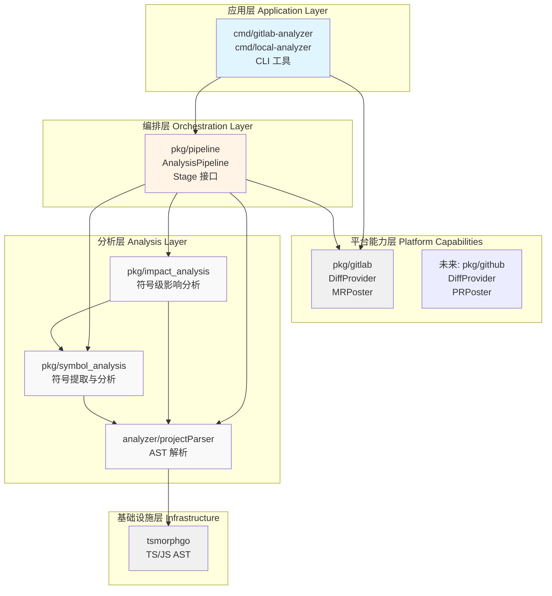
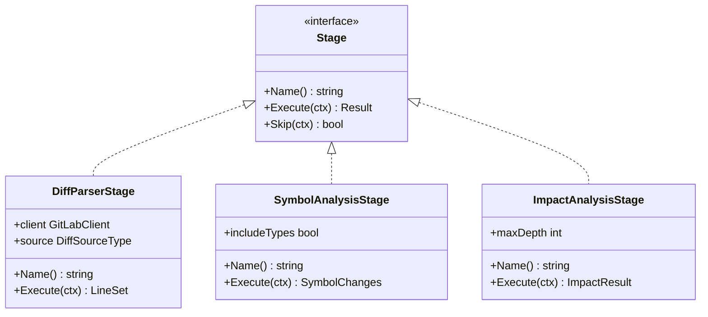
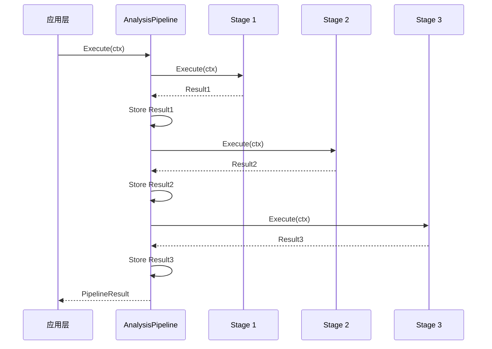
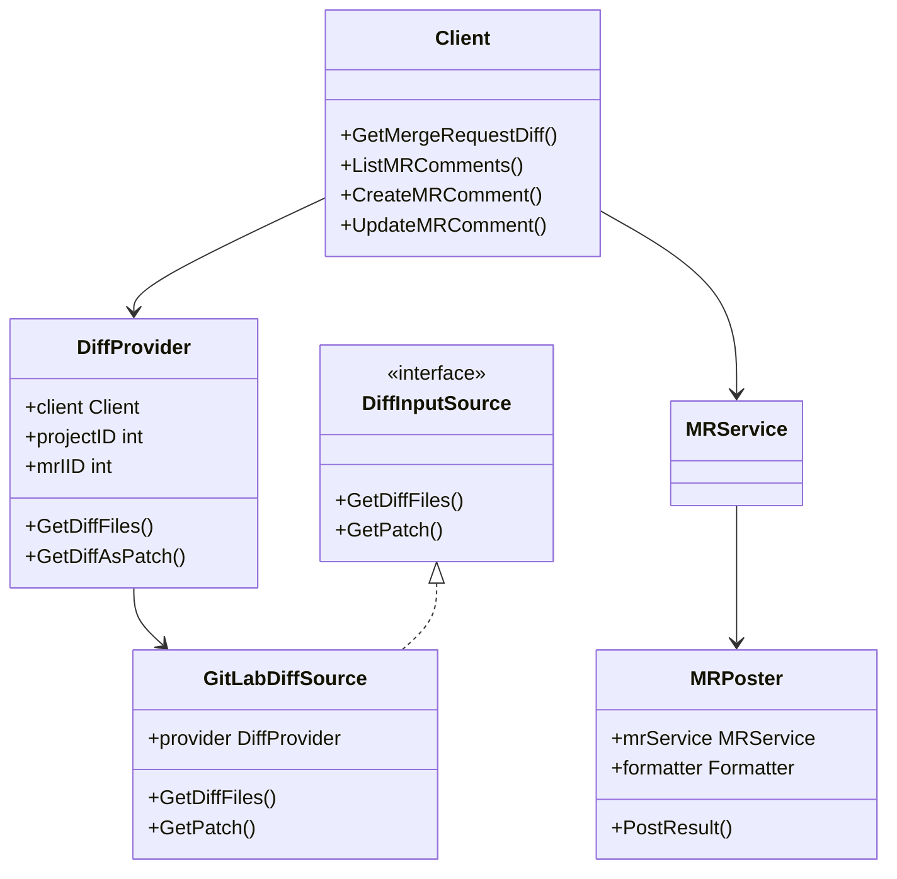
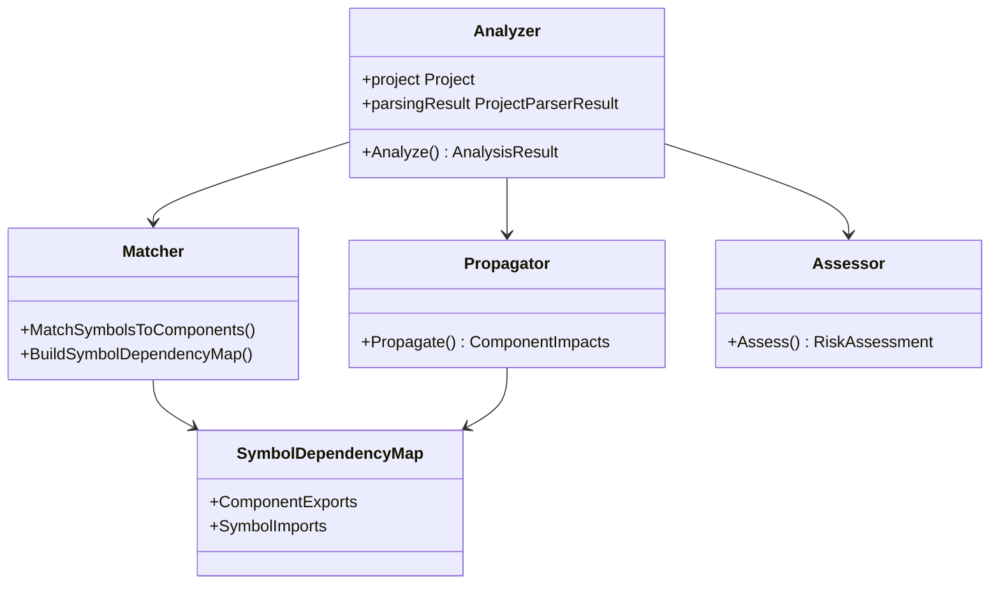
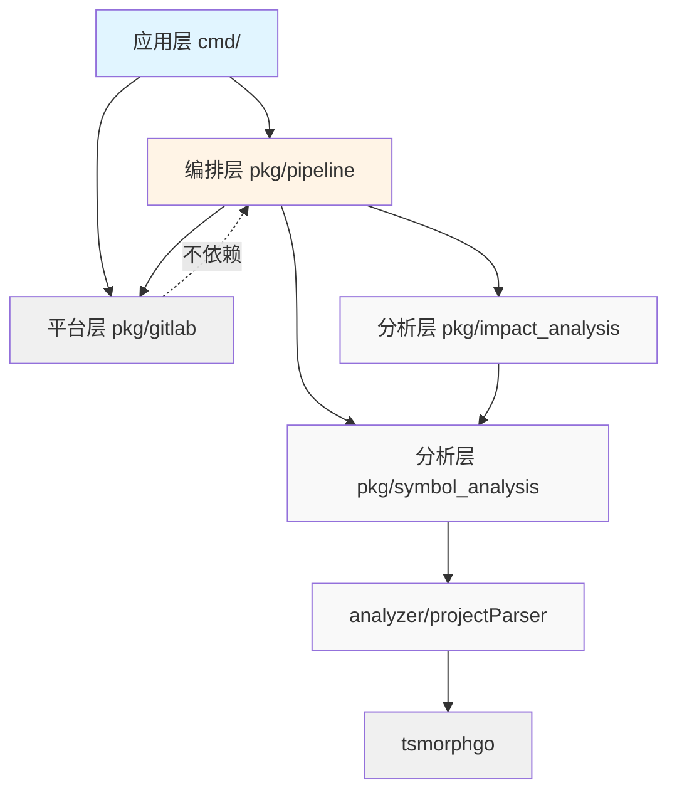
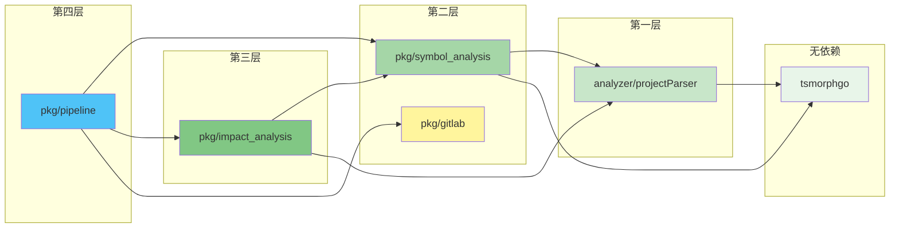
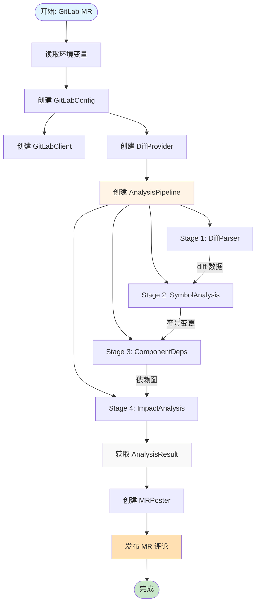
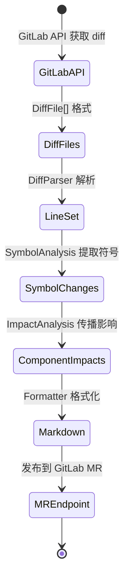

# analyzer-ts 架构文档

本文档描述 analyzer-ts 的整体架构设计，包括各层的职责、依赖关系和使用方式。

## 目录

- [架构概览](#架构概览)
- [分层设计](#分层设计)
- [核心组件](#核心组件)
- [依赖关系](#依赖关系)
- [数据流](#数据流)
- [使用示例](#使用示例)

---

## 架构概览

analyzer-ts 采用分层架构设计，将代码分析能力按职责划分为独立的模块：



---

## 分层设计

### 1. 应用层 (Application Layer)

**位置**: `cmd/`

**职责**:
- 作为程序的入口点
- 负责组装各个模块
- 处理命令行参数
- 协调平台能力层和编排层

**特点**:
- 不包含业务逻辑
- 只负责组装和调用

### 2. 编排层 (Orchestration Layer)

**位置**: `pkg/pipeline/`

**职责**:
- 定义分析流程（Stage）
- 提供工厂函数创建完整管道
- 执行管道并收集结果
- 不依赖具体平台

**核心接口**:
```go
type Stage interface {
    Name() string
    Execute(ctx *AnalysisContext) (interface{}, error)
    Skip(ctx *AnalysisContext) bool
}
```

**提供的 Stage**:
- `DiffParserStage` - 解析 git diff
- `SymbolAnalysisStage` - 符号分析
- `ComponentDepsStage` - 组件依赖分析
- `ImpactAnalysisStage` - 影响分析

### 3. 平台能力层 (Platform Capabilities)

**位置**: `pkg/gitlab/`, 未来 `pkg/github/`

**职责**:
- 提供特定平台的 API 客户端
- 提供 diff 获取能力
- 提供结果发布功能（MR/PR 评论）
- **不包含编排逻辑**

**设计原则**:
- ✅ 只提供能力
- ❌ 不依赖 pipeline
- ✅ 可以被 pipeline 使用

### 4. 分析层 (Analysis Layer)

**位置**: `pkg/impact_analysis/`, `pkg/symbol_analysis/`, `analyzer/projectParser/`

**职责**:
- 具体的分析逻辑
- 不关心数据来源
- 不关心结果去向

### 5. 基础设施层 (Infrastructure)

**位置**: `tsmorphgo/`

**职责**:
- 提供底层 AST 解析能力
- 被多个分析模块共享

---

## 核心组件

### pkg/pipeline

**Stage 接口**:



**Pipeline 执行流程**:



### pkg/gitlab

**提供的能力**:



### pkg/impact_analysis

**组件结构**:



---

## 依赖关系

### 正确的依赖方向



**关键原则**:
- ✅ 高层可以依赖低层
- ✅ 编排层可以平台能力层
- ❌ 平台能力层不依赖编排层

### 模块依赖图



---

## 数据流

### GitLab MR 分析完整流程



### 数据在各层之间的流转



---

## 使用示例

### 示例 1: GitLab CI 环境

```go
// cmd/gitlab-analyzer/main.go

package main

import (
    "context"
    "github.com/Flying-Bird1999/analyzer-ts/pkg/gitlab"
    "github.com/Flying-Bird1999/analyzer-ts/pkg/pipeline"
    "github.com/Flying-Bird1999/analyzer-ts/tsmorphgo"
)

func main() {
    ctx := context.Background()
    projectRoot := "/path/to/project"

    // 1. 从环境变量读取配置
    config, _ := gitlab.ReadConfigFromEnv()

    // 2. 创建 GitLab 客户端和 diff 提供者
    client := gitlab.NewClient(config.URL, config.Token)
    diffSource := gitlab.NewGitLabDiffSource(client, config.ProjectID, config.MRIID)

    // 3. 创建 tsmorphgo 项目
    project := tsmorphgo.NewProject(tsmorphgo.ProjectConfig{
        RootPath: projectRoot,
    })
    defer project.Close()

    // 4. 创建分析上下文
    analysisCtx := pipeline.NewAnalysisContext(ctx, projectRoot, project)

    // 5. 创建并配置 pipeline
    pipe := pipeline.NewPipeline("GitLab Analysis")
    pipe.AddStage(pipeline.NewDiffParserStageWithSource(diffSource))
    pipe.AddStage(pipeline.NewSymbolAnalysisStage())
    pipe.AddStage(pipeline.NewImpactAnalysisStage(config.MaxDepth))

    // 6. 执行 pipeline
    result, _ := pipe.Execute(analysisCtx)

    // 7. 发布结果到 MR
    poster := gitlab.NewMRPoster(client, config.ProjectID, config.MRIID)
    impactResult, _ := result.GetResult("影响分析")
    poster.PostResult(ctx, impactResult)
}
```

### 示例 2: 本地文件分析

```go
// cmd/local-analyzer/main.go

func main() {
    ctx := context.Background()
    projectRoot := "/path/to/project"

    // 1. 从文件读取 diff
    diffSource := gitlab.NewFileDiffSource("changes.patch")

    // 2. 创建 pipeline
    project := tsmorphgo.NewProject(...)
    analysisCtx := pipeline.NewAnalysisContext(ctx, projectRoot, project)

    pipe := pipeline.NewPipeline("Local Analysis")
    pipe.AddStage(pipeline.NewDiffParserStageWithSource(diffSource))
    pipe.AddStage(pipeline.NewSymbolAnalysisStage())

    // 3. 执行并输出到控制台
    result, _ := pipe.Execute(analysisCtx)
    fmt.Println(result.ToConsole())
}
```

### 示例 3: 自定义分析流程

```go
// 只做符号分析，不做影响分析

func main() {
    pipe := pipeline.NewPipeline("Symbol Only Analysis")
    pipe.AddStage(pipeline.NewDiffParserStage(...))
    pipe.AddStage(pipeline.NewSymbolAnalysisStage())
    // 不添加 ImpactAnalysisStage

    result, _ := pipe.Execute(analysisCtx)
    symbolResult, _ := result.GetResult("符号分析")

    // 自定义处理符号结果
    for _, symbol := range symbolResult {
        fmt.Println(symbol.Name, symbol.Kind)
    }
}
```

---

## 设计原则

### 1. 依赖倒置原则 (DIP)

- 高层模块不依赖低层模块
- 抽象不依赖具体实现
- `pipeline` 定义 `Stage` 接口，具体 Stage 实现该接口

### 2. 单一职责原则 (SRP)

- `pkg/gitlab` 只提供 GitLab 相关能力
- `pkg/pipeline` 只负责编排
- `pkg/impact_analysis` 只负责影响分析

### 3. 开闭原则 (OCP)

- 通过 `Stage` 接口，可以扩展新的分析阶段
- 通过 `DiffInputSource` 接口，可以扩展新的 diff 来源

### 4. 接口隔离原则 (ISP)

- `DiffInputSource` 只定义获取 diff 的方法
- `MRPoster` 只定义发布结果的方法

---

## 常见问题

### Q: 为什么 gitlab 不依赖 pipeline？

**A**: 因为 `gitlab` 是能力提供者，应该保持独立。如果 `gitlab` 依赖 `pipeline`，那么：
- 无法在非 pipeline 场景使用 gitlab 的能力
- 造成循环依赖的风险
- 违反了依赖倒置原则

### Q: 如何添加新的平台支持（如 GitHub）？

**A**: 创建 `pkg/github` 包，实现与 `pkg/gitlab` 相同的接口：
- `Client` - GitHub API 客户端
- `DiffProvider` - 从 GitHub 获取 diff
- `PRPoster` - 发布 PR 评论

然后在应用层使用时，只需替换导入即可。

### Q: 如何添加新的分析阶段？

**A**: 实现 `Stage` 接口：
```go
type MyCustomStage struct {}

func (s *MyCustomStage) Name() string {
    return "MyCustomStage"
}

func (s *MyCustomStage) Execute(ctx *pipeline.AnalysisContext) (interface{}, error) {
    // 分析逻辑
}

func (s *MyCustomStage) Skip(ctx *pipeline.AnalysisContext) bool {
    // 跳过条件
}
```

然后添加到 pipeline：
```go
pipe.AddStage(&MyCustomStage{})
```

---

## 版本历史

### v2.0 (当前架构)

- 重构为分层架构
- `pkg/impact_analysis` 从 `analyzer_plugin` 迁移到 `pkg/`
- `pkg/pipeline` 作为独立编排层
- `pkg/gitlab` 只提供能力，不依赖 pipeline

### v1.0 (旧架构)

- `analyzer_plugin/project_analyzer/impact_analysis` 独立命令行工具
- `pkg/gitlab/integration.go` 包含编排逻辑
- 存在循环依赖风险

---

## 相关文档

- [IMPACT_ANALYSIS_REFACTOR_PLAN.md](../IMPACT_ANALYSIS_REFACTOR_PLAN.md) - 影响分析重构计划
- [SYMBOL_LEVEL_IMPACT_ANALYSIS_PLAN.md](../SYMBOL_LEVEL_IMPACT_ANALYSIS_PLAN.md) - 符号级影响分析计划
- [README.md](../README.md) - 项目总览
