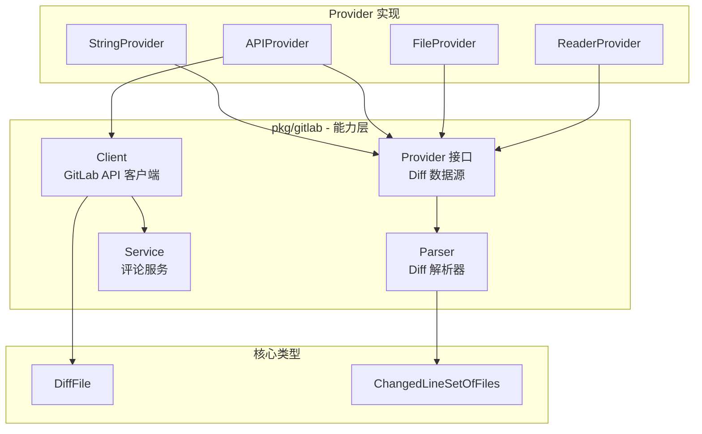

# pkg/gitlab

`analyzer-ts` 的 GitLab 集成包。提供 GitLab API 客户端、diff 解析和 MR 评论发布功能。

## 概述

本包提供 GitLab 集成的**纯能力**功能：

- **Diff 解析器**: 从多种来源解析 git diff（API、文件、字符串、git 命令）
- **GitLab 客户端**: GitLab API 操作的 HTTP 客户端
- **评论服务**: 发布 MR 评论

> **设计原则**: 本包仅提供能力，**不**依赖 `pkg/pipeline`。编排工作由上层处理。

## 架构



## 核心能力

### 1. Diff 解析器

从多种来源解析 git diff 并提取变更行号。

```mermaid
flowchart LR
    A[输入来源] --> B[Parser]
    B --> C[ChangedLineSetOfFiles]

    A --> A1[字符串]
    A --> A2[文件]
    A --> A3[GitLab API]
    A --> A4[Git 命令]

    C --> D[map[string]map[int]bool]
```

**支持的来源:**

- **字符串**: 从字符串解析 diff
- **文件**: 从文件系统读取并解析 diff
- **GitLab API**: 从 GitLab MR 获取 diff
- **Git 命令**: 执行 `git diff` 并解析输出

**输出格式:**

```go
type ChangedLineSetOfFiles map[string]map[int]bool
// Key:    文件路径 (例如 "src/Button.tsx")
// Value:  变更行号集合 (例如 {1: true, 5: true, 6: true})
```

### 2. GitLab 客户端

用于 GitLab API 操作的 HTTP 客户端。

**支持的操作:**

| 方法                      | 描述             |
| ------------------------- | ---------------- |
| `GetMergeRequest()`       | 获取 MR 详情     |
| `GetMergeRequestDiff()`   | 获取 MR diff 文件 |
| `CreateMRComment()`       | 创建新 MR 评论   |

### 3. 评论服务

用于发布 MR 评论的服务。

```go
// 发布评论
func (s *Service) PostComment(ctx context.Context, body string) error
```

### 4. Provider 接口

灵活的 diff 数据源抽象。

```go
type Provider interface {
    GetDiffString(ctx context.Context) (string, error)
}
```

**实现类:**

| Provider          | 描述                        |
| ----------------- | --------------------------- |
| `StringProvider`  | 从内存字符串获取 diff       |
| `FileProvider`    | 从文件系统获取 diff         |
| `APIProvider`     | 从 GitLab API 获取 diff     |
| `ReaderProvider`  | 从任何 `io.Reader` 获取 diff |

## 使用方法

### 基础 Diff 解析

```go
import "github.com/Flying-Bird1999/analyzer-ts/pkg/gitlab"

// 从字符串解析
parser := gitlab.NewParser("")
diffContent := `diff --git a/src/Button.tsx b/src/Button.tsx
@@ -1,5 +1,7 @@
 export const Button = () => {
-  return <button>Click</button>;
+  return <button>{props.label}</button>;
 }`

lineSet, err := parser.ParseDiffString(diffContent)
// lineSet["src/Button.tsx"] = {2: true}
```

### 从文件解析

```go
parser := gitlab.NewParser("/path/to/project")
lineSet, err := parser.ParseDiffFile("changes.patch")
```

### 从 GitLab API 解析

```go
client := gitlab.NewClient("https://gitlab.example.com", "your-token")
parser := gitlab.NewParser("")

// 创建 provider
provider := gitlab.NewAPIProvider(client, projectID, mrIID)

// 解析
lineSet, err := parser.ParseProvider(ctx, provider)
```

### 从 Git 命令解析

```go
parser := gitlab.NewParser("/path/to/project")
lineSet, err := parser.ParseFromGit("baseSHA", "HEAD")
```

### 发布 MR 评论

```go
client := gitlab.NewClient("https://gitlab.example.com", "your-token")
service := gitlab.NewService(client, projectID, mrIID)

// 发布评论
err := service.PostComment(ctx, "分析完成！")
```

### 完整示例

```go
package main

import (
    "context"
    "fmt"
    "github.com/Flying-Bird1999/analyzer-ts/pkg/gitlab"
)

func main() {
    ctx := context.Background()

    // 1. 创建 GitLab 客户端
    client := gitlab.NewClient("https://gitlab.example.com", "your-token")

    // 2. 从 GitLab API 获取 diff
    diffFiles, err := client.GetMergeRequestDiff(ctx, 123, 456)
    if err != nil {
        panic(err)
    }

    // 3. 解析 diff
    parser := gitlab.NewParser("/path/to/project")
    lineSet, err := parser.ParseDiffFiles(diffFiles)
    if err != nil {
        panic(err)
    }

    // 4. 处理变更行
    for file, lines := range lineSet {
        fmt.Printf("%s: %d 行变更\n", file, len(lines))
    }

    // 5. 将结果发布到 MR
    service := gitlab.NewService(client, 123, 456)
    err = service.PostComment(ctx, "分析完成！")
    if err != nil {
        panic(err)
    }
}
```

## 数据类型

### DiffFile

```go
type DiffFile struct {
    OldPath     string // 旧文件路径
    NewPath     string // 新文件路径
    Diff        string // 统一 diff 内容
    NewFile     bool   // 是否为新文件？
    RenamedFile bool   // 是否为重命名文件？
    DeletedFile bool   // 是否为删除文件？
}
```

### ChangedLineSetOfFiles

```go
type ChangedLineSetOfFiles map[string]map[int]bool

// 示例:
// {
//   "src/Button.tsx":   {1: true, 5: true, 6: true},
//   "src/Input.tsx":    {2: true},
//   "assets/logo.png":  {0: true},  // 0 = 二进制文件标记
// }
```

### MergeRequest

```go
type MergeRequest struct {
    IID          int    // MR IID
    ID           int    // MR ID
    ProjectID    int    // 项目 ID
    Title        string // MR 标题
    Description  string // MR 描述
    SourceBranch string // 源分支
    TargetBranch string // 目标分支
    WebURL       string // Web URL
}
```

## 二进制文件处理

二进制文件使用特殊行号 `0` 标记：

```go
const BinaryFileMarker = 0

// 二进制文件的结果示例:
// lineSet["assets/logo.png"] = {0: true}
```

## 测试

本包包含全面的测试：

```bash
# 运行所有测试
go test ./pkg/gitlab/...

# 运行测试并查看覆盖率
go test -cover ./pkg/gitlab/...

# 当前覆盖率: 48.6%
```

**测试类别:**

- **HTTP Mock 测试**: 使用 mock 服务器测试 GitLab API 客户端
- **Diff 解析测试**: 测试各种 diff 格式和边界情况
- **集成测试**: 测试完整的分析流程

## 依赖

```go
import (
    "context"
    "bytes"
    "encoding/json"
    "fmt"
    "bufio"
    "io"
    "net/http"
    "os"
    "os/exec"
    "path/filepath"
    "regexp"
    "strings"
)
```

## 许可证

属于 `analyzer-ts` 项目的一部分。
