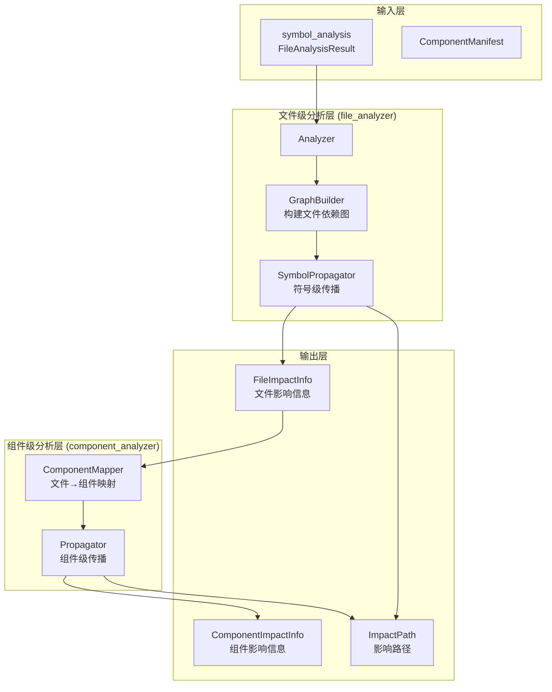
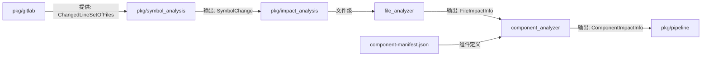

# pkg/impact_analysis

`analyzer-ts` 的影响分析包。提供代码变更的影响传播分析功能，支持文件级和组件级两个分析层次。

## 概述

本包提供**影响传播分析**能力：

- **文件级影响分析**：分析符号变更对其他文件的影响
- **组件级影响分析**：在组件库场景下，分析变更对组件的影响传播
- **多级传播**：支持深层依赖链的影响传播（Level 0 → Level 1 → Level 2...）
- **依赖图构建**：自动构建文件级和组件级的依赖关系图

> **设计原则**：影响分析基于符号级分析结果（`pkg/symbol_analysis`），通过依赖关系图进行传播计算

## 架构



## 核心能力

### 1. 文件级影响分析

分析符号变更对其他文件的影响：

| 能力         | 说明                                                |
| ------------ | --------------------------------------------------- |
| 直接变更识别 | 识别被修改符号所在的文件（ImpactLevel = 0）         |
| 间接影响传播 | 通过 import/export 关系传播影响（ImpactLevel ≥ 1） |
| 符号级精确性 | 精确到具体符号的影响计数（SymbolCount）             |
| 影响路径追踪 | 记录从变更源头到影响文件的完整路径                  |

### 2. 组件级影响分析

在组件库场景下，分析变更对组件的影响：

| 能力         | 说明                                      |
| ------------ | ----------------------------------------- |
| 组件边界识别 | 基于 component-manifest.json 识别组件范围 |
| 组件依赖图   | 从文件依赖图自动构建组件依赖关系          |
| 多级传播     | 支持深层组件依赖链的影响传播              |
| 最大深度控制 | 可配置最大传播深度，避免无限循环          |

### 3. 依赖图构建

| 图类型                   | 说明         | 用途             |
| ------------------------ | ------------ | ---------------- |
| 正向依赖图 (DepGraph)    | A 依赖 B     | 影响传播方向     |
| 反向依赖图 (RevDepGraph) | B 被 A 依赖  | 快速查找依赖者   |
| 外部依赖 (ExternalDeps)  | 第三方库依赖 | 过滤非项目内依赖 |

## 数据类型

### ChangedSymbol

变更符号信息（来自 `symbol_analysis`）：

```go
type ChangedSymbol struct {
    Name       string                    // 符号名称
    FilePath   string                    // 文件路径
    ExportType symbol_analysis.ExportType // 导出类型
}
```

### FileImpactInfo

文件影响信息：

```go
type FileImpactInfo struct {
    Path        string   // 文件路径
    ImpactLevel int      // 影响层级（0=直接，1=一级，2+=二级）
    ImpactType  string   // 影响类型
    ChangePaths []string // 从变更源头到该文件的路径
    SymbolCount int      // 影响的符号数量
}
```

### ComponentImpactInfo

组件影响信息：

```go
type ComponentImpactInfo struct {
    Name        string                    // 组件名称
    ImpactLevel impact_analysis.ImpactLevel // 影响层级
    ImpactType  impact_analysis.ImpactType  // 影响类型
    ChangePaths []string                  // 影响路径
    SymbolCount int                       // 影响的符号数量
}
```

### ComponentManifest

组件清单定义：

```go
type ComponentManifest struct {
    Meta       Meta        // 元数据（版本、库名等）
    Components []Component // 组件列表
}

type Component struct {
    Name  string // 组件名称
    Entry string // 组件入口文件路径（相对于项目根目录）
}
```

### ImpactLevel

影响层级定义：

| 层级 | 说明     | 示例                               |
| ---- | -------- | ---------------------------------- |
| 0    | 直接变更 | Button.tsx 被修改                  |
| 1    | 一级影响 | Form.tsx 引用 Button.tsx           |
| 2+   | 深层影响 | Page.tsx → Form.tsx → Button.tsx |

### ImpactType

影响类型定义：

| 类型         | 说明       | 判断标准                 |
| ------------ | ---------- | ------------------------ |
| `breaking` | 破坏性变更 | 导出的 API 被删除或修改  |
| `internal` | 内部变更   | 实现细节变更，API 未变   |
| `additive` | 增强性变更 | 新增导出，不影响现有代码 |

> **注意**：当前实现中，ImpactType 恒为 `"internal"`，类型区分功能待实现

## 使用方法

### 基础用法 - 文件级分析

```go
import (
    "github.com/Flying-Bird1999/analyzer-ts/analyzer/projectParser"
    "github.com/Flying-Bird1999/analyzer-ts/pkg/impact_analysis/file_analyzer"
    "github.com/Flying-Bird1999/analyzer-ts/pkg/symbol_analysis"
)

// 1. 解析项目（获取 parsingResult）
config := projectParser.NewProjectParserConfig(projectPath, nil, false, nil)
parsingResult := projectParser.NewProjectParserResult(config)
parsingResult.ProjectParser()

// 2. 假设从 symbol_analysis 获取变更符号
changedSymbols := []symbol_analysis.SymbolChange{
    {
        Name:      "Button",
        FilePath:  "/src/components/Button/Button.tsx",
        ExportType: symbol_analysis.ExportTypeDefault,
    },
}

// 3. 创建文件分析器
analyzer := file_analyzer.NewAnalyzer(parsingResult)

// 4. 转换为 file_analyzer 输入格式
input := &file_analyzer.Input{
    ChangedSymbols: []file_analyzer.ChangedSymbol{
        {
            Name:       "Button",
            FilePath:   "/src/components/Button/Button.tsx",
            ExportType: symbol_analysis.ExportTypeDefault,
        },
    },
    ChangedNonSymbolFiles: []string{}, // 非 TS/JS 文件变更（如 CSS、图片）
}

// 5. 执行文件级分析
result, err := analyzer.Analyze(input)
if err != nil {
    log.Fatalf("分析失败: %v", err)
}

// 6. 查看结果
fmt.Printf("直接变更: %d 个文件\n", len(result.Changes))
for _, change := range result.Changes {
    fmt.Printf("  %s (%d 个符号)\n", change.Path, change.SymbolCount)
}

fmt.Printf("间接受影响: %d 个文件\n", len(result.Impact))
for _, impact := range result.Impact {
    fmt.Printf("  %s (层级 %d, %d 个符号)\n", impact.Path, impact.ImpactLevel, impact.SymbolCount)
}
```

### 进阶用法 - 组件级分析

```go
import (
    "encoding/json"
    "github.com/Flying-Bird1999/analyzer-ts/pkg/impact_analysis"
    "github.com/Flying-Bird1999/analyzer-ts/pkg/impact_analysis/component_analyzer"
    "github.com/Flying-Bird1999/analyzer-ts/pkg/impact_analysis/file_analyzer"
)

// 1. 加载组件清单
manifestData, _ := os.ReadFile(".analyzer/component-manifest.json")
var manifest impact_analysis.ComponentManifest
json.Unmarshal(manifestData, &manifest)

// 2. 先执行文件级分析
fileAnalyzer := file_analyzer.NewAnalyzer(parsingResult)
fileResult, _ := fileAnalyzer.Analyze(fileInput)

// 3. 构建文件依赖图
graphBuilder := file_analyzer.NewGraphBuilder(parsingResult)
fileGraph := graphBuilder.BuildFileDependencyGraph()

// 4. 转换为组件级输入格式
fileResultProxy := &component_analyzer.FileAnalysisResultProxy{
    DepGraph:    fileGraph.DepGraph,
    RevDepGraph: fileGraph.RevDepGraph,
    ExternalDeps: fileGraph.ExternalDeps,
}

for _, change := range fileResult.Changes {
    fileResultProxy.Changes = append(fileResultProxy.Changes,
        component_analyzer.FileChangeInfoProxy{
            Path:        change.Path,
            ChangeType:  impact_analysis.ChangeTypeModified,
            SymbolCount: change.SymbolCount,
        })
}

for _, impact := range fileResult.Impact {
    fileResultProxy.Impact = append(fileResultProxy.Impact,
        component_analyzer.FileImpactInfoProxy{
            Path:        impact.Path,
            ImpactLevel: impact_analysis.ImpactLevel(impact.ImpactLevel),
            ImpactType:  impact_analysis.ImpactType(impact.ImpactType),
            ChangePaths: impact.ChangePaths,
        })
}

// 5. 创建组件分析器（最大传播深度 = 10）
componentAnalyzer := component_analyzer.NewAnalyzer(&manifest, parsingResult, 10)

// 6. 执行组件级分析
compInput := &component_analyzer.Input{FileResult: fileResultProxy}
compResult, _ := componentAnalyzer.Analyze(compInput)

// 7. 查看结果
fmt.Printf("变更组件: %d 个\n", len(compResult.Changes))
for _, change := range compResult.Changes {
    fmt.Printf("  %s\n", change.Name)
}

fmt.Printf("受影响组件: %d 个\n", len(compResult.Impact))
for _, impact := range compResult.Impact {
    fmt.Printf("  %s (层级 %d)\n", impact.Name, impact.ImpactLevel)
    for _, path := range impact.ChangePaths {
        fmt.Printf("    路径: %s\n", path)
    }
}
```

### 配置选项

```go
// 组件分析器的最大传播深度
maxDepth := 10 // 0=只分析直接依赖，1=一级传播，10=最多10级
componentAnalyzer := component_analyzer.NewAnalyzer(&manifest, parsingResult, maxDepth)
```

## 分析流程

### 文件级分析流程

```
1. 输入：ChangedSymbol[] + ChangedNonSymbolFiles[]
   ↓
2. 构建符号索引（buildSymbolIndex）
   - 提取变更符号的文件导出信息
   - 建立符号到文件的映射
   ↓
3. 符号级传播（SymbolPropagator.Propagate）
   - Direct: 包含变更符号的文件
   - Indirect: 导入变更符号的文件
   ↓
4. 深层传播（通过 BFS 遍历依赖图）
   - 使用 RevDepGraph 快速查找依赖者
   - 记录影响层级和路径
   ↓
5. 输出：FileImpactInfo[]
```

### 组件级分析流程

```
1. 输入：FileAnalysisResultProxy
   - 包含文件级分析结果
   - 包含文件依赖图
   ↓
2. 文件到组件映射（ComponentMapper）
   - 将文件路径映射到组件名称
   - 基于 component-manifest.json
   ↓
3. 构建组件依赖图
   - 从文件依赖图聚合得到组件依赖图
   - 过滤掉非组件文件和外部依赖
   ↓
4. 组件级传播（Propagator.Propagate）
   - BFS 遍历组件依赖图
   - 应用最大深度限制
   ↓
5. 输出：ComponentImpactInfo[]
```

## 依赖关系



- **pkg/gitlab**: 提供 diff 解析能力
- **pkg/symbol_analysis**: 提供符号级分析结果
- **file_analyzer**: 执行文件级影响分析
- **component_analyzer**: 执行组件级影响分析（依赖 file_analyzer）
- **pkg/pipeline**: 协调整个分析流程

## 组件清单 (component-manifest.json)

组件清单是组件级分析的关键配置文件，定义了组件的边界和入口：

```json
{
  "meta": {
    "version": "1.0.0",
    "libraryName": "@my/ui-components"
  },
  "components": [
    {
      "name": "Button",
      "entry": "src/components/Button/index.tsx"
    },
    {
      "name": "Form",
      "entry": "src/components/Form/index.tsx"
    }
  ]
}
```

### 组件边界规则

1. **基于入口文件的目录结构**：组件包含 `entry` 所在目录及其子目录的所有文件
2. **文件到组件映射**：通过路径前缀匹配，将文件映射到组件
3. **非组件文件**：不在任何组件边界内的文件（如 utils、hooks）

```go
// 示例：Button 组件的文件组织
src/components/Button/
├── index.tsx          // 入口文件（在 manifest 中定义）
├── Button.tsx         // 属于 Button 组件
├── Button.types.tsx   // 属于 Button 组件
└── utils/
    └── helpers.tsx    // 属于 Button 组件

// 其他文件不属于 Button 组件
src/utils/
└── helpers.tsx        // 不属于任何组件
```

## 影响路径示例

### 单级传播

```
Button.tsx (变更) → Form.tsx (受影响)

影响路径: ["/src/components/Button/Button.tsx → /src/components/Form/Form.tsx"]
```

### 多级传播

```
Button.tsx (变更) → Form.tsx (受影响, Level 1) → Page.tsx (受影响, Level 2)

影响路径: [
  "/src/components/Button/Button.tsx → /src/components/Form/Form.tsx",
  "/src/components/Button/Button.tsx → /src/components/Form/Form.tsx → /src/components/Page/Page.tsx"
]
```

### 多源头传播

```
Button.tsx (变更) ┐
                   ├→ Form.tsx (受影响, 2 个符号)
Input.tsx (变更)  ┘

影响路径: [
  "/src/components/Button/Button.tsx → /src/components/Form/Form.tsx",
  "/src/components/Input/Input.tsx → /src/components/Form/Form.tsx"
]
```

## 测试

本包包含全面的测试：

```bash
# 运行所有测试
go test ./pkg/impact_analysis/...

# 运行测试并查看覆盖率
go test -cover ./pkg/impact_analysis/...

# 当前覆盖率:
# - file_analyzer:    44.4%
# - component_analyzer: 28.6%
```

**测试类别**：

- **集成测试** (`integration_test.go`): 使用真实测试项目验证端到端分析
- **单元测试** (`analyzer_test.go`): 测试传播、映射、依赖图构建等核心逻辑
- **场景测试** (`scenario_test.go`): 边界情况和特殊场景的覆盖

## 与其他包的关系

### 与 symbol_analysis 的关系

```
symbol_analysis (上游)
  ├─ 分析变更行
  ├─ 提取受影响的符号
  └─ 输出: SymbolChange[]
         ↓
impact_analysis (下游)
  ├─ 接收符号变更信息
  ├─ 构建依赖关系图
  └─ 传播影响
```

### 与 pipeline 的关系

```
pipeline (协调器)
  ├─ 调用 gitlab 解析 diff
  ├─ 调用 symbol_analysis 分析符号
  ├─ 调用 impact_analysis 传播影响
  └─ 输出最终报告
```

## API 参考

### 文件级分析器

```go
// 创建分析器
analyzer := file_analyzer.NewAnalyzer(parsingResult)

// 执行分析
result, err := analyzer.Analyze(input)

// 构建依赖图
graphBuilder := file_analyzer.NewGraphBuilder(parsingResult)
fileGraph := graphBuilder.BuildFileDependencyGraph()
```

### 组件级分析器

```go
// 创建分析器
analyzer := component_analyzer.NewAnalyzer(&manifest, parsingResult, maxDepth)

// 执行分析
result, err := analyzer.Analyze(input)

// 组件映射
mapper := component_analyzer.NewComponentMapper(&manifest)
componentName := mapper.MapFileToComponent(filePath)
```

### 辅助类型

```go
// 影响信息查询
impact, exists := result.GetComponentImpact("Form")
allImpacts := result.GetImpactedComponents()
directChanges := result.GetDirectChangedComponents()
```

## 注意事项

### ⚠️ 传播深度控制

- 默认最大深度为 10，可根据项目需求调整
- 设置过大的深度可能导致性能问题
- 循环依赖会自动检测并停止传播

### ⚠️ 组件清单维护

- 组件清单需要手动维护，与代码保持同步
- 新增组件后必须更新清单
- 入口文件路径使用相对于项目根目录的路径

### ⚠️ 符号类型限制

- 当前只支持 TypeScript/JavaScript 文件的符号分析
- CSS、图片等非符号文件单独处理
- 动态 import 暂不支持

## 性能考虑

| 操作         | 时间复杂度 | 说明                           |
| ------------ | ---------- | ------------------------------ |
| 符号索引构建 | O(n)       | n = 变更符号数量               |
| 文件级传播   | O(V + E)   | V = 文件数，E = 依赖关系数     |
| 组件级传播   | O(V + E)   | V = 组件数，E = 组件依赖关系数 |
| 依赖图构建   | O(V + E)   | 一次性构建，可复用             |

**优化建议**：

- 缓存依赖图构建结果
- 限制最大传播深度
- 过滤掉外部依赖（node_modules）

## 许可证

属于 `analyzer-ts` 项目的一部分。
