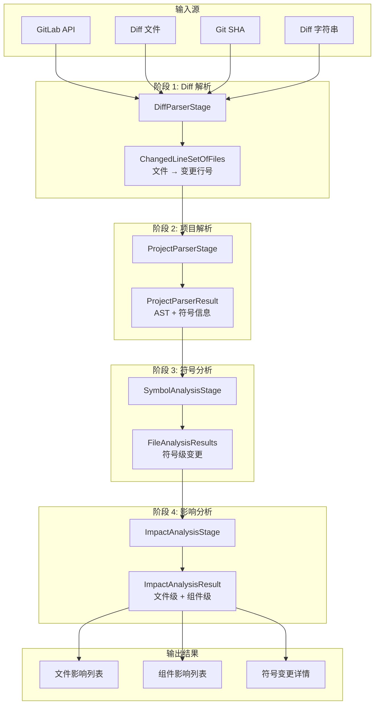

# pkg/pipeline

代码影响分析管道 - 用于分析代码变更对项目的影响范围。

## 概述

`pkg/pipeline` 提供了一个可扩展的、分阶段的代码分析管道，用于：
- 解析 Git diff（支持多种输入源）
- 分析符号级变更
- 计算文件级和组件级影响

## 架构设计

### 整体架构

管道采用**顺序执行模式**，每个阶段独立处理数据并通过共享上下文传递结果：

```
┌─────────────────────────────────────────────────────────────────┐
│                     AnalysisContext                             │
│  ┌────────────┐ ┌────────────┐ ┌────────────┐ ┌────────────┐  │
│  │   Config   │ │    Diff    │ │   Project  │ │  Symbols   │  │
│  │            │ │    Data    │ │      AST   │ │   Results  │  │
│  └────────────┘ └────────────┘ └────────────┘ └────────────┘  │
└─────────────────────────────────────────────────────────────────┘
         │
         ▼
┌──────────────────────────────────────────────────────────────────┐
│                        Pipeline                                  │
│  ┌──────────┐   ┌──────────┐   ┌──────────┐   ┌──────────┐    │
│  │  Stage 1 │ ➜ │  Stage 2 │ ➜ │  Stage 3 │ ➜ │  Stage 4 │    │
│  │   Diff   │   │  Project │   │  Symbol  │   │  Impact  │    │
│  │  Parser  │   │  Parser  │   │ Analysis │   │ Analysis │    │
│  └──────────┘   └──────────┘   └──────────┘   └──────────┘    │
└──────────────────────────────────────────────────────────────────┘
         │
         ▼
┌─────────────────────────────────────────────────────────────────┐
│                      PipelineResult                              │
│  ┌──────────────────────────────────────────────────────────┐   │
│  │  Stage Results  │  Success Status  │  Errors             │   │
│  └──────────────────────────────────────────────────────────┘   │
└─────────────────────────────────────────────────────────────────┘
```

### 数据流向图



### 核心组件

#### 1. AnalysisContext（分析上下文）

贯穿整个管道的共享上下文，携带：

| 字段 | 类型 | 说明 |
|------|------|------|
| `Context` | `context.Context` | Go 标准上下文 |
| `projectRoot` | `string` | 项目根目录 |
| `project` | `*tsmorphgo.Project` | AST 项目实例 |
| `options` | `map[string]interface{}` | 额外配置选项 |
| `results` | `map[string]interface{}` | 阶段结果存储 |

#### 2. Pipeline（管道）

| 组件 | 文件 | 说明 |
|------|------|------|
| `AnalysisPipeline` | `pipeline.go` | 通用管道执行器 |
| `GitLabPipeline` | `gitlab_pipeline.go` | GitLab MR 专用管道 |
| `Stage` | `stage.go` | 阶段接口定义 |

#### 3. Stages（阶段）

| 阶段 | 文件 | 输入 | 输出 |
|------|------|------|------|
| `DiffParserStage` | `diff_parser_stage.go` | Diff 数据 | `ChangedLineSetOfFiles` |
| `ProjectParserStage` | `gitlab_pipeline.go` | 项目路径 | `ProjectParserResult` |
| `SymbolAnalysisStage` | `symbol_analysis_stage.go` | Diff + AST | `FileAnalysisResults` |
| `ImpactAnalysisStage` | `gitlab_pipeline.go` | 符号变更 | `ImpactAnalysisResult` |

## 配置选项

### GitLabPipelineConfig

```go
type GitLabPipelineConfig struct {
    // Diff 输入源
    DiffSource  DiffSourceType  // API, File, SHA, String
    DiffFile    string          // Diff 文件路径
    DiffSHA     string          // Git SHA 或分支
    ProjectRoot string          // 项目根目录（必需）
    GitRoot     string          // Git 仓库根（可选，默认 = ProjectRoot）

    // GitLab API（使用 DiffSourceAPI 时）
    ProjectID   int             // GitLab 项目 ID
    MRIID       int             // GitLab MR IID
    Client      GitLabClient    // GitLab API 客户端

    // 组件分析
    ManifestPath string         // 组件清单路径
    DepsFile     string         // 依赖配置文件

    // 分析配置
    MaxDepth     int            // 影响分析最大深度（默认 10）
}
```

### DiffSourceType

```go
const (
    DiffSourceString DiffSourceType = "string" // 直接传入 diff 字符串
    DiffSourceFile   DiffSourceType = "file"   // 从文件读取
    DiffSourceSHA    DiffSourceType = "sha"    // git diff 命令
    DiffSourceAPI    DiffSourceType = "api"    // GitLab API
)
```

## 调用方法

### 基础用法

```go
package main

import (
    "context"
    "github.com/Flying-Bird1999/analyzer-ts/pkg/pipeline"
)

func main() {
    // 1. 创建配置
    config := &pipeline.GitLabPipelineConfig{
        DiffSource:  pipeline.DiffSourceString,
        ProjectRoot: "/path/to/project",
        MaxDepth:    10,
    }

    // 2. 创建分析上下文
    ctx := context.Background()
    analysisCtx := pipeline.NewAnalysisContext(ctx, config.ProjectRoot, nil)

    // 3. 传入 diff 字符串（如果使用 DiffSourceString）
    diffContent := `diff --git a/src/example.ts b/src/example.ts
--- a/src/example.ts
+++ b/src/example.ts
@@ -1,3 +1,4 @@
 export function foo() {}
+export function bar() {}`
    analysisCtx.SetOption("diffString", diffContent)

    // 4. 执行管道
    pipe := pipeline.NewGitLabPipeline(config)
    result, err := pipe.Execute(analysisCtx)
    if err != nil {
        panic(err)
    }

    // 5. 获取结果
    impactResult, _ := result.GetResult("影响分析（文件级）")
    if impact, ok := impactResult.(*pipeline.ImpactAnalysisResult); ok {
        fmt.Printf("受影响文件数: %d\n", impact.FileResult.Meta.ImpactFileCount)
    }
}
```

### 使用 Diff 文件

```go
config := &pipeline.GitLabPipelineConfig{
    DiffSource:  pipeline.DiffSourceFile,
    DiffFile:    "/path/to/mr.patch",
    ProjectRoot: "/path/to/project",
    MaxDepth:    10,
}
```

### 使用 Git Diff

```go
config := &pipeline.GitLabPipelineConfig{
    DiffSource:  pipeline.DiffSourceSHA,
    DiffSHA:     "HEAD~1 HEAD",  // 或 "main...feature-branch"
    ProjectRoot: "/path/to/project",
    GitRoot:     "/path/to/git/repo",  // 可选，monorepo 场景需要
    MaxDepth:    10,
}
```

### 使用组件清单

```go
config := &pipeline.GitLabPipelineConfig{
    DiffSource:   pipeline.DiffSourceFile,
    DiffFile:     "/path/to/mr.patch",
    ProjectRoot:  "/path/to/project",
    ManifestPath: "/path/to/component-manifest.json",  // 启用组件级分析
    MaxDepth:     10,
}
```

## 结果结构

### ImpactAnalysisResult

```go
type ImpactAnalysisResult struct {
    // 文件级结果
    FileResult *FileImpactResult `json:"fileResult,omitempty"`
    // 组件级结果
    ComponentResult *ComponentImpactResult `json:"componentResult,omitempty"`
    // 是否为组件库
    IsComponentLibrary bool `json:"isComponentLibrary"`
}

type FileImpactResult struct {
    Meta struct {
        TotalFileCount   int  // 总文件数
        ChangedFileCount int  // 变更文件数
        ImpactFileCount  int  // 受影响文件数
    }
    Changes []FileChange  // 直接变更的文件
    Impact  []FileImpact  // 间接受影响的文件
}

type ComponentImpactResult struct {
    Meta struct {
        TotalComponentCount   int  // 总组件数
        ChangedComponentCount int  // 变更组件数
        ImpactComponentCount  int  // 受影响组件数
    }
    Changes []ComponentChange  // 变更的组件
    Impact  []ComponentImpact  // 受影响的组件
}
```

## 组件库检测

管道会自动检测项目是否为组件库：

1. **检测方式**：检查 `ManifestPath` 指定的 `component-manifest.json` 文件
2. **触发条件**：文件存在且格式正确
3. **影响**：
   - 执行组件级影响分析
   - 输出包含组件变更和影响信息

### component-manifest.json 格式

```json
{
  "components": [
    {
      "name": "Button",
      "entry": "/src/components/Button/Button.tsx",
      "dependencies": {
        "Icon": "/src/components/Icon/Icon.tsx"
      }
    }
  ]
}
```

## 扩展

### 添加自定义阶段

```go
type CustomStage struct{}

func (s *CustomStage) Name() string {
    return "自定义阶段"
}

func (s *CustomStage) Execute(ctx *AnalysisContext) (*StageResult, error) {
    // 自定义逻辑
    return &StageResult{Status: StageStatusSuccess}, nil
}

func (s *CustomStage) Skip(ctx *AnalysisContext) bool {
    return false  // 是否跳过此阶段
}

// 添加到管道
pipeline.AddStage(&CustomStage{})
```

## 错误处理

管道提供详细的错误信息：

```go
result, err := pipe.Execute(analysisCtx)

// 检查整体成功状态
if !result.IsSuccessful() {
    fmt.Printf("管道执行失败: %v\n", result.GetErrors())
}

// 检查特定阶段
if stageResult, ok := result.GetStageResult("Diff解析"); ok {
    if stageResult.Status != StageStatusSuccess {
        fmt.Printf("阶段失败: %s\n", stageResult.Error)
    }
}
```
