# pkg/pipeline - 代码影响分析管道

> 一个基于管道模式的代码影响分析系统，用于分析 TypeScript 项目的代码变更影响范围

## 目录

- [概述](#概述)
- [架构设计](#架构设计)
- [数据流向](#数据流向)
- [核心组件](#核心组件)
- [执行流程](#执行流程)
- [配置选项](#配置选项)
- [使用示例](#使用示例)
- [结果结构](#结果结构)
- [设计模式](#设计模式)
- [扩展指南](#扩展指南)

---

## 概述

`pkg/pipeline` 是一个可扩展的、分阶段的代码分析管道，用于：

- **解析 Git diff** - 支持多种输入源（GitLab API、diff 文件、git 命令、字符串）
- **符号级变更分析** - 将行级变更转换为符号级变更
- **影响范围计算** - 分析文件级和组件级影响范围
- **智能检测** - 自动识别组件库项目并执行相应分析

### 核心特性

| 特性 | 说明 |
|------|------|
| **管道模式** | 将复杂分析流程拆分为独立阶段，易于扩展和维护 |
| **多输入源** | 支持 GitLab API、diff 文件、git 命令、直接字符串 |
| **智能检测** | 自动识别组件库项目，动态选择分析策略 |
| **上下文传递** | 通过 `AnalysisContext` 实现阶段间数据共享 |
| **错误处理** | 完善的错误处理和取消机制 |

---

## 架构设计

### 整体架构图

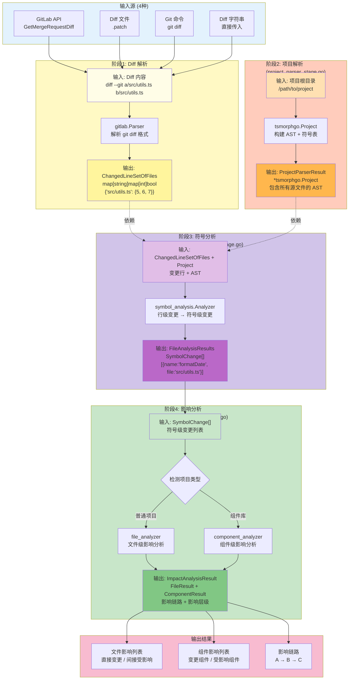

### 模块调用关系图

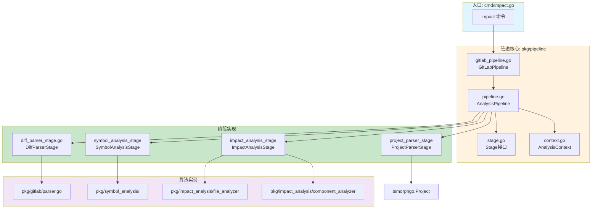

---

## 数据流向

### 完整数据流图

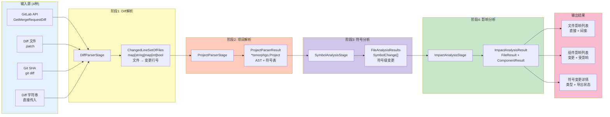

### 阶段间数据传递

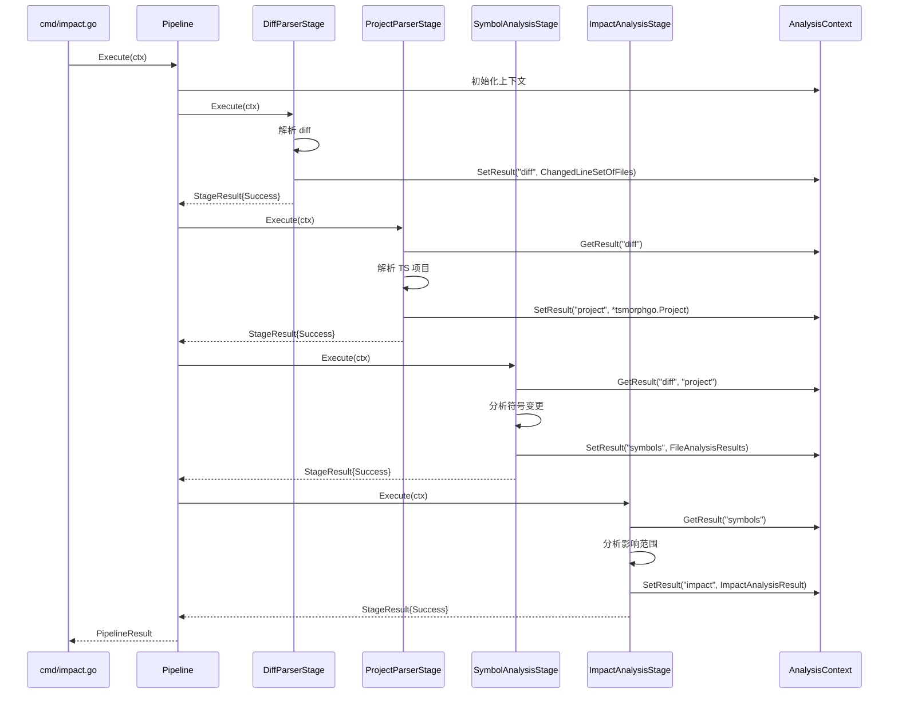

---

## 核心组件

### 1. AnalysisContext（分析上下文）

贯穿整个管道的共享上下文，用于阶段间数据传递。

```go
// pkg/pipeline/context.go
type AnalysisContext struct {
    // Go 标准上下文（用于取消和超时）
    context.Context

    // 项目根目录
    projectRoot string

    // AST 项目实例（阶段2填充）
    project *tsmorphgo.Project

    // 排除路径模式
    excludePaths []string

    // 配置选项
    options map[string]interface{}

    // 阶段结果存储（key: 阶段名称, value: 阶段输出）
    results map[string]interface{}
}
```

| 字段 | 类型 | 说明 | 填充阶段 |
|------|------|------|----------|
| `Context` | `context.Context` | Go 标准上下文 | 初始化 |
| `projectRoot` | `string` | 项目根目录 | 初始化 |
| `project` | `*tsmorphgo.Project` | AST 项目实例 | 阶段2 |
| `excludePaths` | `[]string` | 排除路径模式 | 初始化 |
| `options` | `map[string]interface{}` | 额外配置选项 | 初始化 |
| `results` | `map[string]interface{}` | 阶段结果存储 | 各阶段 |

**核心方法**：
```go
// 获取项目实例
func (c *AnalysisContext) GetProject() *tsmorphgo.Project

// 获取阶段结果
func (c *AnalysisContext) GetResult(key string) (interface{}, bool)

// 设置阶段结果
func (c *AnalysisContext) SetResult(key string, result interface{})

// 获取配置选项
func (c *AnalysisContext) GetOption(key string) (interface{}, bool)

// 设置配置选项
func (c *AnalysisContext) SetOption(key string, value interface{})
```

### 2. Pipeline（管道）

#### 2.1 AnalysisPipeline（通用管道）

```go
// pkg/pipeline/pipeline.go
type AnalysisPipeline struct {
    stages []Stage
}

// 添加阶段
func (p *AnalysisPipeline) AddStage(stage Stage)

// 执行管道
func (p *AnalysisPipeline) Execute(ctx *AnalysisContext) *PipelineResult
```

#### 2.2 GitLabPipeline（GitLab MR 专用管道）

```go
// pkg/pipeline/gitlab_pipeline.go
type GitLabPipeline struct {
    *AnalysisPipeline
    config *GitLabPipelineConfig
}

// 创建 GitLab 管道
func NewGitLabPipeline(config *GitLabPipelineConfig) *GitLabPipeline
```

### 3. Stage（阶段接口）

```go
// pkg/pipeline/stage.go
type Stage interface {
    // 阶段名称
    Name() string

    // 执行阶段逻辑
    Execute(ctx *AnalysisContext) (*StageResult, error)

    // 是否跳过此阶段
    Skip(ctx *AnalysisContext) bool
}
```

#### 3.1 DiffParserStage

**输入**：Diff 数据（来自 API/文件/命令/字符串）
**输出**：`ChangedLineSetOfFiles`

```go
// pkg/pipeline/diff_parser_stage.go
type DiffParserStage struct {
    diffSource  DiffSourceType
    diffFile    string
    diffSHA     string
    client      GitLabClient
    projectID   int
    mrIID       int
}
```

#### 3.2 ProjectParserStage

**输入**：项目路径
**输出**：`*tsmorphgo.Project`

```go
// pkg/pipeline/gitlab_pipeline.go (内嵌阶段)
type ProjectParserStage struct {
    projectRoot string
    excludePaths []string
}
```

#### 3.3 SymbolAnalysisStage

**输入**：`ChangedLineSetOfFiles` + `*tsmorphgo.Project`
**输出**：`FileAnalysisResults`

```go
// pkg/pipeline/symbol_analysis_stage.go
type SymbolAnalysisStage struct {
    gitRoot string
}
```

#### 3.4 ImpactAnalysisStage

**输入**：`FileAnalysisResults`
**输出**：`ImpactAnalysisResult`

```go
// pkg/pipeline/gitlab_pipeline.go (内嵌阶段)
type ImpactAnalysisStage struct {
    manifestPath string
    maxDepth     int
}
```

---

## 执行流程

### 命令执行流程（cmd/impact.go）

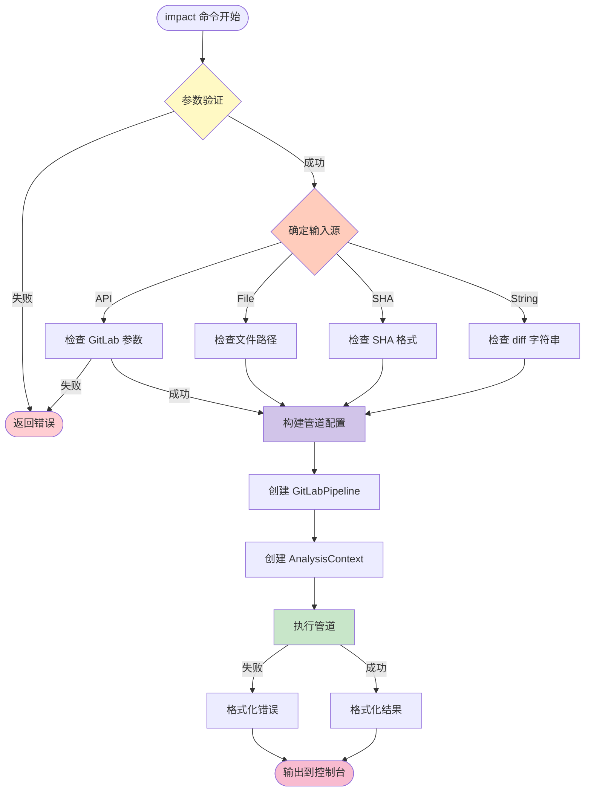

### 管道执行流程（pkg/pipeline）

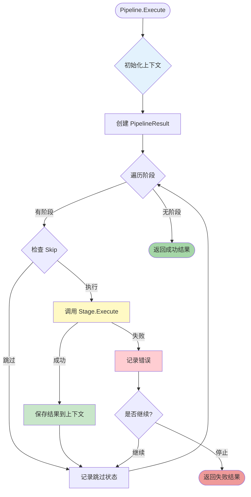

### 各阶段详细流程

#### 阶段1: Diff 解析

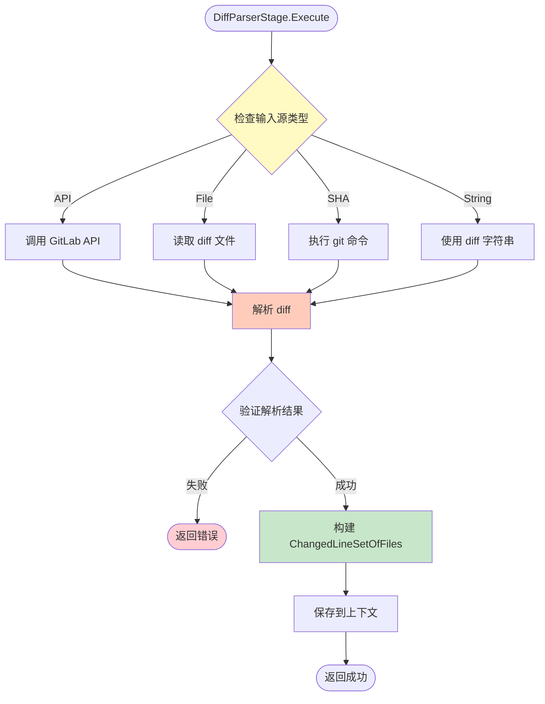

#### 阶段2: 项目解析

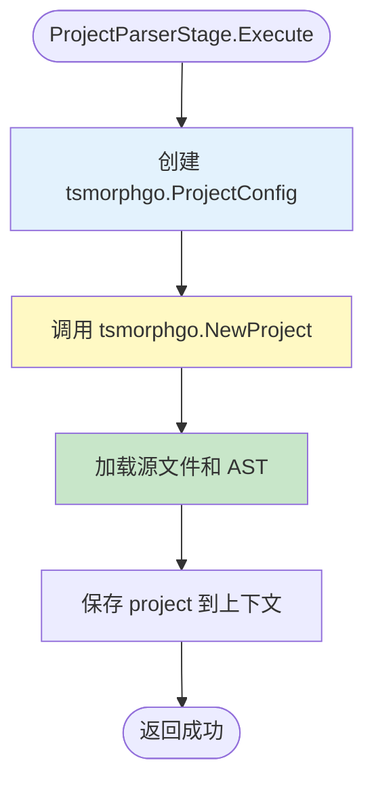

#### 阶段3: 符号分析

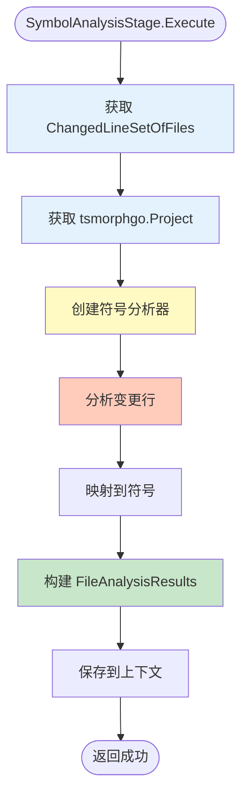

#### 阶段4: 影响分析

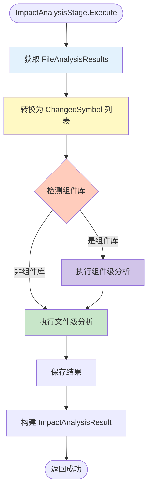

---

## 配置选项

### GitLabPipelineConfig

```go
// pkg/pipeline/gitlab_pipeline.go
type GitLabPipelineConfig struct {
    // ========== Diff 输入源 ==========
    DiffSource  DiffSourceType  // 输入源类型: API, File, SHA, String
    DiffFile    string          // Diff 文件路径 (DiffSourceFile)
    DiffSHA     string          // Git SHA 或分支 (DiffSourceSHA)
    ProjectRoot string          // 项目根目录（必需）
    GitRoot     string          // Git 仓库根（可选，默认 = ProjectRoot）

    // ========== GitLab API（DiffSourceAPI 时必需）==========
    ProjectID   int             // GitLab 项目 ID
    MRIID       int             // GitLab MR IID
    Client      GitLabClient    // GitLab API 客户端

    // ========== 组件分析 ==========
    ManifestPath string         // 组件清单路径（自动检测组件库）
    DepsFile     string         // 依赖配置文件

    // ========== 分析配置 ==========
    MaxDepth     int            // 影响分析最大深度（默认 10）
}
```

### DiffSourceType

```go
// pkg/pipeline/gitlab_pipeline.go
const (
    DiffSourceString DiffSourceType = "string" // 直接传入 diff 字符串
    DiffSourceFile   DiffSourceType = "file"   // 从文件读取 diff
    DiffSourceSHA    DiffSourceType = "sha"    // 执行 git diff 命令
    DiffSourceAPI    DiffSourceType = "api"    // 从 GitLab API 获取
)
```

### 配置示例

#### 使用 Diff 字符串

```go
config := &pipeline.GitLabPipelineConfig{
    DiffSource:  pipeline.DiffSourceString,
    ProjectRoot: "/path/to/project",
    MaxDepth:    10,
}
// 通过 context.SetOption("diffString", diffContent) 传入
```

#### 使用 Diff 文件

```go
config := &pipeline.GitLabPipelineConfig{
    DiffSource:  pipeline.DiffSourceFile,
    DiffFile:    "/path/to/mr.patch",
    ProjectRoot: "/path/to/project",
    MaxDepth:    10,
}
```

#### 使用 Git Diff

```go
config := &pipeline.GitLabPipelineConfig{
    DiffSource:  pipeline.DiffSourceSHA,
    DiffSHA:     "HEAD~1 HEAD",  // 或 "main...feature-branch"
    ProjectRoot: "/path/to/project",
    GitRoot:     "/path/to/git/repo",  // monorepo 场景需要
    MaxDepth:    10,
}
```

#### 使用 GitLab API

```go
config := &pipeline.GitLabPipelineConfig{
    DiffSource:  pipeline.DiffSourceAPI,
    ProjectRoot: "/path/to/project",
    ProjectID:   123,
    MRIID:       456,
    Client:      gitLabClient,
    MaxDepth:    10,
}
```

---

## 使用示例

### 完整使用流程

```go
package main

import (
    "context"
    "fmt"
    "github.com/Flying-Bird1999/analyzer-ts/pkg/pipeline"
)

func main() {
    // 1. 创建管道配置
    config := &pipeline.GitLabPipelineConfig{
        DiffSource:  pipeline.DiffSourceFile,
        DiffFile:    "/path/to/mr.patch",
        ProjectRoot: "/path/to/project",
        ManifestPath: ".analyzer/component-manifest.json", // 可选，启用组件级分析
        MaxDepth:    10,
    }

    // 2. 创建分析上下文
    ctx := context.Background()
    analysisCtx := pipeline.NewAnalysisContext(ctx, config.ProjectRoot, nil)

    // 3. 创建管道
    pipe := pipeline.NewGitLabPipeline(config)

    // 4. 执行管道
    result, err := pipe.Execute(analysisCtx)
    if err != nil {
        panic(err)
    }

    // 5. 获取结果
    if !result.IsSuccessful() {
        fmt.Printf("管道执行失败: %v\n", result.GetErrors())
        return
    }

    // 6. 处理影响分析结果
    impactResult, _ := result.GetResult("影响分析（文件级）")
    if impact, ok := impactResult.(*pipeline.ImpactAnalysisResult); ok {
        fmt.Printf("受影响文件数: %d\n", impact.FileResult.Meta.ImpactFileCount)
        if impact.IsComponentLibrary {
            fmt.Printf("受影响组件数: %d\n", impact.ComponentResult.Meta.ImpactComponentCount)
        }
    }
}
```

### 命令行使用

```bash
# 使用 diff 文件
analyzer-ts impact \
  --project-root /path/to/project \
  --diff-file /path/to/mr.patch

# 使用 git diff
analyzer-ts impact \
  --project-root /path/to/project \
  --diff-sha "HEAD~1 HEAD"

# 使用 GitLab API
analyzer-ts impact \
  --project-root /path/to/project \
  --diff-source api \
  --project-id 123 \
  --mr-iid 456 \
  --gitlab-token $GITLAB_TOKEN

# 指定组件清单（启用组件级分析）
analyzer-ts impact \
  --project-root /path/to/project \
  --diff-file /path/to/mr.patch \
  --manifest-path .analyzer/component-manifest.json
```

---

## 结果结构

### ImpactAnalysisResult

```go
// pkg/pipeline/types.go
type ImpactAnalysisResult struct {
    // 文件级结果（始终存在）
    FileResult *FileImpactResult `json:"fileResult,omitempty"`

    // 组件级结果（仅组件库项目）
    ComponentResult *ComponentImpactResult `json:"componentResult,omitempty"`

    // 是否为组件库项目
    IsComponentLibrary bool `json:"isComponentLibrary"`
}
```

### FileImpactResult

```go
type FileImpactResult struct {
    // 元数据
    Meta struct {
        TotalFileCount    int  // 项目总文件数
        ChangedFileCount  int  // 直接变更的文件数
        ImpactFileCount   int  // 间接受影响的文件数
    }

    // 直接变更的文件（影响层级 = 0）
    Changes []FileChange

    // 间接受影响的文件（影响层级 ≥ 1）
    Impact []FileImpact
}

type FileChange struct {
    FilePath     string
    ChangeType   string  // "modified", "added", "deleted"
    ChangedLines []int   // 变更的行号
}

type FileImpact struct {
    FilePath     string
    ImpactLevel  int     // 影响层级（0=直接，1=间接，2+=传递）
    ImpactType   string  // "direct", "indirect", "transitive"
    DependedBy   []string // 依赖链
}
```

### ComponentImpactResult

```go
type ComponentImpactResult struct {
    // 元数据
    Meta struct {
        TotalComponentCount   int  // 组件库总组件数
        ChangedComponentCount int  // 直接变更的组件数
        ImpactComponentCount  int  // 间接受影响的组件数
    }

    // 直接变更的组件
    Changes []ComponentChange

    // 间接受影响的组件
    Impact []ComponentImpact
}

type ComponentChange struct {
    ComponentName string
    EntryFile     string
    ChangeType    string
    ChangedFiles  []string
}

type ComponentImpact struct {
    ComponentName string
    ImpactLevel   int
    ImpactReason  string  // "direct", "dependency", "transitive"
    DependencyPath []string
}
```

---

## 设计模式

### 1. 管道模式（Pipeline Pattern）

将复杂处理流程分解为多个独立的处理阶段：


**优势**：
- 各阶段独立，易于测试
- 灵活组合，可动态添加/移除阶段
- 易于扩展，添加新阶段不影响现有代码

### 2. 上下文模式（Context Pattern）

使用 `AnalysisContext` 在阶段间传递数据：

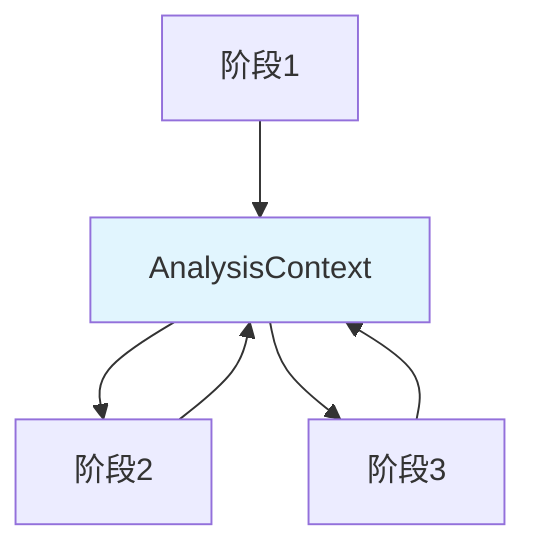

**优势**：
- 解耦阶段间依赖
- 统一的数据访问接口
- 支持阶段跳过和错误恢复

### 3. 策略模式（Strategy Pattern）

根据项目类型动态选择分析策略：

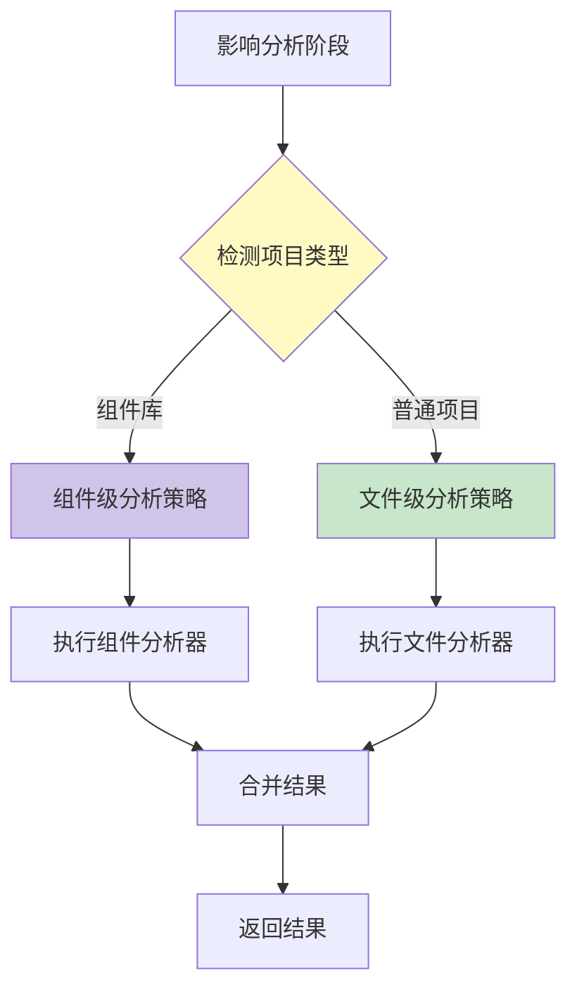

---

## 扩展指南

### 添加自定义阶段

```go
// 1. 实现 Stage 接口
type CustomStage struct {
    name string
    config map[string]interface{}
}

func (s *CustomStage) Name() string {
    return s.name
}

func (s *CustomStage) Execute(ctx *pipeline.AnalysisContext) (*pipeline.StageResult, error) {
    // 从上下文获取前置阶段的结果
    prevResult, ok := ctx.GetResult("前一阶段名称")
    if !ok {
        return nil, fmt.Errorf("缺少前置结果")
    }

    // 执行自定义逻辑
    result := doSomething(prevResult)

    // 保存结果到上下文
    ctx.SetResult(s.Name(), result)

    return &pipeline.StageResult{
        Status: pipeline.StageStatusSuccess,
        Data:   result,
    }, nil
}

func (s *CustomStage) Skip(ctx *pipeline.AnalysisContext) bool {
    // 根据上下文决定是否跳过
    return false
}

// 2. 添加到管道
pipe := pipeline.NewGitLabPipeline(config)
pipe.AddStage(&CustomStage{name: "自定义阶段"})
```

### 添加新的输入源

```go
// 1. 定义新的 DiffSourceType
const DiffSourceCustom DiffSourceType = "custom"

// 2. 在 DiffParserStage 中添加处理逻辑
func (s *DiffParserStage) Execute(ctx *pipeline.AnalysisContext) (*StageResult, error) {
    var diffContent string
    var err error

    switch s.diffSource {
    case DiffSourceCustom:
        diffContent, err = s.parseCustomSource(ctx)
    // ... 其他 case
    }

    // ... 后续处理
}

func (s *DiffParserStage) parseCustomSource(ctx *pipeline.AnalysisContext) (string, error) {
    // 自定义解析逻辑
    return "", nil
}
```

### 添加新的分析器

```go
// 1. 创建分析器
type CustomAnalyzer struct {
    project *tsmorphgo.Project
    config  map[string]interface{}
}

func (a *CustomAnalyzer) Analyze(changes []SymbolChange) (*CustomResult, error) {
    // 分析逻辑
    return &CustomResult{}, nil
}

// 2. 在新阶段中使用分析器
func (s *CustomAnalysisStage) Execute(ctx *pipeline.AnalysisContext) (*StageResult, error) {
    analyzer := NewCustomAnalyzer(ctx.GetProject(), nil)
    result, err := analyzer.Analyze(changes)
    // ...
}
```

---

## 关键文件索引

| 组件 | 文件路径 | 说明 |
|------|----------|------|
| **命令入口** | `cmd/impact.go` | CLI 命令定义和执行 |
| **管道核心** | `pkg/pipeline/pipeline.go` | 通用管道执行器 |
| **GitLab 管道** | `pkg/pipeline/gitlab_pipeline.go` | GitLab MR 专用管道 |
| **阶段接口** | `pkg/pipeline/stage.go` | Stage 接口定义 |
| **上下文** | `pkg/pipeline/context.go` | AnalysisContext 定义 |
| **Diff 解析** | `pkg/pipeline/diff_parser_stage.go` | Diff 解析阶段 |
| **符号分析** | `pkg/pipeline/symbol_analysis_stage.go` | 符号分析阶段 |
| **GitLab 解析器** | `pkg/gitlab/parser.go` | Git diff 解析器 |
| **符号分析** | `pkg/symbol_analysis/analyzer.go` | 符号分析算法 |
| **文件影响** | `pkg/impact_analysis/file_analyzer` | 文件级影响分析 |
| **组件影响** | `pkg/impact_analysis/component_analyzer` | 组件级影响分析 |

---

## 附录：错误处理

### 管道错误处理流程

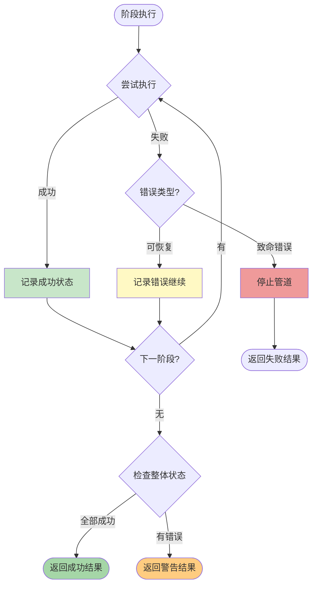

### 错误处理示例

```go
result, err := pipe.Execute(analysisCtx)

// 检查整体成功状态
if !result.IsSuccessful() {
    fmt.Printf("管道执行失败:\n")
    for stageName, stageErr := range result.GetErrors() {
        fmt.Printf("  - %s: %v\n", stageName, stageErr)
    }
}

// 检查特定阶段
if stageResult, ok := result.GetStageResult("Diff解析"); ok {
    if stageResult.Status != pipeline.StageStatusSuccess {
        fmt.Printf("Diff解析阶段失败: %s\n", stageResult.Error)
    }
}

// 检查跳过的阶段
skipped := result.GetSkippedStages()
if len(skipped) > 0 {
    fmt.Printf("跳过的阶段: %v\n", skipped)
}
```

---

**文档版本**: v2.0
**最后更新**: 2025-01-07
**维护者**: analyzer-ts 团队
