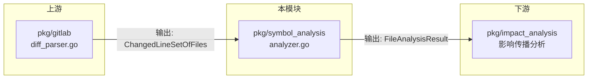

# Symbol Analysis Module

符号级代码分析模块，用于分析 git diff 变更影响的符号（函数、变量、类等）及其导出状态。

## 系统架构

### 模块定位

本模块是代码影响分析链路中的核心环节，负责将**行级变更**转换为**符号级变更**。

```
┌─────────────────┐      ┌──────────────────┐      ┌─────────────────┐
│  Git Diff 输入   │ ───▶ │  Symbol Analysis │ ───▶ │  影响传播分析     │
│  (行号变更)      │      │  (本模块)         │      │  (下游模块)      │
└─────────────────┘      └──────────────────┘      └─────────────────┘
```

### 核心能力

| 能力                   | 描述                                                                                     |
| ---------------------- | ---------------------------------------------------------------------------------------- |
| **祖先节点识别** | 当变更发生在声明内部（如 useEffect、函数体、类方法）时，向上追踪包含该变更的顶层声明节点 |
| **AST 驱动分析** | 基于 TypeScript AST 结构进行分析，而非字符串匹配，确保准确性                             |
| **完整导出检测** | 支持 8 种导出语法，区分命名导出和默认导出                                                |
| **智能符号过滤** | 自动过滤函数/类内部的变量声明，只返回顶层符号                                            |

### 技术选型原则

**核心原则：AST-Based Analysis**

作为 AST 解析工具，所有分析都应基于 AST 节点关系，而非字符串匹配。

| 需求               | ✅ AST 方法                           | ❌ 字符串方法                         |
| ------------------ | ------------------------------------- | ------------------------------------- |
| 检测 export 修饰符 | 检查子节点 `ast.KindExportKeyword`  | `strings.Contains(text, "export")`  |
| 检测 default 导出  | 检查子节点 `ast.KindDefaultKeyword` | `strings.Contains(text, "default")` |
| 提取类名           | 遍历子节点找 Identifier               | 正则匹配 `class (\w+)`              |
| 检测父节点类型     | `parent.Kind == ast.KindX`          | 文本模式匹配                          |

---

## 数据结构

### 输入结构

```go
// ChangedLineSetOfFiles 变更行集合
// key: 文件路径, value: 该文件中变更的行号集合
type ChangedLineSetOfFiles map[string]map[int]bool

// 示例
changedLines := ChangedLineSetOfFiles{
    "/src/button.ts": {
        5:  true,  // 第5行有变更
        10: true,  // 第10行有变更
        15: true,  // 第15行有变更
    },
}
```

### 输出结构

```go
// FileAnalysisResult 单文件分析结果
type FileAnalysisResult struct {
    FilePath        string         // 文件路径
    AffectedSymbols []SymbolChange // 受影响的符号列表
    FileExports     []ExportInfo   // 文件的所有导出（用于上下文）
}

// SymbolChange 符号变更信息
type SymbolChange struct {
    Name         string      // 符号名称，如 "handleClick", "Button"
    Kind         SymbolKind  // 符号类型：function/class/variable 等
    FilePath     string      // 文件路径
    StartLine    int         // 声明起始行号（1-based）
    EndLine      int         // 声明结束行号（1-based）
    ChangedLines []int       // 符号内部的变更行号
    ChangeType   ChangeType  // 变更类型：added/modified/deleted
    IsExported   bool        // 是否导出
    ExportType   ExportType  // 导出类型：named/default/namespace
}

// ExportInfo 导出信息
type ExportInfo struct {
    Name       string     // 导出名称
    ExportType ExportType // 导出类型
    DeclLine   int        // 声明行号
    DeclNode   string     // 声明节点类型
}
```

### 符号类型

```go
type SymbolKind string

const (
    SymbolKindFunction   SymbolKind = "function"    // 函数声明
    SymbolKindVariable   SymbolKind = "variable"    // 变量声明
    SymbolKindClass      SymbolKind = "class"       // 类声明
    SymbolKindInterface  SymbolKind = "interface"   // 接口声明
    SymbolKindTypeAlias  SymbolKind = "type-alias"  // 类型别名
    SymbolKindEnum       SymbolKind = "enum"        // 枚举声明
    SymbolKindMethod     SymbolKind = "method"      // 类方法
    SymbolKindProperty   SymbolKind = "property"    // 类属性
)
```

### 导出类型

```go
type ExportType string

const (
    ExportTypeNamed     ExportType = "named"      // 命名导出: export const A = 1
    ExportTypeDefault    ExportType = "default"    // 默认导出: export default class A {}
    ExportTypeNamespace  ExportType = "namespace"  // 命名空间: export * as ns from './mod'
    ExportTypeNone       ExportType = ""           // 非导出
)
```

---

## 分析流程

### 主流程图

```mermaid
flowchart TD
    subgraph Input ["输入"]
        A[ChangedLineSetOfFiles<br/>]
    end

    subgraph Phase1 ["阶段1: 遍历文件"]
        B[AnalyzeChangedLines]
        C[For each file path]
        D[Get SourceFile from Project]
    end

    subgraph Phase2 ["阶段2: 提取导出信息 (Step 1)"]
        E[extractExportsFromFileResult]
        E1[ExportDeclarations<br/>]
        E2[ExportAssignments<br/>export default ...]
        E3[VariableDeclarations<br/>export const]
        E4[FunctionDeclarations<br/>export function]
        E5[InterfaceDeclarations<br/>export interface]
        E6[TypeDeclarations<br/>export type]
        E7[EnumDeclarations<br/>export enum]
        E8[ClassDeclarations<br/>AST遍历 + 子节点检查]
        F[收集到 FileExports 数组]
    end

    subgraph Phase3 ["阶段3: 提取受影响符号 (Step 2)"]
        G[extractAffectedSymbols]
        H[AST 遍历: ForEachDescendant]
        I{isAffectedByChanges?<br/>节点行号是否在变更行集合中?}
        I -->|否| H
        I -->|是| J{isDeclarationNode?<br/>是否为顶层声明节点?}
        J -->|否| H
        J -->|是| K{shouldIncludeSymbol?<br/>是否导出或包含内部符号?}
        K -->|否| H
        K -->|是| L[extractSymbolChange<br/>提取符号信息]
        M[添加到 AffectedSymbols]
    end

    subgraph Phase4 ["阶段4: 填充导出信息 (Step 3)"]
        N[fillExportInfo]
        O[For each AffectedSymbol]
        P{在 FileExports<br/>索引中查找?}
        P -->|找到| Q[标记 IsExported=true<br/>设置 ExportType]
        P -->|未找到| R{getExportTypeFromNode<br/>检查节点修饰符}
        R -->|有 export| Q
        R -->|无 export| S[标记 IsExported=false]
    end

    subgraph Output ["输出"]
        T[FileAnalysisResult<br/>AffectedSymbols + FileExports]
        U[返回结果 FileAnalysisResult]
    end

    A --> B
    B --> C
    C --> D
    D --> E

    E --> E1 & E2 & E3 & E4 & E5 & E6 & E7 & E8
    E1 & E2 & E3 & E4 & E5 & E6 & E7 & E8 --> F

    F --> G
    G --> H
    H --> I
    I --> J
    J --> K
    K --> L
    L --> M

    M --> N
    N --> O
    O --> P
    P --> Q
    P --> R
    R --> Q
    R --> S

    Q --> T
    S --> T
    T --> U


    subgraph Phase2 ["阶段2: 提取导出信息 (Step 1)"]
        E[extractExportsFromFileResult]
        E1[ExportDeclarations<br/>export { A, B }]
        E2[ExportAssignments<br/>export default ...]
        E3[VariableDeclarations<br/>export const]
        E4[FunctionDeclarations<br/>export function]
        E5[InterfaceDeclarations<br/>export interface]
        E6[TypeDeclarations<br/>export type]
        E7[EnumDeclarations<br/>export enum]
        E8[ClassDeclarations<br/>AST遍历 + 子节点检查]
        F[收集到 FileExports 数组]
    end

    subgraph Phase3 ["阶段3: 提取受影响符号 (Step 2)"]
        G[extractAffectedSymbols]
        H[AST 遍历: ForEachDescendant]
        I{isAffectedByChanges?<br/>节点行号是否在变更行集合中?}
        I -->|否| H
        I -->|是| J{isDeclarationNode?<br/>是否为顶层声明节点?}
        J -->|否| H
        J -->|是| K{shouldIncludeSymbol?<br/>是否导出或包含内部符号?}
        K -->|否| H
        K -->|是| L[extractSymbolChange<br/>提取符号信息]
        M[添加到 AffectedSymbols]
    end

    subgraph Phase4 ["阶段4: 填充导出信息 (Step 3)"]
        N[fillExportInfo]
        O[For each AffectedSymbol]
        P{在 FileExports<br/>索引中查找?}
        P -->|找到| Q[标记 IsExported=true<br/>设置 ExportType]
        P -->|未找到| R{getExportTypeFromNode<br/>检查节点修饰符}
        R -->|有 export| Q
        R -->|无 export| S[标记 IsExported=false]
    end

    subgraph Output ["输出"]
        T[FileAnalysisResult<br/>AffectedSymbols + FileExports]
        U[返回结果 map[string]*FileAnalysisResult]
    end

    A --> B
    B --> C
    C --> D
    D --> E

    E --> E1 & E2 & E3 & E4 & E5 & E6 & E7 & E8
    E1 & E2 & E3 & E4 & E5 & E6 & E7 & E8 --> F

    F --> G
    G --> H
    H --> I
    I --> J
    J --> K
    K --> L
    L --> M

    M --> N
    N --> O
    O --> P
    P --> Q
    P --> R
    R --> Q
    R --> S

    Q --> T
    S --> T
    T --> U
```

---

## 核心机制详解

### 1. 祖先节点识别机制

当 git diff 变更发生在声明内部时，需要向上追踪找到包含该变更的顶层声明节点。

#### 问题场景

```typescript
// Git diff 显示第 5 行有变更
export function processUser(id: string) {
    const validated = validateUser(id)  // ← 第 5 行变更在这里
    return validated
}
```

**问题**：第 5 行是 `const validated` 变量声明，但我们关心的应该是包含它的 `processUser` 函数。

#### 解决方案

**方法1：只处理顶层声明节点**

```go
// isDeclarationNode 判断是否为顶层声明节点
func (a *Analyzer) isDeclarationNode(node tsmorphgo.Node) bool {
    // ✅ 识别：顶层函数、类、接口等
    if node.IsFunctionDeclaration() ||
       node.IsClassDeclaration() ||
       node.IsInterfaceDeclaration() {
        return true
    }

    // ❌ 过滤：类方法（变更应归属于父类）
    if node.IsKind(tsmorphgo.KindMethodDeclaration) {
        return false  // 方法内部的变更会追溯到其父类
    }

    // ⚠️  特殊处理：变量声明需要检查是否在顶层
    if node.IsVariableDeclaration() {
        return a.isTopLevelVariable(node)  // 递归检查父节点
    }

    return false
}
```

**方法2：递归检查顶层变量**

```go
// isTopLevelVariable 检查变量是否在模块顶层
func (a *Analyzer) isTopLevelVariable(node tsmorphgo.Node) bool {
    parent := node.GetParent()

    // 父节点是 SourceFile，说明在顶层
    if parent.IsKind(tsmorphgo.KindSourceFile) {
        return true
    }

    // 父节点是函数/类/块，说明是内部变量
    if parent.IsFunctionDeclaration() ||
       parent.IsClassDeclaration() ||
       parent.IsKind(tsmorphgo.KindBlock) {
        return false
    }

    // 递归检查父节点的父节点
    return a.isTopLevelVariable(*parent)
}
```

#### 识别效果

| 变更位置                                                 | 识别结果              | 说明                       |
| -------------------------------------------------------- | --------------------- | -------------------------- |
| `export function f() { const x = 1 }` 中的 `const x` | `f` (function)      | 变量在函数内，归属到父函数 |
| `export class C { method() {} }` 中的 `method()`     | `C` (class)         | 方法在类内，归属到父类     |
| `export const CONFIG = { ... }`                        | `CONFIG` (variable) | 变量在顶层，直接识别       |

---

### 2. AST-Based 导出检测

#### 核心原则

**不使用字符串匹配，直接检查 AST 节点关系**

#### TypeScript AST 结构

在 TypeScript AST 中，修饰符（如 `export`、`default`）是**子节点**，而非父节点：

```typescript
export default class MyClass {}
```

AST 结构：

```
ClassDeclaration
├── ExportKeyword (子节点)
├── DefaultKeyword (子节点)
└── Identifier: "MyClass"
```

#### 检测方法

**方法1：检查子节点（推荐，最准确）**

```go
// 检查类是否有 export 修饰符
node.ForEachChild(func(child tsmorphgo.Node) bool {
    if child.Kind == ast.KindExportKeyword {
        hasExportKeyword = true
    }
    if child.Kind == ast.KindDefaultKeyword {
        isDefaultExport = true
    }
    return false
})
```

**方法2：检查父节点（适用于特定情况）**

```go
// 检查父节点是否是 ExportAssignment（用于 export default ClassName;）
parent := node.GetParent()
if parent.Kind == ast.KindExportAssignment {
    return ExportTypeDefault
}
```

**方法3：使用 Parser 提取的字段**

```go
// Parser 已经通过 AST 解析提取了 Expression 字段
if exportAssign.Expression != "" {
    return exportAssign.Expression  // 直接使用，无需字符串解析
}
```

#### 支持的导出语法

| 语法                          | AST 结构                                          | 检测方式                   |
| ----------------------------- | ------------------------------------------------- | -------------------------- |
| `export const A = 1`        | VariableDeclaration + ExportKeyword 子节点        | Parser `Exported: true`  |
| `export function f() {}`    | FunctionDeclaration + ExportKeyword 子节点        | Parser `Exported: true`  |
| `export default class C {}` | ClassDeclaration + ExportKeyword + DefaultKeyword | 检查子节点                 |
| `export default expr`       | ExportAssignment 节点                             | Parser `Expression` 字段 |
| `export { A, B }`           | ExportDeclaration 节点                            | Parser `ExportModules`   |

---

### 3. 导出信息填充策略

#### 三阶段填充

```go
func (a *Analyzer) fillExportInfo(result *FileAnalysisResult) {
    // 阶段1: 构建 FileExports 索引
    exportIndex := make(map[string]ExportInfo)
    for _, export := range result.FileExports {
        exportIndex[export.Name] = export
    }

    // 阶段2: 匹配受影响符号
    for _, symbol := range result.AffectedSymbols {
        // 策略1: 在索引中查找（快速路径）
        if export, ok := exportIndex[symbol.Name]; ok {
            symbol.IsExported = true
            symbol.ExportType = export.ExportType
            continue
        }

        // 策略2: 检查节点修饰符（备用路径）
        sourceFile := a.project.GetSourceFile(symbol.FilePath)
        if sourceFile != nil {
            node := a.findSymbolNode(sourceFile, symbol)
            if node.IsValid() && a.hasExportModifier(sourceFile, node) {
                symbol.IsExported = true
                symbol.ExportType = a.getExportTypeFromNode(node)
            }
        }
    }
}
```

#### getExportTypeFromNode 实现

```go
func (a *Analyzer) getExportTypeFromNode(node tsmorphgo.Node) ExportType {
    // 检查父节点
    parent := node.GetParent()
    if parent.Kind == ast.KindExportAssignment {
        return ExportTypeDefault
    }
    if parent.IsExportDeclaration() {
        return ExportTypeNamed
    }

    // 检查子节点（用于 inline export）
    hasDefaultKeyword := false
    hasExportKeyword := false
    node.ForEachChild(func(child tsmorphgo.Node) bool {
        if child.Kind == ast.KindDefaultKeyword {
            hasDefaultKeyword = true
        }
        if child.Kind == ast.KindExportKeyword {
            hasExportKeyword = true
        }
        return false
    })

    if hasDefaultKeyword && hasExportKeyword {
        return ExportTypeDefault
    }
    if hasExportKeyword {
        return ExportTypeNamed
    }

    return ExportTypeNone
}
```

---

## 使用示例

### 完整示例

```go
package main

import (
    "fmt"
    "github.com/Flying-Bird1999/analyzer-ts/pkg/symbol_analysis"
    "github.com/Flying-Bird1999/analyzer-ts/tsmorphgo"
)

func main() {
    // 1. 创建项目
    project := tsmorphgo.NewProjectFromSources(map[string]string{
        "/src/button.ts": `
            export const SIZE = 'medium'

            export function handleClick() {
                console.log('clicked')
            }

            export default class Button {
                render() {
                    return <button />
                }
            }
        `,
    })

    // 2. 创建分析器
    analyzer := symbol_analysis.NewAnalyzer(
        project,
        symbol_analysis.AnalysisOptions{
            IncludeTypes:    true,  // 包含类型声明（接口、类型别名）
            IncludeInternal: true,  // 包含非导出符号
        },
    )

    // 3. 定义变更行（来自 git diff）
    changedLines := symbol_analysis.ChangedLineSetOfFiles{
        "/src/button.ts": {
            7:  true,  // handleClick 函数体内的变更
            12: true,  // Button.render 方法内的变更
        },
    }

    // 4. 执行分析
    results := analyzer.AnalyzeChangedLines(changedLines)

    // 5. 处理结果
    for filePath, result := range results {
        fmt.Printf("文件: %s\n", filePath)

        // 打印所有导出
        fmt.Println("\n文件导出:")
        for _, export := range result.FileExports {
            fmt.Printf("  - %s (%s)\n", export.Name, export.ExportType)
        }

        // 打印受影响的符号
        fmt.Println("\n受影响的符号:")
        for _, symbol := range result.AffectedSymbols {
            if symbol.IsExported {
                fmt.Printf("  [已导出] %s (%s) 行 %d-%d\n",
                    symbol.Name, symbol.Kind, symbol.StartLine, symbol.EndLine)
            } else {
                fmt.Printf("  [内部] %s (%s) 行 %d-%d\n",
                    symbol.Name, symbol.Kind, symbol.StartLine, symbol.EndLine)
            }
        }
    }
}
```

### 输出示例

```
文件: /src/button.ts

文件导出:
  - SIZE (named)
  - handleClick (named)
  - Button (default)

受影响的符号:
  [已导出] handleClick (function) 行 5-8
  [已导出] Button (class) 行 10-14
```

---

## 测试覆盖

```bash
# 运行所有测试
go test -v ./pkg/symbol_analysis

# 运行特定测试
go test -v ./pkg/symbol_analysis -run TestAnalyzer_ComplexScenarios
go test -v ./pkg/symbol_analysis -run TestAnalyzer_ExportedAncestorTracking

# 查看测试覆盖率
go test ./pkg/symbol_analysis -cover
```

### 测试场景

| 测试类别             | 覆盖场景                                           |
| -------------------- | -------------------------------------------------- |
| **复杂场景**   | 多行数组、长函数、useEffect 回调、嵌套回调、类方法 |
| **多变更测试** | 同一符号多行变更、多符号同时变更                   |
| **导出追踪**   | 导出符号内部变更、私有符号内部变更                 |
| **导出检测**   | 8种导出语法、命名导出、默认导出                    |

---

## 与其他模块的集成



### 集成代码示例

```go
// 1. 从 pkg/gitlab 获取 diff 解析结果
gitDiffResult := gitlab.ParseDiff(diffString)

// 2. 转换为 ChangedLineSetOfFiles 格式
changedLines := make(symbol_analysis.ChangedLineSetOfFiles)
for file, changes := range gitDiffResult {
    changedLines[file] = changes.ChangedLines
}

// 3. 执行符号分析
analyzer := symbol_analysis.NewAnalyzer(project, options)
results := analyzer.AnalyzeChangedLines(changedLines)

// 4. 传递给影响分析模块
impactResults := impact_analysis.Analyze(results)

// 5. 生成报告
report := generateReport(impactResults)
```

---

## 技术要点

### 1. AST vs 字符串解析

| 方面     | AST 方法          | 字符串方法       |
| -------- | ----------------- | ---------------- |
| 准确性   | ✅ 100% 准确      | ⚠️ 可能误判    |
| 性能     | ✅ O(节点数)      | ❌ O(字符串长度) |
| 维护性   | ✅ 结构化，易理解 | ❌ 正则复杂      |
| 边界情况 | ✅ 自动处理       | ❌ 需要特殊处理  |

### 2. Parser 的 Exported 字段

Parser 对大多数声明类型提供了可靠的 `Exported` 布尔字段：

```go
// Parser 输出结构
type VariableDeclarationResult struct {
    Exported bool  // ✅ 优先使用此字段
    // ...
}
```

### 3. ClassDeclaration 特殊处理

Parser 没有提供 ClassDeclarationResult，需要：

1. AST 遍历找到 ClassDeclaration 节点
2. 检查子节点中的 ExportKeyword 和 DefaultKeyword
3. 使用 AST 遍历提取类名（Identifier 子节点）

### 4. 单次 AST 遍历

使用 `ForEachDescendant` 进行单次遍历，避免多次遍历：

```go
sourceFile.ForEachDescendant(func(node tsmorphgo.Node) {
    // 单次遍历完成所有检查
    if !isAffectedByChanges(node, changedLines) {
        return
    }
    if !isDeclarationNode(node) {
        return
    }
    // ... 处理逻辑
})
```

### 5. 行号计算

AST 节点的 `Pos()` 是字符位置，需要计算行号：

```go
func (a *Analyzer) calculateLineNumber(sourceFile *tsmorphgo.SourceFile, node *ast.Node) int {
    sourceCode := sourceFile.GetFileResult().Raw
    pos := node.Pos()

    line := 1
    for i, c := range sourceCode {
        if i >= int(pos) {
            break
        }
        if c == '\n' {
            line++
        }
    }
    return line
}
```

---

## 目录结构

```
pkg/symbol_analysis/
├── README.md              # 项目文档（本文件）
├── types.go               # 类型定义（导出类型、符号类型等）
├── analyzer.go            # 主分析器（三大步骤实现）
├── symbol_extractor.go    # 符号提取逻辑（判断声明节点、提取符号信息）
└── analyzer_test.go       # 单元测试（包含复杂场景测试）
```

---

## 未来扩展

- [ ] 支持更精确的变更类型检测（新增/修改/删除）
- [ ] 支持 JSDoc 注释提取
- [ ] 支持装饰器 (Decorator) 识别
- [ ] 性能优化：缓存 AST 解析结果
- [ ] 支持增量分析
