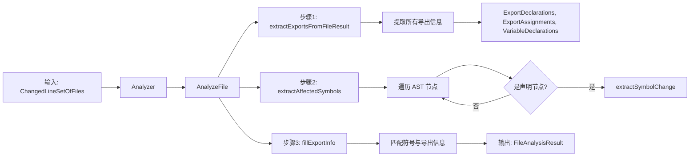
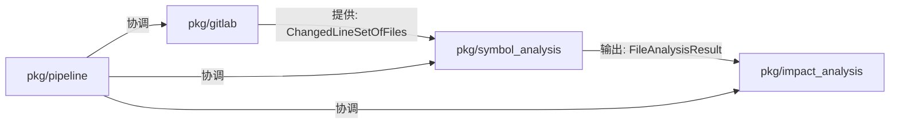

# pkg/symbol_analysis

`analyzer-ts` 的符号级代码分析包。提供 TypeScript/JavaScript 代码的符号级变更分析功能。

## 概述

本包提供**符号级代码分析**能力：

- **符号提取**: 从变更行中识别受影响的符号（函数、类、变量、接口等）
- **导出状态分析**: 判断符号是否导出，以及导出类型（命名导出、默认导出）
- **文件类型识别**: 支持符号文件和非符号文件的区分处理
- **祖先追踪**: 当变更发生在声明内部时，能正确识别其父声明节点

> **设计原则**: 本包专注于符号级分析，不关心具体的业务逻辑或语义分析

## 架构



## 核心能力

### 1. 符号分析

分析变更行对代码符号的影响，支持以下符号类型：

| SymbolKind | 说明 | 示例 |
|------------|------|------|
| `function` | 函数声明 | `export function foo() {}` |
| `variable` | 变量声明（仅顶层） | `export const config = {}` |
| `class` | 类声明 | `export class Button {}` |
| `interface` | 接口声明 | `export interface Props {}` |
| `type-alias` | 类型别名 | `export type ID = string` |
| `enum` | 枚举声明 | `export enum Color {}` |
| `method` | 类方法 | `class Service { method() {} }` |

### 2. 导出状态分析

识别符号的导出状态和类型：

| ExportType | 说明 | 示例 |
|------------|------|------|
| `named` | 命名导出 | `export const A = 1` |
| `default` | 默认导出 | `export default class Foo {}` |
| `namespace` | 命名空间导出 | `export * as utils from './utils'` |
| `""` (空) | 非导出 | `const internal = 1` |

### 3. 文件类型识别

支持多种文件类型的识别：

| FileType | 扩展名 | 是否符号文件 |
|----------|--------|-------------|
| `typescript` | .ts, .tsx, .mts | ✅ |
| `javascript` | .js, .jsx, .mjs | ✅ |
| `style` | .css, .scss, .sass, .less | ❌ |
| `markup` | .html, .htm, .xml, .svg | ❌ |
| `data` | .json, .yaml, .yml, .toml | ❌ |
| `binary` | .png, .jpg, .woff, .mp3 等 | ❌ |
| `unknown` | 其他 | ❌ |

## 使用方法

### 基础用法

```go
import (
    "github.com/Flying-Bird1999/analyzer-ts/tsmorphgo"
    "github.com/Flying-Bird1999/analyzer-ts/pkg/symbol_analysis"
)

// 1. 创建 Project
sources := map[string]string{
    "/src/Button.tsx": `
export const Button = (props: { label: string }) => {
    return <button>{props.label}</button>
}

export function handleClick() {
    console.log('clicked')
}
`,
}

project := tsmorphgo.NewProjectFromSources(sources)

// 2. 创建 Analyzer
analyzer := symbol_analysis.NewAnalyzerWithDefaults(project)

// 3. 分析变更行
changedLines := map[string]map[int]bool{
    "/src/Button.tsx": {
        5: true, // handleClick 函数内部
    },
}

results := analyzer.AnalyzeChangedLines(changedLines)

// 4. 查看结果
for filePath, result := range results {
    fmt.Printf("文件: %s\n", filePath)
    fmt.Printf("  类型: %s\n", result.FileType)
    fmt.Printf("  是符号文件: %v\n", result.IsSymbolFile)

    for _, symbol := range result.AffectedSymbols {
        fmt.Printf("  符号: %s\n", symbol.Name)
        fmt.Printf("    类型: %s\n", symbol.Kind)
        fmt.Printf("    位置: 行 %d-%d\n", symbol.StartLine, symbol.EndLine)
        fmt.Printf("    导出: %v (%s)\n", symbol.IsExported, symbol.ExportType)
        fmt.Printf("    变更行: %v\n", symbol.ChangedLines)
    }
}
```

### 自定义分析选项

```go
// 只分析导出符号，跳过类型声明
options := symbol_analysis.AnalysisOptions{
    IncludeTypes:    false, // 跳过 interface、type-alias
    IncludeInternal: false, // 只分析导出符号
}

analyzer := symbol_analysis.NewAnalyzer(project, options)
```

### 分析单个文件

```go
changedLines := map[int]bool{
    5: true,
    10: true,
}

result, err := analyzer.AnalyzeFile("/src/Button.tsx", changedLines)
if err != nil {
    log.Fatalf("分析失败: %v", err)
}

fmt.Printf("受影响符号数量: %d\n", len(result.AffectedSymbols))
```

## 数据类型

### SymbolChange

符号变更信息：

```go
type SymbolChange struct {
    // 符号标识
    Name string     // 符号名称，如 "handleClick"、"Button"
    Kind SymbolKind // 符号类型：function, variable, class 等

    // 位置信息
    FilePath  string // 源文件路径
    StartLine int    // 起始行号（注意：tsmorphgo 行号可能与源代码不一致）
    EndLine   int    // 结束行号

    // 变更信息
    ChangedLines []int      // 符号内部的实际变更行号
    ChangeType   ChangeType // 变更类型（目前恒为 Modified）

    // 导出信息
    ExportType ExportType // 导出类型
    IsExported bool       // 是否导出
}
```

### FileAnalysisResult

文件分析结果：

```go
type FileAnalysisResult struct {
    FilePath        string         // 文件路径
    FileType        FileType       // 文件类型
    AffectedSymbols []SymbolChange // 受影响的符号列表
    FileExports     []ExportInfo   // 该文件的所有导出
    ChangedLines    []int          // 变更行号列表
    IsSymbolFile    bool           // 是否为符号文件
}
```

### ExportInfo

导出符号信息：

```go
type ExportInfo struct {
    Name       string     // 符号名称
    ExportType ExportType // 导出类型
    DeclLine   int        // 声明行号
    DeclNode   string     // 声明节点类型（调试用）
}
```

## 重要说明

### ⚠️ tsmorphgo 行号偏差

**tsmorphgo 的行号计算可能与实际源代码行号不一致**：

```typescript
// 源代码（实际行号）：
//   1: export const config = { key: 'value' }
//   2: (空行)
//   3: export function helper() {
//   4:     return 'help'
//   5: }
//
// tsmorphgo 报告的节点位置：
//   config:  行 1-1  ✓ 正确
//   helper:  行 1-5  ✗ 偏差！实际应该是 3-5
```

**原因**：tsmorphgo 可能使用内部行号系统，或在解析时跳过了某些空行。

**影响**：使用 `ChangedLineSetOfFiles` 时，行号应与 tsmorphgo 报告的行号一致，而非源代码编辑器显示的行号。

### 祖先追踪行为

当变更发生在声明**内部**时，分析器会识别其**父声明节点**：

```typescript
// 示例：变更第 5 行
export function helper() {
    const x = 1  // 第 5 行变更
    return x
}

// 结果：识别出 helper 函数受影响，而非内部变量 x
```

### 顶层声明过滤

分析器只分析**顶层声明**，排除：
- 函数内部的变量
- 类方法的局部变量
- 嵌套在块作用域中的声明

```typescript
// ✅ 会被分析：顶层变量
export const config = {}

// ❌ 不会被分析：函数内部变量
export function foo() {
    const local = 1  // 跳过
}
```

## 测试

本包包含全面的测试：

```bash
# 运行所有测试
go test ./pkg/symbol_analysis/...

# 运行测试并查看覆盖率
go test -cover ./pkg/symbol_analysis/...

# 当前覆盖率: 56.6%
```

**测试类别**：

- **复杂场景测试**: 多行数组、长函数、useEffect 回调、嵌套回调、类方法
- **多符号变更测试**: 同一文件中多个符号的变更
- **导出状态追踪测试**: 验证导出/非导出符号的正确识别
- **祖先追踪测试**: 验证内部变更能正确识别父声明

## 依赖

```go
import (
    "github.com/Flying-Bird1999/analyzer-ts/analyzer/parser"
    "github.com/Flying-Bird1999/analyzer-ts/tsmorphgo"
    "github.com/Zzzen/typescript-go/use-at-your-own-risk/ast"
)
```

## 与其他包的关系



- **pkg/gitlab**: 提供 diff 解析能力，输出 `ChangedLineSetOfFiles`
- **pkg/symbol_analysis**: 接收变更行，输出符号级分析结果
- **pkg/impact_analysis**: 使用符号分析结果进行影响分析

## API 参考

### 创建分析器

```go
// 使用默认选项
analyzer := symbol_analysis.NewAnalyzerWithDefaults(project)

// 使用自定义选项
analyzer := symbol_analysis.NewAnalyzer(project, symbol_analysis.AnalysisOptions{
    IncludeTypes:    true,
    IncludeInternal: true,
})
```

### 分析方法

```go
// 分析多个文件
results := analyzer.AnalyzeChangedLines(changedLineSet)

// 分析单个文件
result, err := analyzer.AnalyzeFile(filePath, changedLines)

// 验证文件是否存在
err := analyzer.ValidateFile(filePath)

// 获取项目和选项
project := analyzer.GetProject()
opts := analyzer.GetOptions()
```

## 许可证

属于 `analyzer-ts` 项目的一部分。
