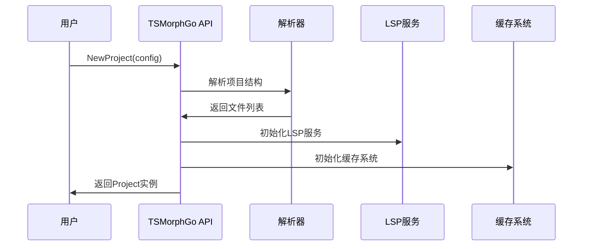
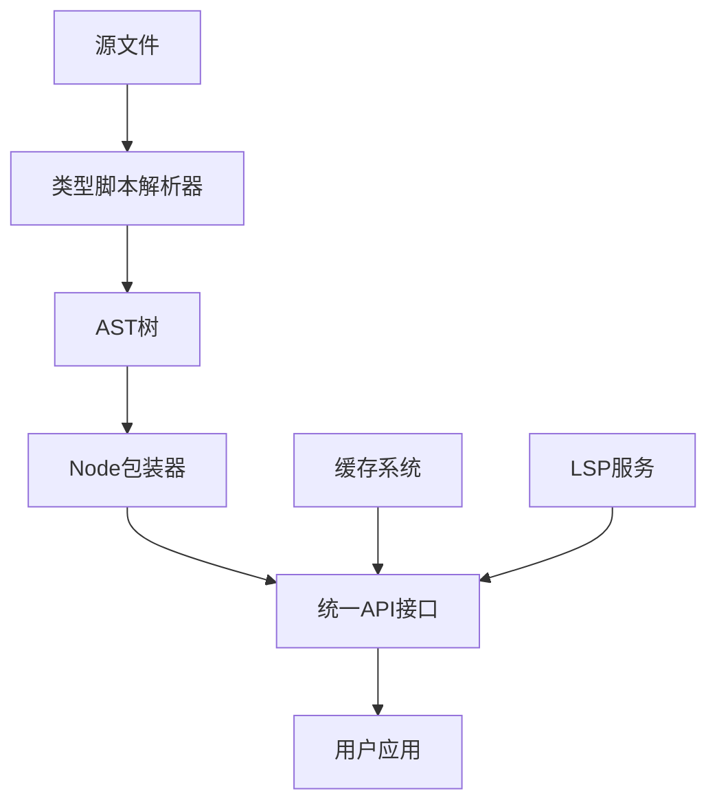
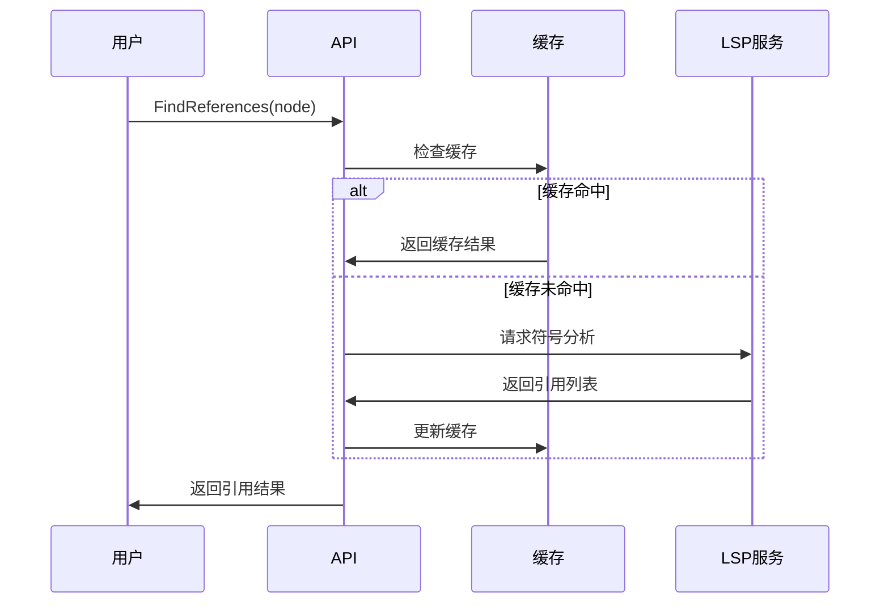

# TSMorphGo 架构设计文档

## 概述

TSMorphGo是一个为Go语言设计的TypeScript/JavaScript代码分析库，提供强大的AST分析、符号查找和代码重构能力。本文档详细描述了TSMorphGo的架构设计、核心组件和实现原理。

## 设计原则

### 1. 统一API设计
- **一致性**: 所有方法遵循统一的命名规范（IsXxx, GetXxx）
- **简洁性**: 提供简洁直观的接口，降低学习成本
- **类型安全**: 充分利用Go的类型系统，提供编译时检查

### 2. 分层架构
- **用户层**: 提供友好的API接口
- **核心层**: 实现AST操作和分析逻辑
- **基础层**: 基于typescript-go引擎

### 3. 性能优化
- **缓存机制**: 智能缓存提升重复操作性能
- **懒加载**: 按需加载，减少内存占用
- **并发安全**: 支持多线程并发访问

## 核心组件

### 1. Node (节点抽象)

```go
type Node struct {
    *ast.Node                    // 底层AST节点
    sourceFile *SourceFile       // 所属源文件
    declarationAccessor DeclarationAccessor // 声明访问器
}
```

**职责**:
- 封装底层AST节点，提供统一的访问接口
- 实现类型检查、导航和信息获取功能
- 支持类型转换和符号分析

**关键方法**:
- 类型检查: `IsKind()`, `IsDeclaration()`, `IsExpression()`
- 信息获取: `GetNodeName()`, `GetText()`, `GetStartLineNumber()`
- 导航功能: `GetParent()`, `GetAncestors()`, `ForEachDescendant()`

### 2. Project (项目管理)

```go
type Project struct {
    parserResult   *projectParser.ProjectParserResult
    sourceFiles    map[string]*SourceFile
    lspService     *lsp.Service
    symbolManager  *SymbolManager
    referenceCache *ReferenceCache
}
```

**职责**:
- 管理TypeScript项目的所有源文件
- 提供项目级别的分析和操作功能
- 集成LSP服务，支持符号分析
- 管理缓存机制，优化性能

**关键功能**:
- 文件管理: `GetSourceFiles()`, `GetSourceFile()`, `CreateSourceFile()`
- LSP集成: `GetLSPService()`, 符号分析
- 缓存管理: 引用查找缓存，性能优化

### 3. SourceFile (源文件抽象)

```go
type SourceFile struct {
    filePath     string
    fileResult   *projectParser.JsFileParserResult
    astNode      *ast.Node
    project      *Project
    nodeResultMap map[*ast.Node]interface{}
}
```

**职责**:
- 表示单个TypeScript源文件
- 管理AST树和解析结果
- 提供文件级别的分析功能
- 维护节点到解析结果的映射关系

**关键功能**:
- AST访问: `GetAstNode()`, `ForEachDescendant()`
- 解析结果: `GetFileResult()`, 节点映射
- 项目关联: `GetProject()`, 文件关系

### 4. SymbolManager (符号管理)

**职责**:
- 管理项目中的符号信息
- 支持作用域分析和符号解析
- 提供符号查找和引用分析功能

**核心功能**:
- 符号表构建和维护
- 作用域链分析
- 符号解析和查找

### 5. ReferenceCache (引用缓存)

**职责**:
- 缓存符号查找结果
- 提供性能优化
- 支持缓存策略配置

**缓存策略**:
- LRU淘汰算法
- TTL过期机制
- 重试和错误处理

## 数据流架构

### 1. 项目初始化流程



### 2. AST分析流程



### 3. 符号查找流程



## 统一API设计

### 设计目标

1. **简化学习**: 统一的命名规范，减少记忆负担
2. **类型安全**: 利用Go类型系统，减少运行时错误
3. **功能完整**: 覆盖所有常见的AST操作需求
4. **性能优化**: 高效的缓存和遍历算法

### API分类

#### 1. 类型检查API
```go
// 精确类型检查
node.IsKind(KindFunctionDeclaration)

// 便捷类型检查
node.IsFunctionDeclaration()

// 类别检查
node.IsDeclaration()

// 多类型检查
node.IsAnyKind(KindA, KindB, KindC)
```

#### 2. 信息获取API
```go
// 基本信息
node.GetNodeName()
node.GetText()
node.GetKind()

// 位置信息
node.GetStartLineNumber()
node.GetStartColumnNumber()
node.GetStart()
node.GetEnd()
```

#### 3. 导航API
```go
// 节点导航
node.GetParent()
node.GetAncestors()
node.GetFirstAncestorByKind(kind)

// 节点遍历
node.ForEachDescendant(callback)
```

#### 4. 类型转换API
```go
// 统一转换
node.AsDeclaration()

// 具体转换
AsVariableDeclaration(node)
AsFunctionDeclaration(node)
AsImportDeclaration(node)
```

## 性能优化策略

### 1. 缓存机制

**引用查找缓存**:
- 缓存符号查找结果
- LRU淘汰策略
- TTL过期机制

**项目级缓存**:
- 符号表缓存
- AST结构缓存
- 解析结果缓存

### 2. 懒加载

**声明访问器**:
- 按需加载解析结果
- 避免不必要的计算

**符号管理**:
- 延迟初始化符号表
- 按需分析作用域

### 3. 算法优化

**AST遍历**:
- 高效的遍历算法
- 减少不必要的节点访问
- 支持提前终止

**类型检查**:
- 快速类型匹配
- 批量类型检查
- 缓存检查结果

## 错误处理

### 1. 分层错误处理

```go
// API层错误
type APIError struct {
    Code    ErrorCode
    Message string
    Cause   error
}

// LSP层错误
type LSPError struct {
    Method string
    Error  error
}

// 缓存层错误
type CacheError struct {
    Operation string
    Error     error
}
```

### 2. 重试机制

**引用查找重试**:
```go
type RetryConfig struct {
    MaxRetries int
    Delay      time.Duration
    Backoff    float64
}
```

### 3. 优雅降级

- 缓存失败时直接计算
- LSP服务不可用时使用基础分析
- 部分功能失败时继续其他操作

## 扩展性设计

### 1. 插件架构

**分析器插件**:
- 自定义AST分析器
- 可插拔的类型检查器
- 自定义符号解析器

### 2. 配置系统

**项目配置**:
- 灵活的配置选项
- 环境变量支持
- 配置文件解析

### 3. 回调机制

**事件系统**:
- 文件变更监听
- 符号变化通知
- 分析进度回调

## 测试策略

### 1. 单元测试

- API接口测试
- 类型检查测试
- 导航功能测试

### 2. 集成测试

- 项目级分析测试
- LSP集成测试
- 缓存系统测试

### 3. 性能测试

- 大型项目处理测试
- 内存使用测试
- 并发访问测试

## 未来规划

### 短期目标
- [ ] 完善类型转换API
- [ ] 优化缓存性能
- [ ] 增强错误处理

### 中期目标
- [ ] 支持更多TypeScript特性
- [ ] 提供代码重构功能
- [ ] 增加插件系统

### 长期目标
- [ ] 支持JavaScript ESNext
- [ ] 提供IDE插件支持
- [ ] 构建完整的工具链

## 总结

TSMorphGo的架构设计遵循简洁、高效、可扩展的原则。通过统一API设计、分层架构和性能优化，为TypeScript代码分析提供了强大而易用的工具。持续的优化和扩展将使TSMorphGo成为Go生态系统中不可或缺的TypeScript分析库。