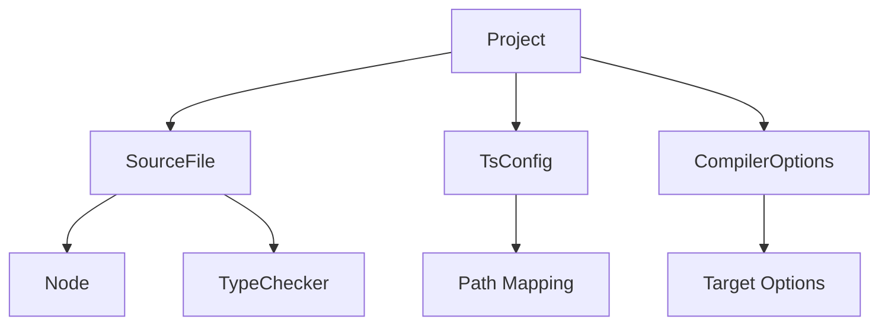
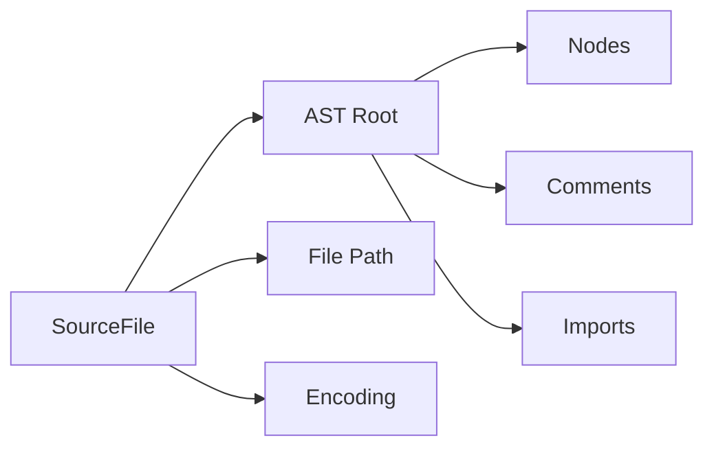
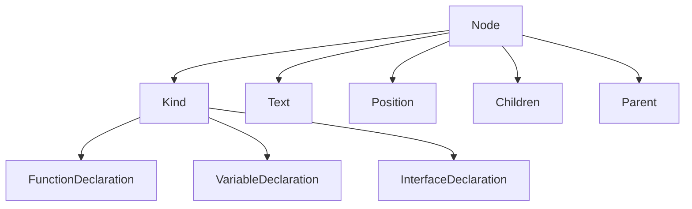

# TSMorphGo

[](https://golang.org/)
[](LICENSE)
[](https://www.typescriptlang.org/)

> 🚀 TSMorphGo 是一个强大的 Go 语言 TypeScript 代码分析库，提供了类似 ts-morph 的 API，用于 TypeScript/JavaScript 代码的 AST 操作、代码转换和静态分析。

## 📋 目录

- [特性](#-特性)
- [快速开始](#-快速开始)
- [架构设计](#-架构设计)
- [核心概念](#-核心概念)
- [API 参考](#-api-参考)
- [使用示例](#-使用示例)
- [性能优化](#-性能优化)
- [最佳实践](#-最佳实践)
- [贡献指南](#-贡献指南)
- [许可证](#-许可证)

## ✨ 特性

### 🎯 核心功能
- **🔍 代码分析**: 完整的 TypeScript/JavaScript AST 遍历和分析
- **🛠️ 代码转换**: 强大的代码修改和生成能力
- **📊 静态分析**: 类型检查、依赖分析、引用查找
- **🔗 符号解析**: 跨文件的符号引用和定义查找
- **⚡ 高性能**: 基于高性能 TypeScript 编译器后端

### 🏗️ 技术特点
- **类型安全**: 完整的 Go 类型系统支持
- **内存安全**: 自动内存管理，避免内存泄漏
- **并发安全**: 支持 goroutine 并发处理
- **跨平台**: 支持 Windows、macOS、Linux
- **易于集成**: 简洁的 API 设计，易于集成到现有项目

### 📚 API 兼容性
- **ts-morph 风格**: 提供 ts-morph 类似的 API 体验
- **TypeScript API**: 直接访问 TypeScript 编译器 API
- **扩展性**: 支持自定义节点类型和扩展

## 🚀 快速开始

### 安装

```bash
go get github.com/Flying-Bird1999/analyzer-ts/tsmorphgo
```

### 基础示例

```go
package main

import (
    "fmt"
    "log"

    "github.com/Flying-Bird1999/analyzer-ts/tsmorphgo"
)

func main() {
    // 创建项目
    project := tsmorphgo.NewProject(tsmorphgo.ProjectConfig{
        RootPath:     "./my-project",
        UseTsConfig:  true,
        TsConfigPath: "./my-project/tsconfig.json",
    })

    if project == nil {
        log.Fatal("项目创建失败")
    }

    // 获取源文件
    file := project.GetSourceFile("./src/index.ts")
    if file == nil {
        log.Fatal("文件未找到")
    }

    // 遍历所有节点
    file.ForEachDescendant(func(node tsmorphgo.Node) {
        if node.IsFunctionDeclaration() {
            fmt.Printf("找到函数: %s\n", node.GetText())
        }
    })

    // 清理资源
    defer project.Close()
}
```

## 🏗️ 架构设计

### 整体架构图

```
┌─────────────────────────────────────────────────────────────┐
│                    TSMorphGo 架构                            │
├─────────────────────────────────────────────────────────────┤
│                                                             │
│  ┌─────────────────┐    ┌─────────────────┐               │
│  │   Go API 层     │    │   用户代码       │               │
│  │                 │    │                 │               │
│  │ • Project       │◄──►│ • 业务逻辑       │               │
│  │ • SourceFile    │    │ • 代码转换       │               │
│  │ • Node          │    │ • 静态分析       │               │
│  │ • Type          │    │                 │               │
│  └─────────────────┘    └─────────────────┘               │
│           │                      │                           │
│           ▼                      ▼                           │
│  ┌─────────────────────────────────────────────────────┐   │
│  │              核心引擎层                              │   │
│  │                                                     │   │
│  │  ┌─────────────┐  ┌─────────────┐  ┌─────────────┐   │   │
│  │  │ 项目管理器   │  │  节点管理器   │  │  类型管理器   │   │   │
│  │  │             │  │             │  │             │   │   │
│  │  │ • 配置解析   │  │ • AST 遍历   │  │ • 类型检查   │   │   │
│  │  │ • 文件管理   │  │ • 节点操作   │  │ • 符号解析   │   │   │
│  │  │ • 缓存管理   │  │ • 类型收窄   │  │ • 引用查找   │   │   │
│  │  └─────────────┘  └─────────────┘  └─────────────┘   │   │
│  └─────────────────────────────────────────────────────┘   │
│                           │                                 │
│                           ▼                                 │
│  ┌─────────────────────────────────────────────────────┐   │
│  │             TypeScript 编译器后端                     │   │
│  │                                                     │   │
│  │  ┌─────────────┐  ┌─────────────┐  ┌─────────────┐   │   │
│  │  │   解析器     │  │  类型检查器  │  │   发射器     │   │   │
│  │  │             │  │             │  │             │   │   │
│  │  │ • 词法分析   │  │ • 语义分析   │  │ • 代码生成   │   │   │
│  │  │ • 语法分析   │  │ • 类型推断   │  │ • 源码映射   │   │   │
│  │  │ • AST 构建   │  │ • 错误检查   │  │ • 输出生成   │   │   │
│  │  └─────────────┘  └─────────────┘  └─────────────┘   │   │
│  └─────────────────────────────────────────────────────┘   │
└─────────────────────────────────────────────────────────────┘
```

### 数据流图

```
┌─────────────┐    ┌─────────────┐    ┌─────────────┐    ┌─────────────┐
│   源文件    │───►│   解析器    │───►│   AST      │───►│   节点操作  │
│             │    │             │    │             │    │             │
│ • .ts/.tsx  │    │ • Token化   │    │ • AST 节点  │    │ • 遍历      │
│ • .js/.jsx  │    │ • 语法分析   │    │ • 类型信息  │    │ • 修改      │
│ • .json     │    │ • AST 构建   │    │ • 符号表    │    │ • 查询      │
└─────────────┘    └─────────────┘    └─────────────┘    └─────────────┘
                           │                   │                   │
                           ▼                   ▼                   ▼
                   ┌─────────────┐    ┌─────────────┐    ┌─────────────┐
                   │  类型检查器  │    │  符号解析器  │    │   代码输出  │
                   │             │    │             │    │             │
                   │ • 类型推断   │    │ • 引用分析   │    │ • 代码生成  │
                   │ • 类型检查   │    │ • 定义查找   │    │ • 格式化    │
                   │ • 错误检测   │    │ • 跨文件解析 │    │ • 写入文件   │
                   └─────────────┘    └─────────────┘    └─────────────┘
```

## 🧠 核心概念

### 项目 (Project)



**Project** 是 TSMorphGo 的核心入口，管理整个 TypeScript 项目的分析。

```go
// 项目配置
config := tsmorphgo.ProjectConfig{
    RootPath:     "./my-project",
    UseTsConfig:  true,
    TsConfigPath: "./tsconfig.json",
}

// 创建项目
project := tsmorphgo.NewProject(config)
```

### 源文件 (SourceFile)



**SourceFile** 代表一个 TypeScript/JavaScript 源文件。

```go
// 获取文件
file := project.GetSourceFile("./src/index.ts")

// 遍历文件节点
file.ForEachDescendant(func(node tsmorphgo.Node) {
    // 处理节点
})

// 获取文件文本
text := file.GetFullText()
```

### 节点 (Node)



**Node** 是 AST 的基本单位，代表源代码中的语法结构。

```go
// 节点类型判断
if node.IsFunctionDeclaration() {
    fmt.Println("这是一个函数声明")
}

// 类型转换
funcDecl, ok := node.AsFunctionDeclaration()
if ok {
    // 使用函数声明专有API
    name := funcDecl.GetName()
}

// 获取节点信息
kind := node.GetKind()
text := node.GetText()
pos := node.GetStart()
```

## 📚 API 参考

### 项目管理 API

#### 创建项目

```go
// 基础配置
project := tsmorphgo.NewProject(tsmorphgo.ProjectConfig{
    RootPath: "./project",
})

// 使用 tsconfig.json
project := tsmorphgo.NewProject(tsmorphgo.ProjectConfig{
    RootPath:     "./project",
    UseTsConfig:  true,
    TsConfigPath: "./project/tsconfig.json",
})
```

#### 获取文件

```go
// 通过路径获取
file := project.GetSourceFile("./src/index.ts")

// 获取所有文件
files := project.GetSourceFiles()

// 获取指定模式的文件
files := project.GetSourceFiles("src/**/*.ts")
```

### 节点遍历 API

#### ForEachDescendant

```go
// 深度优先遍历所有子节点
file.ForEachDescendant(func(node tsmorphgo.Node) {
    fmt.Printf("节点类型: %s, 文本: %s\n",
        node.GetKind().String(),
        node.GetText())
})
```

#### ForEachChild

```go
// 只遍历直接子节点
node.ForEachChild(func(child tsmorphgo.Node) bool {
    fmt.Printf("子节点: %s\n", child.GetText())
    return true // 继续遍历
})
```

### 节点查询 API

#### 类型判断

```go
// 具体类型判断
if node.IsFunctionDeclaration() {
    // 函数声明
}

// 通用类型判断
if node.IsKind(tsmorphgo.KindFunctionDeclaration) {
    // 函数声明
}
```

#### 类型转换

```go
// 安全类型转换
funcDecl, ok := node.AsFunctionDeclaration()
if ok {
    // 使用函数声明专有API
    name := funcDecl.GetName()
    params := funcDecl.GetParameters()
}
```

#### 查找节点

```go
// 查找特定类型的父节点
parent := node.GetFirstAncestorByKind(tsmorphgo.KindFunctionDeclaration)

// 查找特定类型的子节点
child := node.GetFirstChildByKind(tsmorphgo.KindIdentifier)

// 通过文本查找
foundNode := file.FindNodeByText("functionName")
```

### 符号和引用 API

#### 获取符号信息

```go
symbol, err := node.GetSymbol()
if err == nil && symbol != nil {
    name := symbol.GetName()
    flags := symbol.GetFlags()
}
```

#### 查找引用

```go
// 查找所有引用
references, err := tsmorphgo.FindReferences(node)
if err == nil {
    for _, ref := range references {
        fmt.Printf("引用位置: %s:%d\n",
            ref.GetSourceFile().GetFilePath(),
            ref.GetStartLineNumber())
    }
}
```

### 代码修改 API

#### 修改节点文本

```go
// 替换节点文本
node.ReplaceWithText("new code")

// 在节点前插入
node.InsertBefore("inserted code")

// 在节点后插入
node.InsertAfter("inserted code")

// 删除节点
node.Remove()
```

#### 修改文件

```go
// 保存修改
file.Save()

// 获取完整文本
text := file.GetFullText()

// 替换文件内容
file.ReplaceWithText("new file content")
```

## 🎯 使用示例

### 示例 1: 函数分析

```go
package main

import (
    "fmt"
    "log"

    "github.com/Flying-Bird1999/analyzer-ts/tsmorphgo"
)

func main() {
    project := tsmorphgo.NewProject(tsmorphgo.ProjectConfig{
        RootPath: "./my-project",
    })

    // 分析所有函数
    for _, file := range project.GetSourceFiles() {
        file.ForEachDescendant(func(node tsmorphgo.Node) {
            if node.IsFunctionDeclaration() {
                funcDecl, ok := node.AsFunctionDeclaration()
                if ok {
                    name := funcDecl.GetName()
                    params := funcDecl.GetParameters()
                    body := funcDecl.GetBody()

                    fmt.Printf("函数: %s\n", name)
                    fmt.Printf("参数数量: %d\n", len(params))
                    fmt.Printf("有函数体: %t\n", body != nil)
                    fmt.Println("---")
                }
            }
        })
    }

    defer project.Close()
}
```

### 示例 2: 类型查找

```go
package main

import (
    "fmt"

    "github.com/Flying-Bird1999/analyzer-ts/tsmorphgo"
)

func main() {
    project := tsmorphgo.NewProject(tsmorphgo.ProjectConfig{
        RootPath: "./my-project",
    })

    // 查找所有接口
    interfaces := []string{}

    for _, file := range project.GetSourceFiles() {
        file.ForEachDescendant(func(node tsmorphgo.Node) {
            if node.IsInterfaceDeclaration() {
                interfaceDecl, ok := node.AsInterfaceDeclaration()
                if ok {
                    name := interfaceDecl.GetName()
                    interfaces = append(interfaces, name)
                }
            }
        })
    }

    fmt.Printf("找到接口: %v\n", interfaces)

    defer project.Close()
}
```

### 示例 3: 代码转换

```go
package main

import (
    "fmt"

    "github.com/Flying-Bird1999/analyzer-ts/tsmorphgo"
)

func main() {
    project := tsmorphgo.NewProject(tsmorphgo.ProjectConfig{
        RootPath: "./my-project",
    })

    // 将所有 var 声明转换为 const
    for _, file := range project.GetSourceFiles() {
        file.ForEachDescendant(func(node tsmorphgo.Node) {
            if node.IsVariableDeclaration() {
                varDecl, ok := node.AsVariableDeclaration()
                if ok && !varDecl.IsConst() {
                    // 替换 var 为 const
                    text := varDecl.GetText()
                    newText := strings.Replace(text, "var", "const", 1)
                    varDecl.ReplaceWithText(newText)
                }
            }
        })

        // 保存修改
        file.Save()
    }

    defer project.Close()
}
```

### 示例 4: 依赖分析

```go
package main

import (
    "fmt"
    "strings"

    "github.com/Flying-Bird1999/analyzer-ts/tsmorphgo"
)

func main() {
    project := tsmorphgo.NewProject(tsmorphgo.ProjectConfig{
        RootPath: "./my-project",
    })

    dependencies := make(map[string][]string)

    for _, file := range project.GetSourceFiles() {
        fileName := file.GetFilePath()
        file.ForEachDescendant(func(node tsmorphgo.Node) {
            if node.IsImportDeclaration() {
                importDecl, ok := node.AsImportDeclaration()
                if ok {
                    moduleSpecifier := importDecl.GetModuleSpecifier()
                    dependencies[fileName] = append(dependencies[fileName], moduleSpecifier)
                }
            }
        })
    }

    // 输出依赖关系
    for file, deps := range dependencies {
        fmt.Printf("%s 依赖于:\n", file)
        for _, dep := range deps {
            fmt.Printf("  - %s\n", dep)
        }
        fmt.Println()
    }

    defer project.Close()
}
```

## ⚡ 性能优化

### 内存管理

```go
// 及时关闭项目
defer project.Close()

// 分批处理大量文件
files := project.GetSourceFiles()
batchSize := 100

for i := 0; i < len(files); i += batchSize {
    end := i + batchSize
    if end > len(files) {
        end = len(files)
    }

    batch := files[i:end]
    processBatch(batch)
}
```

### 并发处理

```go
import (
    "sync"
)

func processFilesConcurrently(project *tsmorphgo.Project) {
    files := project.GetSourceFiles()
    var wg sync.WaitGroup

    // 控制并发数
    semaphore := make(chan struct{}, 10)

    for _, file := range files {
        wg.Add(1)
        go func(f tsmorphgo.SourceFile) {
            defer wg.Done()

            semaphore <- struct{}{}
            defer func() { <-semaphore }()

            processFile(f)
        }(file)
    }

    wg.Wait()
}
```

### 缓存优化

```go
// 缓存类型检查结果
type CachedProject struct {
    *tsmorphgo.Project
    typeCache map[string]tsmorphgo.Type
    mu         sync.RWMutex
}

func (cp *CachedProject) GetCachedType(node tsmorphgo.Node) tsmorphgo.Type {
    key := fmt.Sprintf("%s:%d", node.GetSourceFile().GetFilePath(), node.GetStart())

    cp.mu.RLock()
    if typ, exists := cp.typeCache[key]; exists {
        cp.mu.RUnlock()
        return typ
    }
    cp.mu.RUnlock()

    typ := node.GetType()

    cp.mu.Lock()
    cp.typeCache[key] = typ
    cp.mu.Unlock()

    return typ
}
```

## 📋 最佳实践

### 1. 项目初始化

```go
// ✅ 推荐：使用 tsconfig.json
project := tsmorphgo.NewProject(tsmorphgo.ProjectConfig{
    RootPath:     "./project",
    UseTsConfig:  true,
    TsConfigPath: "./project/tsconfig.json",
})

// ✅ 推荐：明确指定编译选项
project := tsmorphgo.NewProject(tsmorphgo.ProjectConfig{
    RootPath: "./project",
    CompilerOptions: map[string]interface{}{
        "target":     "ES2020",
        "module":     "CommonJS",
        "strict":     true,
    },
})
```

### 2. 资源管理

```go
// ✅ 推荐：使用 defer 确保资源释放
func analyzeProject() {
    project := tsmorphgo.NewProject(config)
    defer project.Close() // 确保资源被释放

    // 分析代码...
}

// ✅ 推荐：批量处理时及时清理
func processLargeProject() {
    project := tsmorphgo.NewProject(config)
    defer project.Close()

    files := project.GetSourceFiles()
    for i, file := range files {
        processFile(file)

        // 每处理100个文件强制清理一次
        if i%100 == 0 {
            project.ClearCache()
        }
    }
}
```

### 3. 错误处理

```go
// ✅ 推荐：检查所有可能的错误
symbol, err := node.GetSymbol()
if err != nil {
    log.Printf("获取符号失败: %v", err)
    return
}
if symbol == nil {
    log.Printf("节点没有符号信息")
    return
}

// ✅ 推荐：类型转换时检查结果
funcDecl, ok := node.AsFunctionDeclaration()
if !ok {
    log.Printf("节点不是函数声明")
    return
}
```

### 4. 性能考虑

```go
// ✅ 推荐：避免重复遍历
func analyzeEfficiently(file tsmorphgo.SourceFile) {
    // 一次遍历收集所有信息
    functions := []tsmorphgo.FunctionDeclaration{}
    interfaces := []tsmorphgo.InterfaceDeclaration{}

    file.ForEachDescendant(func(node tsmorphgo.Node) {
        if node.IsFunctionDeclaration() {
            if funcDecl, ok := node.AsFunctionDeclaration(); ok {
                functions = append(functions, funcDecl)
            }
        } else if node.IsInterfaceDeclaration() {
            if interfaceDecl, ok := node.AsInterfaceDeclaration(); ok {
                interfaces = append(interfaces, interfaceDecl)
            }
        }
    })

    // 使用收集到的信息...
}
```

## 🤝 贡献指南

我们欢迎所有形式的贡献！请阅读以下指南：

### 开发环境设置

```bash
# 克隆仓库
git clone https://github.com/Flying-Bird1999/analyzer-ts.git
cd analyzer-ts/tsmorphgo

# 安装依赖
go mod tidy

# 运行测试
go test ./...

# 运行示例
cd examples
go run -tags=examples basic_usage.go
```

### 代码规范

- 遵循 Go 官方代码规范
- 使用 `gofmt` 格式化代码
- 添加适当的注释和文档
- 确保所有测试通过

### 提交 Pull Request

1. Fork 项目
2. 创建功能分支 (`git checkout -b feature/amazing-feature`)
3. 提交更改 (`git commit -m 'Add amazing feature'`)
4. 推送到分支 (`git push origin feature/amazing-feature`)
5. 创建 Pull Request

### 问题报告

使用 GitHub Issues 报告问题，请包含：

- 详细的错误描述
- 复现步骤
- 环境信息 (Go 版本、操作系统等)
- 相关代码片段

## 📄 许可证

本项目采用 MIT 许可证。详情请参阅 [LICENSE](LICENSE) 文件。

## 🔗 相关链接

- [TypeScript](https://www.typescriptlang.org/)
- [ts-morph](https://ts-morph.com/)
- [TypeScript Compiler API](https://github.com/microsoft/TypeScript/wiki/Using-the-Compiler-API)
- [Go AST](https://pkg.go.dev/go/ast)

## 📞 联系我们

- 项目主页: https://github.com/Flying-Bird1999/analyzer-ts
- 问题反馈: https://github.com/Flying-Bird1999/analyzer-ts/issues
- 邮箱: your-email@example.com

---

**TSMorphGo** - 让 TypeScript 代码分析变得简单而强大！ 🚀