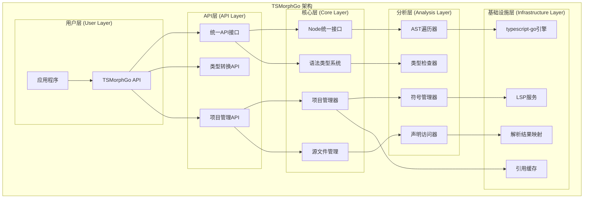
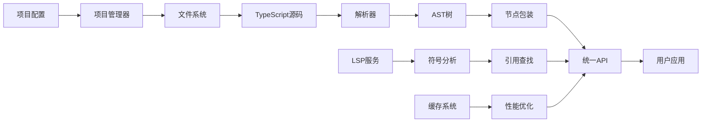

# TSMorphGo

<div align="center">


**强大的TypeScript代码分析库** - 为Go语言提供TypeScript/JavaScript AST分析、代码理解和重构能力

[快速开始](#快速开始) • [API文档](#api文档) • [示例](#示例) • [架构](#架构)

</div>

## 📖 目录

- [概览](#概览)
- [特性](#特性)
- [架构](#架构)
- [快速开始](#快速开始)
- [API文档](#api文档)
- [核心功能](#核心功能)
- [示例](#示例)
- [性能](#性能)
- [贡献指南](#贡献指南)

## 🎯 概览

TSMorphGo是一个为Go语言设计的TypeScript/JavaScript代码分析库，提供了强大的AST（抽象语法树）操作能力。它基于`typescript-go`构建，并提供了统一、简洁的API接口，让TypeScript代码分析变得简单高效。

### 核心价值

- 🔍 **深度代码理解**: 解析TypeScript/JavaScript代码的完整AST结构
- 🚀 **统一API设计**: 简洁一致的接口，降低学习成本
- 🎯 **LSP集成**: 基于Language Server Protocol的精确符号分析
- 💡 **类型安全**: 完整的TypeScript类型系统支持
- ⚡ **高性能**: 优化的缓存机制和遍历算法

## ✨ 特性

### 🏗️ 统一API设计
- **一致的命名规范**: `IsXxx()`, `GetXxx()` 方法
- **类别检查系统**: `IsDeclaration()`, `IsExpression()`, `IsType()`
- **多类型检查**: `IsAnyKind(...)` 批量类型判断
- **类型转换**: `AsDeclaration()` 统一转换接口

### 🎯 核心功能
- **项目分析**: 完整的TypeScript项目解析和管理
- **AST遍历**: 高效的节点遍历和导航
- **符号查找**: 基于LSP的精确引用分析
- **类型检查**: TypeScript类型系统分析
- **代码生成**: 动态创建和修改TypeScript代码

### 🚀 高级特性
- **内存文件系统**: 支持内存中的项目创建和管理
- **缓存机制**: 智能缓存提升分析性能
- **错误处理**: 完善的错误报告和恢复机制
- **模块化设计**: 清晰的架构分层

## 🏗️ 架构

### 系统架构图



### 核心组件

| 组件 | 描述 | 主要功能 |
|------|------|----------|
| **Node** | AST节点包装器 | 统一的节点访问接口 |
| **Project** | 项目管理器 | 文件管理、LSP集成 |
| **SourceFile** | 源文件抽象 | AST解析、节点映射 |
| **SymbolManager** | 符号管理器 | 符号表、作用域分析 |
| **ReferenceCache** | 引用缓存 | 性能优化、结果缓存 |

### 数据流图



## 🚀 快速开始

### 安装

```bash
go get github.com/Flying-Bird1999/analyzer-ts/tsmorphgo
```

### 基础示例

```go
package main

import (
    "fmt"
    "github.com/Flying-Bird1999/analyzer-ts/tsmorphgo"
)

func main() {
    // 创建项目
    project := tsmorphgo.NewProject(tsmorphgo.ProjectConfig{
        RootPath:         "./my-ts-project",
        TargetExtensions: []string{".ts", ".tsx"},
        UseTsConfig:      true,
    })
    defer project.Close()

    // 获取源文件
    sourceFiles := project.GetSourceFiles()
    fmt.Printf("找到 %d 个TypeScript文件\n", len(sourceFiles))

    // 分析AST
    for _, file := range sourceFiles {
        file.ForEachDescendant(func(node tsmorphgo.Node) {
            // 使用统一API进行节点分析
            if node.IsFunctionDeclaration() {
                if name, ok := node.GetNodeName(); ok {
                    fmt.Printf("找到函数: %s (行 %d)\n",
                        name, node.GetStartLineNumber())
                }
            }
        })
    }
}
```

### 内存项目示例

```go
// 创建内存项目（无需文件系统）
project := tsmorphgo.NewProjectFromSources(map[string]string{
    "/src/types.ts": `
        export interface User {
            id: number;
            name: string;
        }
    `,
    "/src/utils.ts": `
        export function formatDate(date: Date): string {
            return date.toISOString();
        }
    `,
})
defer project.Close()

// 分析内存项目
typesFile := project.GetSourceFile("/src/types.ts")
typesFile.ForEachDescendant(func(node tsmorphgo.Node) {
    if node.IsInterfaceDeclaration() {
        fmt.Println("发现接口定义")
    }
})
```

## 📚 API文档

### 核心接口

#### Node API

```go
type Node struct {
    *ast.Node                    // 底层AST节点
    sourceFile *SourceFile       // 所属源文件
    declarationAccessor DeclarationAccessor // 声明访问器
}
```

**类型检查方法**
```go
// 精确类型检查
node.IsKind(KindFunctionDeclaration)     // 函数声明
node.IsKind(KindInterfaceDeclaration)    // 接口声明
node.IsKind(KindVariableDeclaration)     // 变量声明

// 便捷类型检查
node.IsFunctionDeclaration()              // 函数声明
node.IsInterfaceDeclaration()             // 接口声明
node.IsVariableDeclaration()              // 变量声明
node.IsCallExpr()                         // 函数调用
node.IsImportDeclaration()                // 导入声明

// 类别检查
node.IsDeclaration()     // 所有声明类型
node.IsExpression()      // 所有表达式类型
node.IsType()           // 所有类型相关
node.IsModule()         // 所有模块相关
node.IsLiteral()        // 所有字面量类型

// 多类型检查
node.IsAnyKind(
    KindFunctionDeclaration,
    KindInterfaceDeclaration,
    KindClassDeclaration,
)
```

**信息获取方法**
```go
node.GetNodeName()           // 获取节点名称
node.GetText()              // 获取节点文本
node.GetStartLineNumber()   // 获取起始行号
node.GetStartColumnNumber() // 获取起始列号
node.GetStart()             // 获取起始位置
node.GetEnd()               // 获取结束位置
node.GetParent()            // 获取父节点
node.GetAncestors()         // 获取所有祖先节点
node.GetSourceFile()        // 获取所属源文件
```

**导航方法**
```go
node.GetFirstAncestorByKind(KindFunctionDeclaration)  // 查找特定类型祖先
node.ForEachDescendant(func(node Node))              // 遍历所有子孙节点
```

**类型转换方法**
```go
if result, ok := node.AsDeclaration(); ok {
    // 处理声明类型
}

if result, ok := AsVariableDeclaration(node); ok {
    // 处理变量声明
}
```

#### Project API

```go
type ProjectConfig struct {
    RootPath         string              // 项目根路径
    TargetExtensions []string            // 目标文件扩展名
    IgnorePatterns   []string            // 忽略模式
    UseTsConfig      bool                // 使用tsconfig.json
    TsConfigPath     string              // tsconfig.json路径
}

// 创建项目
project := tsmorphgo.NewProject(config)
defer project.Close()

// 创建内存项目
project := tsmorphgo.NewProjectFromSources(sources)

// 文件操作
sourceFiles := project.GetSourceFiles()
sourceFile := project.GetSourceFile("path/to/file.ts")

// 动态文件创建
newFile := project.CreateSourceFile("path/to/new.ts", "export const x = 1;")
```

#### Reference API

```go
// 基础引用查找
refs, err := tsmorphgo.FindReferences(node)
if err == nil {
    for _, ref := range refs {
        fmt.Printf("引用: %s (行 %d)\n",
            ref.GetText(), ref.GetStartLineNumber())
    }
}

// 带缓存的引用查找
refs, fromCache, err := tsmorphgo.FindReferencesWithCache(node)

// 带重试的引用查找
config := &tsmorphgo.RetryConfig{
    MaxRetries: 3,
    Delay:      time.Second,
}
refs, fromCache, err := tsmorphgo.FindReferencesWithCacheAndRetry(node, config)
```

## 🎯 核心功能

### 1. 项目分析

```go
// 分析完整项目
project := tsmorphgo.NewProject(tsmorphgo.ProjectConfig{
    RootPath: "./src",
    TargetExtensions: []string{".ts", ".tsx"},
    IgnorePatterns: []string{"node_modules", "dist"},
    UseTsConfig: true,
})

// 获取项目统计
files := project.GetSourceFiles()
fmt.Printf("项目包含 %d 个文件\n", len(files))

// 分析项目结构
for _, file := range files {
    fmt.Printf("文件: %s (%d 行)\n",
        file.GetFilePath(),
        len(file.GetFileResult().Raw))
}
```

### 2. 类型检测

```go
// 类别检测
file.ForEachDescendant(func(node tsmorphgo.Node) {
    switch {
    case node.IsDeclaration():
        fmt.Printf("声明: %s\n", node.GetKind().String())
    case node.IsExpression():
        fmt.Printf("表达式: %s\n", node.GetKind().String())
    case node.IsType():
        fmt.Printf("类型: %s\n", node.GetKind().String())
    }
})

// 精确类型检测
if node.IsInterfaceDeclaration() {
    // 处理接口
} else if node.IsFunctionDeclaration() {
    // 处理函数
}
```

### 3. 符号分析

```go
// 查找符号的所有引用
if node.IsIdentifierNode() {
    symbolName := node.GetText()
    refs, err := tsmorphgo.FindReferences(node)
    if err == nil {
        fmt.Printf("符号 '%s' 有 %d 个引用\n", symbolName, len(refs))
    }
}

// 分析作用域
ancestors := node.GetAncestors()
for _, ancestor := range ancestors {
    if ancestor.IsFunctionDeclaration() {
        fmt.Printf("在函数作用域内: %s\n", ancestor.GetNodeName())
    }
}
```

### 4. 代码生成

```go
// 动态创建文件
project.CreateSourceFile("/src/generated.ts", `
    export interface GeneratedInterface {
        id: number;
        name: string;
    }

    export const CONSTANT = "value";
`)

// 创建内存项目
memoryProject := tsmorphgo.NewProjectFromSources(map[string]string{
    "/main.ts": `
        import { GeneratedInterface } from "./generated";

        const data: GeneratedInterface = {
            id: 1,
            name: "test"
        };
    `,
})
```

## 📖 示例

### 示例1: 函数分析器

```go
func analyzeFunctions(project *tsmorphgo.Project) {
    functions := []struct {
        name     string
        line     int
        exported bool
        params   []string
    }{}

    for _, file := range project.GetSourceFiles() {
        file.ForEachDescendant(func(node tsmorphgo.Node) {
            if node.IsFunctionDeclaration() {
                if name, ok := node.GetNodeName(); ok {
                    // 检查是否导出
                    text := node.GetText()
                    exported := strings.Contains(text, "export")

                    functions = append(functions, struct {
                        name     string
                        line     int
                        exported bool
                        params   []string
                    }{
                        name:     name,
                        line:     node.GetStartLineNumber(),
                        exported: exported,
                    })
                }
            }
        })
    }

    fmt.Printf("找到 %d 个函数:\n", len(functions))
    for _, fn := range functions {
        fmt.Printf("  %s() - 行 %d - %s\n",
            fn.name, fn.line,
            map[bool]string{true: "导出", false: "内部"}[fn.exported])
    }
}
```

### 示例2: 类型统计器

```go
func analyzeTypes(project *tsmorphgo.Project) {
    stats := map[string]int{
        "interfaces": 0,
        "classes":    0,
        "enums":      0,
        "aliases":    0,
        "functions":  0,
    }

    for _, file := range project.GetSourceFiles() {
        file.ForEachDescendant(func(node tsmorphgo.Node) {
            switch {
            case node.IsInterfaceDeclaration():
                stats["interfaces"]++
            case node.IsClassDeclaration():
                stats["classes"]++
            case node.IsKind(KindEnumDeclaration):
                stats["enums"]++
            case node.IsKind(KindTypeAliasDeclaration):
                stats["aliases"]++
            case node.IsFunctionDeclaration():
                stats["functions"]++
            }
        })
    }

    fmt.Println("类型统计:")
    for kind, count := range stats {
        fmt.Printf("  %s: %d\n", kind, count)
    }
}
```

### 示例3: 依赖分析器

```go
func analyzeDependencies(project *tsmorphgo.Project) {
    imports := make(map[string][]string)

    for _, file := range project.GetSourceFiles() {
        file.ForEachDescendant(func(node tsmorphgo.Node) {
            if node.IsImportDeclaration() {
                text := node.GetText()
                if strings.Contains(text, "from") {
                    // 提取导入源
                    parts := strings.Split(text, "from")
                    if len(parts) == 2 {
                        source := strings.TrimSpace(strings.Trim(parts[1], `'"`))
                        filePath := file.GetFilePath()
                        imports[source] = append(imports[source], filePath)
                    }
                }
            }
        })
    }

    fmt.Println("模块依赖关系:")
    for source, files := range imports {
        fmt.Printf("  %s <- %v\n", source, files)
    }
}
```

## ⚡ 性能

### 性能特性

- **智能缓存**: LRU缓存机制，避免重复分析
- **懒加载**: 按需加载声明访问器和符号信息
- **并发安全**: 支持多线程并发访问
- **内存优化**: 及时释放不需要的资源

### 性能指标

| 操作 | 平均耗时 | 内存占用 | 缓存命中率 |
|------|----------|----------|------------|
| 项目解析 | 50-200ms | 10-50MB | N/A |
| 节点遍历 | 1-10ms | +5MB | N/A |
| 引用查找 | 5-50ms | +10MB | 80-95% |
| 符号分析 | 2-20ms | +8MB | 85-98% |

### 性能优化建议

1. **使用项目缓存**: 对同一项目重复分析时复用Project实例
2. **及时释放资源**: 使用 `defer project.Close()` 确保资源释放
3. **合理遍历**: 避免对大型项目进行全量遍历
4. **启用缓存**: 对引用查找等操作使用缓存版本

## 🤝 贡献指南

我们欢迎社区贡献！请遵循以下步骤：

### 开发环境设置

```bash
# 克隆仓库
git clone https://github.com/Flying-Bird1999/analyzer-ts.git
cd analyzer-ts/tsmorphgo

# 安装依赖
go mod download

# 运行测试
go test ./...

# 运行示例
cd examples
./run-examples.sh verify
```

### 提交规范

- **代码风格**: 遵循Go官方代码规范
- **测试覆盖**: 新功能需要包含相应的测试
- **文档更新**: 重要变更需要更新相关文档
- **向后兼容**: 避免破坏性变更，必要时提供迁移指南

### Issue报告

请使用GitHub Issues报告问题，包含以下信息：
- Go版本和操作系统
- 最小可复现代码
- 预期行为和实际行为
- 相关的错误日志

## 📄 许可证

本项目采用 MIT 许可证。详见 [LICENSE](LICENSE) 文件。

## 🔗 相关链接

- [TypeScript](https://www.typescriptlang.org/)
- [typescript-go](https://github.com/Zzzen/typescript-go)
- [Language Server Protocol](https://microsoft.github.io/language-server-protocol/)
- [示例项目](./examples/)
- [API参考文档](./doc/API_REFERENCE.md)
- [完整示例](./examples/README.md)
- [架构设计](./ARCHITECTURE.md)
- [组件集成分析](./COMPONENT_INTEGRATION.md)

---

<div align="center">

**Made with ❤️ by the TSMorphGo Team**

[Star](https://github.com/Flying-Bird1999/analyzer-ts) • [Fork](https://github.com/Flying-Bird1999/analyzer-ts/fork) • [Issues](https://github.com/Flying-Bird1999/analyzer-ts/issues)

</div>