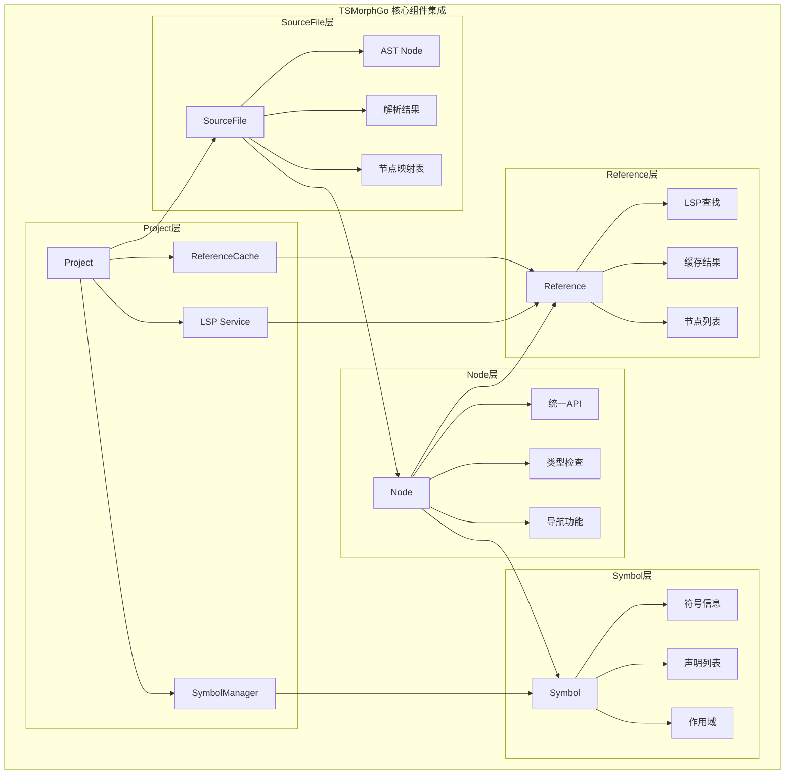
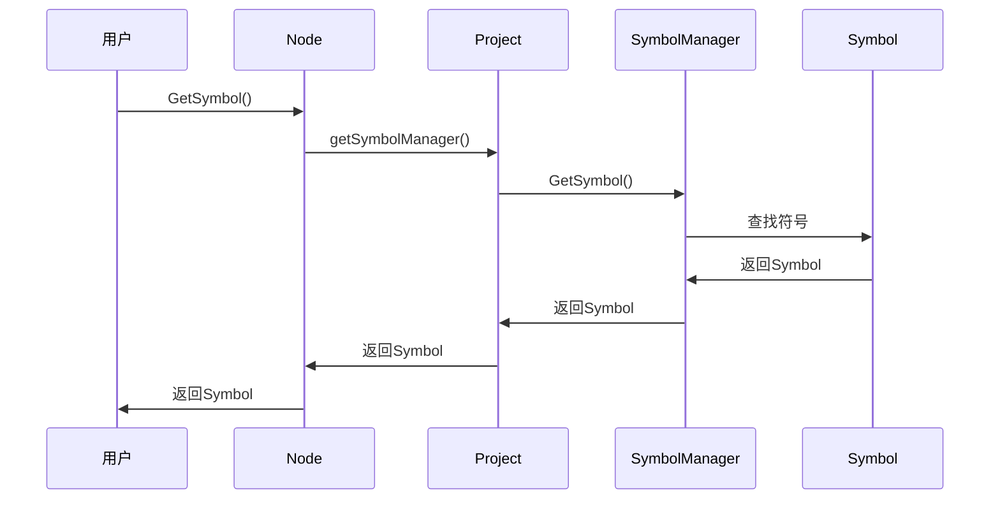
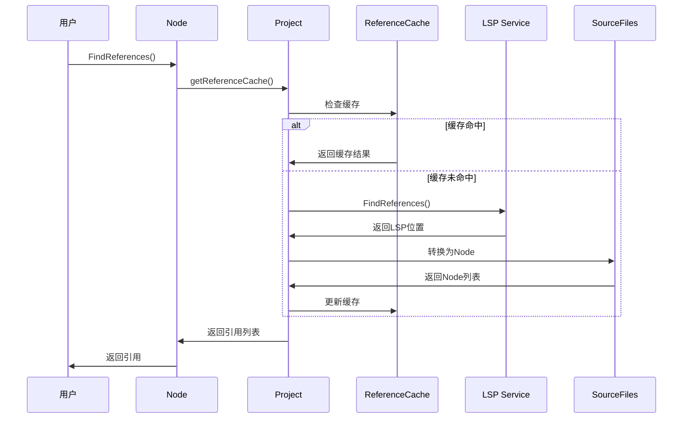

# TSMorphGo 组件集成分析

## 概述

TSMorphGo的核心组件（Project、SourceFile、Node、Reference、Symbol）已经完全串联起来，形成了一个完整的TypeScript代码分析生态系统。本文档详细分析这些组件之间的关联关系和数据流。

## 🏗️ 组件关系架构图



## 📊 详细关联关系分析

### 1. Project ↔ SourceFile 关联

```go
type Project struct {
    sourceFiles    map[string]*SourceFile  // 管理所有源文件
    // ...
}

// Project创建和管理SourceFile
func (p *Project) GetSourceFile(path string) *SourceFile {
    if sf, exists := p.sourceFiles[path]; exists {
        return sf
    }
    // 创建新的SourceFile并添加到项目中
    newFile := &SourceFile{...}
    p.sourceFiles[path] = newFile
    return newFile
}
```

**关联特点**:
- Project作为容器管理所有SourceFile
- 使用map[string]*SourceFile实现快速查找
- 支持动态创建和删除文件

### 2. SourceFile ↔ Node 关联

```go
type SourceFile struct {
    fileResult   *projectParser.JsFileParserResult
    astNode      *ast.Node
    nodeResultMap map[*ast.Node]interface{}
    project      *Project
}

type Node struct {
    *ast.Node                    // 底层AST节点
    sourceFile *SourceFile       // 回溯到所属文件
    declarationAccessor DeclarationAccessor
}

// SourceFile创建Node包装器
func (sf *SourceFile) ForEachDescendant(callback func(node Node)) {
    var walk func(node *ast.Node)
    walk = func(node *ast.Node) {
        if node == nil {
            return
        }
        // 创建TSMorphGo Node包装器
        callback(Node{
            Node:              node,
            sourceFile:        sf,
            declarationAccessor: sf.declarationAccessor,
        })
        // 递归遍历子节点
        node.ForEachChild(func(child *ast.Node) bool {
            walk(child)
            return false
        })
    }
    walk(sf.astNode)
}
```

**关联特点**:
- Node包装底层ast.Node并持有SourceFile引用
- SourceFile提供Node创建和遍历功能
- 通过nodeResultMap实现节点到解析结果的映射

### 3. Node ↔ Symbol 关联

```go
// Node通过Project获取Symbol
func (n *Node) GetSymbol() (*Symbol, bool) {
    if n.sourceFile == nil {
        return nil, false
    }
    symbolManager := n.sourceFile.project.getSymbolManager()
    return symbolManager.GetSymbol(*n)
}

type Symbol struct {
    nativeSymbol *ast.Symbol
    name         string
    flags        ast.SymbolFlags
    declarations []*Node        // 关联的声明节点
    exported     bool
    documentation string
}
```

**关联特点**:
- Node通过Project获取SymbolManager
- Symbol持有声明节点列表，建立双向关联
- 支持符号查询和作用域分析

### 4. Node ↔ Reference 关联

```go
// Node发起引用查找
func FindReferences(node Node) ([]*Node, error) {
    // 1. 通过SourceFile获取Project
    project := node.GetSourceFile().project

    // 2. 获取LSP服务
    lspService, err := project.getLSPService()

    // 3. 执行引用查找
    resp, err := lspService.FindReferences(context.Background(),
        filePath, startLine, startChar)

    // 4. 将LSP位置转换为Node列表
    var results []*Node
    for _, loc := range *resp.Locations {
        foundNode := project.findNodeAt(refPath, line, column)
        results = append(results, &Node{
            Node:       foundNode,
            sourceFile: project.sourceFiles[refPath],
        })
    }
    return results, nil
}
```

**关联特点**:
- Node通过Project和LSP服务查找引用
- 返回的引用列表也是Node类型，保持一致性
- 支持缓存优化，避免重复LSP调用

## 🔄 完整数据流分析

### 场景1: 符号查找流程



### 场景2: 引用查找流程



## 🎯 组件协作示例

### 示例1: 函数分析和引用查找

```go
func analyzeFunctionWithReferences(project *tsmorphgo.Project) {
    // 1. 遍历所有文件查找函数
    for _, file := range project.GetSourceFiles() {
        file.ForEachDescendant(func(node tsmorphgo.Node) {
            if node.IsFunctionDeclaration() {
                // 2. 获取函数符号信息
                if symbol, ok := node.GetSymbol(); ok {
                    fmt.Printf("函数符号: %s, 导出: %v\n",
                        symbol.GetName(), symbol.IsExported())
                }

                // 3. 查找函数的所有引用
                refs, err := tsmorphgo.FindReferences(node)
                if err == nil {
                    fmt.Printf("函数 '%s' 有 %d 个引用\n",
                        node.GetText(), len(refs))

                    // 4. 分析每个引用的位置
                    for _, ref := range refs {
                        fmt.Printf("  引用在: %s:%d\n",
                            ref.GetSourceFile().GetFilePath(),
                            ref.GetStartLineNumber())
                    }
                }
            }
        })
    }
}
```

### 示例2: 符号作用域分析

```go
func analyzeSymbolScope(project *tsmorphgo.Project) {
    symbolMgr := project.GetSymbolManager()
    globalScope := symbolMgr.GetGlobalScope()

    // 1. 查找特定符号
    symbols := project.FindSymbolsByName("UserService")

    for _, symbol := range symbols {
        fmt.Printf("符号: %s\n", symbol.GetName())

        // 2. 分析符号声明
        for _, decl := range symbol.GetDeclarations() {
            fmt.Printf("  声明位置: %s:%d\n",
                decl.GetSourceFile().GetFilePath(),
                decl.GetStartLineNumber())

            // 3. 查找该声明的引用
            refs, _ := tsmorphgo.FindReferences(*decl)
            fmt.Printf("  引用数量: %d\n", len(refs))
        }
    }
}
```

## 📈 性能优化关联

### 1. 缓存策略

```go
// 引用查找缓存
type ReferenceCache struct {
    cache map[string]*CachedReference
    mu    sync.RWMutex
    maxEntries int
    ttl     time.Duration
}

// 符号缓存
type SymbolManager struct {
    provider TypeCheckerProvider
    cache    map[string]*Symbol
    mu       sync.RWMutex
}

// Project统一管理缓存
type Project struct {
    referenceCache *ReferenceCache
    symbolManager  *SymbolManager
    cacheOnce      sync.Once
}
```

### 2. 懒加载机制

```go
// SymbolManager懒加载
func (p *Project) getSymbolManager() *SymbolManager {
    p.symbolManagerMu.Do(func() {
        p.symbolManager = NewSymbolManager(p.getTypeCheckerProvider())
    })
    return p.symbolManager
}

// ReferenceCache懒加载
func (p *Project) getReferenceCache() *ReferenceCache {
    p.cacheOnce.Do(func() {
        p.referenceCache = NewReferenceCache(1000, 10*time.Minute)
    })
    return p.referenceCache
}
```

## 🎯 集成优势

### 1. 统一接口
- 所有操作都通过Node的统一API发起
- 保持接口一致性和类型安全

### 2. 高效关联
- 组件间通过引用关联，避免数据冗余
- 支持双向导航和查询

### 3. 缓存优化
- 多层缓存策略，提升重复操作性能
- 智能缓存失效机制

### 4. 错误处理
- 统一的错误处理和重试机制
- 优雅降级，部分失败不影响整体功能

## 🔧 扩展点

### 1. 新的分析功能
```go
// 可以轻松添加新的分析功能
func (n *Node) GetComplexity() int {
    // 通过关联的Symbol获取复杂度信息
    if symbol, ok := n.GetSymbol(); ok {
        return symbol.GetComplexity()
    }
    return 0
}
```

### 2. 自定义缓存策略
```go
// 扩展缓存功能
type CustomCache struct {
    *ReferenceCache
    customPolicy func(key string) bool
}
```

### 3. 插件架构
```go
// 基于组件关联的插件系统
type AnalysisPlugin interface {
    Analyze(node Node) (*AnalysisResult, error)
    GetDependencies() []string
}
```

## 📝 总结

TSMorphGo的核心组件已经完全串联起来，形成了一个高效的TypeScript代码分析生态系统：

1. **Project**: 作为容器和管理中心，协调所有子组件
2. **SourceFile**: 管理单个文件和AST，提供节点创建服务
3. **Node**: 统一的AST节点接口，关联所有分析功能
4. **Symbol**: 提供符号信息和作用域分析
5. **Reference**: 基于LSP的引用查找，支持缓存优化

这种紧密的组件集成设计使得TSMorphGo能够提供强大、高效、易用的TypeScript代码分析能力。