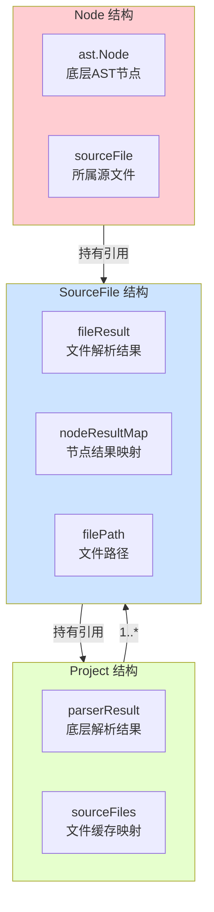

# `tsmorphgo` 包完整使用指南

## 1. 简介

`tsmorphgo` 是 `analyzer-ts` 项目的核心 TypeScript/TSX 代码分析包。它提供了一个高级、易用、类型安全的 API，用于在 Go 语言环境中对 TypeScript 代码进行静态分析、导航和转换。

### 核心设计原则

*   **简单易用**：封装底层复杂的 AST 操作，提供面向对象的、符合直觉的 API
*   **高性能**：通过预计算和缓存机制，最大化复用底层 `analyzer` 包的解析结果
*   **类型安全**：提供丰富的 `IsXXX` 和 `AsXXX` 辅助函数，确保类型安全操作
*   **语义完整**：不仅提供语法分析，还支持符号解析和引用查找等语义功能

### 适用场景

- **代码重构工具**：自动化代码重构和转换
- **静态分析工具**：代码质量检查、依赖分析
- **IDE 插件**：代码补全、跳转到定义、查找引用
- **文档生成器**：从代码注释和类型定义生成文档
- **迁移工具**：框架升级、语法迁移

## 2. 架构与设计哲学

### 核心概念

`tsmorphgo` 的设计围绕三个核心结构体展开：`Project`, `SourceFile`, `Node`。



### 包结构设计

`tsmorphgo` 采用 Go 语言最佳实践的"平铺"包结构设计：

```
tsmorphgo/
├── project.go          # 项目管理 - 项目创建、文件获取
├── sourcefile.go       # 源文件管理 - 文件操作、节点遍历
├── node.go             # 节点基础 - 导航、文本、位置信息
├── types.go            # 类型系统 - 类型判断、转换工具
├── declaration.go      # 声明处理 - 变量、函数、类等声明API
├── expression.go       # 表达式处理 - 调用、属性访问、二元表达式等
├── references.go       # 引用查找 - FindReferences 等语义分析
├── symbol.go           # 符号系统 - 符号获取、符号信息查询
└── tsmorphgo_test.go   # 完整的测试套件
```

**设计优势：**
- **统一 API 体验**：所有功能都在 `package tsmorphgo` 下
- **逻辑分组清晰**：通过文件名明确功能职责
- **符合 Go 惯例**：避免过度包化，保持 API 内聚性

### 性能优化策略

1. **懒加载机制**：文件和节点按需解析，避免不必要的计算
2. **结果缓存**：解析结果和符号信息缓存复用
3. **内存优化**：共享底层 `analyzer` 包的解析结果
4. **智能索引**：符号表和引用关系的预计算

## 3. 快速上手

### 3.1 基础示例

```go
package main

import (
    "fmt"
    "strings"

    "github.com/Flying-Bird1999/analyzer-ts/tsmorphgo"
    "github.com/Zzzen/typescript-go/use-at-your-own-risk/ast"
)

func main() {
    // 1. 创建项目
    project := tsmorphgo.NewProjectFromSources(map[string]string{
        "/main.ts": `
            interface User {
                id: number;
                name: string;
            }

            function getUser(id: number): User {
                return { id, name: "User" + id };
            }

            const user = getUser(1);
            console.log(user.name);
        `,
    })

    // 2. 获取源文件
    mainFile := project.GetSourceFile("/main.ts")

    // 3. 遍历所有节点
    mainFile.ForEachDescendant(func(node tsmorphgo.Node) {
        fmt.Printf("发现节点: %s (Kind: %v)\n",
            strings.TrimSpace(node.GetText()), node.Kind)
    })
}
```

### 3.2 完整分析示例

```go
func advancedExample() {
    project := tsmorphgo.NewProjectFromSources(map[string]string{
        "/tsconfig.json": `{
            "compilerOptions": {
                "baseUrl": ".",
                "paths": { "@/*": ["src/*"] }
            }
        }`,
        "/src/user.ts": `
            export interface User { id: number; name: string; }
            export function getUser(id: number): User {
                return { id, name: "User" + id };
            }
        `,
        "/src/app.ts": `
            import { User, getUser } from '@/user';

            class UserService {
                getUserById(id: number): User {
                    return getUser(id);
                }
            }
        `,
    })

    // 查找所有函数调用
    appFile := project.GetSourceFile("/src/app.ts")
    var callNodes []*tsmorphgo.Node

    appFile.ForEachDescendant(func(node tsmorphgo.Node) {
        if tsmorphgo.IsCallExpression(node) {
            callNodes = append(callNodes, &node)
        }
    })

    fmt.Printf("找到 %d 个函数调用\n", len(callNodes))
    for _, call := range callNodes {
        expr, ok := tsmorphgo.GetCallExpressionExpression(*call)
        if ok {
            fmt.Printf("调用: %s\n", strings.TrimSpace(expr.GetText()))
        }
    }
}
```

## 4. 详细 API 指南

### 4.1 项目管理 (Project)

#### 创建项目

```go
// 从内存源码创建项目
project := tsmorphgo.NewProjectFromSources(sources map[string]string)

// 示例：包含 tsconfig 的完整项目
project := tsmorphgo.NewProjectFromSources(map[string]string{
    // TypeScript 配置
    "/tsconfig.json": `{
        "compilerOptions": {
            "target": "es2018",
            "module": "commonjs",
            "baseUrl": ".",
            "paths": { "@/*": ["src/*"] }
        },
        "include": ["src/**/*"]
    }`,

    // 源文件
    "/src/index.ts": `import { App } from './app';`,
    "/src/app.ts": `export class App { /* ... */ }`,
})
```

#### 获取源文件

```go
// 获取指定路径的源文件
sourceFile := project.GetSourceFile("/src/main.ts")
if sourceFile == nil {
    fmt.Println("文件不存在")
    return
}

// 获取文件路径
filePath := sourceFile.GetFilePath() // "/src/main.ts"

// 获取文件完整文本
fullText := sourceFile.GetText()
```

### 4.2 源文件操作 (SourceFile)

#### 节点遍历

```go
// 遍历所有后代节点
sourceFile.ForEachDescendant(func(node tsmorphgo.Node) {
    // 对每个节点进行操作
    fmt.Printf("节点: %s\n", strings.TrimSpace(node.GetText()))
})

// 使用类型筛选遍历
var functionNodes []*tsmorphgo.Node
sourceFile.ForEachDescendant(func(node tsmorphgo.Node) {
    if tsmorphgo.IsFunctionDeclaration(node) {
        functionNodes = append(functionNodes, &node)
    }
})
```

#### 节点查询

```go
// 查找第一个符合条件的节点
targetNode, found := sourceFile.ForEachDescendantUntil(func(node tsmorphgo.Node) bool {
    return tsmorphgo.IsIdentifier(node) &&
           strings.TrimSpace(node.GetText()) == "targetFunction"
})

if found {
    fmt.Println("找到目标函数")
}
```

### 4.3 节点操作 (Node)

#### 基础信息获取

```go
// 获取节点文本
text := node.GetText() // "const x = 1;"

// 获取节点位置信息
startLine := node.GetStartLineNumber()
startCol := node.GetStartColumn()
endLine := node.GetEndLineNumber()

// 获取节点类型
kind := node.Kind // ast.KindVariableDeclaration
```

#### 节点导航

```go
// 获取父节点
parent := node.GetParent()

// 获取所有祖先节点
ancestors := node.GetAncestors()

// 按类型查找祖先
methodAncestor, ok := node.GetFirstAncestorByKind(ast.KindMethodDeclaration)
if ok {
    fmt.Println("在方法内部:", methodAncestor.GetText())
}

// 获取第一个符合条件的子节点
firstChild, ok := tsmorphgo.GetFirstChild(node, func(child tsmorphgo.Node) bool {
    return tsmorphgo.IsIdentifier(child)
})
if ok {
    fmt.Println("第一个标识符:", firstChild.GetText())
}
```

### 4.4 类型判断与转换

#### 类型判断

```go
// 基础类型判断
if tsmorphgo.IsIdentifier(node) {
    fmt.Println("这是标识符")
}

if tsmorphgo.IsCallExpression(node) {
    fmt.Println("这是函数调用")
}

if tsmorphgo.IsFunctionDeclaration(node) {
    fmt.Println("这是函数声明")
}

// 复杂类型判断
if tsmorphgo.IsClassDeclaration(node) {
    fmt.Println("这是类声明")
}

if tsmorphgo.IsInterfaceDeclaration(node) {
    fmt.Println("这是接口声明")
}
```

#### 类型转换

```go
// 安全的类型转换
if importDecl, ok := tsmorphgo.AsImportDeclaration(node); ok {
    fmt.Println("导入声明:", importDecl.GetText())
}

if varDecl, ok := tsmorphgo.AsVariableDeclaration(node); ok {
    fmt.Println("变量声明:", varDecl.GetText())
}

if funcDecl, ok := tsmorphgo.AsFunctionDeclaration(node); ok {
    fmt.Println("函数声明:", funcDecl.GetText())
}
```

### 4.5 声明处理 API

#### 变量声明处理

```go
// 获取变量名
if tsmorphgo.IsVariableDeclaration(node) {
    name, ok := tsmorphgo.GetVariableName(node)
    if ok {
        fmt.Println("变量名:", name)
    }

    // 获取变量名节点
    nameNode, ok := tsmorphgo.GetVariableDeclarationNameNode(node)
    if ok {
        fmt.Println("变量名节点:", nameNode.GetText())
    }
}
```

#### 函数声明处理

```go
// 获取函数名
if tsmorphgo.IsFunctionDeclaration(node) {
    nameNode, ok := tsmorphgo.GetFunctionDeclarationNameNode(node)
    if ok {
        fmt.Println("函数名:", nameNode.GetText())
    }
}
```

#### 导入声明处理

```go
// 获取导入别名
if tsmorphgo.IsImportSpecifier(node) {
    aliasNode, ok := tsmorphgo.GetImportSpecifierAliasNode(node)
    if ok {
        fmt.Println("导入别名:", aliasNode.GetText())
    } else {
        fmt.Println("无别名")
    }
}
```

### 4.6 表达式处理 API

#### 函数调用表达式

```go
if tsmorphgo.IsCallExpression(node) {
    // 获取调用的表达式
    expr, ok := tsmorphgo.GetCallExpressionExpression(node)
    if ok {
        fmt.Println("调用表达式:", expr.GetText())
    }
}
```

#### 属性访问表达式

```go
if tsmorphgo.IsPropertyAccessExpression(node) {
    // 获取属性名
    propName, ok := tsmorphgo.GetPropertyAccessName(node)
    if ok {
        fmt.Println("属性名:", propName)
    }

    // 获取访问的对象表达式
    objExpr, ok := tsmorphgo.GetPropertyAccessExpression(node)
    if ok {
        fmt.Println("对象表达式:", objExpr.GetText())
    }
}
```

#### 二元表达式

```go
if tsmorphgo.IsBinaryExpression(node) {
    // 获取左操作数
    left, ok := tsmorphgo.GetBinaryExpressionLeft(node)
    if ok {
        fmt.Println("左操作数:", left.GetText())
    }

    // 获取右操作数
    right, ok := tsmorphgo.GetBinaryExpressionRight(node)
    if ok {
        fmt.Println("右操作数:", right.GetText())
    }

    // 获取操作符
    opToken, ok := tsmorphgo.GetBinaryExpressionOperatorToken(node)
    if ok {
        fmt.Println("操作符类型:", opToken.Kind)
    }
}
```

### 4.7 语义分析 API

#### 查找引用

```go
// 查找节点的所有引用
refs, err := tsmorphgo.FindReferences(node)
if err != nil {
    fmt.Printf("查找引用失败: %v\n", err)
    return
}

fmt.Printf("找到 %d 个引用:\n", len(refs))
for _, ref := range refs {
    fmt.Printf("- 文件: %s, 行 %d: %s\n",
        ref.GetSourceFile().GetFilePath(),
        ref.GetStartLineNumber(),
        strings.TrimSpace(ref.GetText()))
}
```

#### 符号系统

```go
// 获取节点的符号
symbol, found := tsmorphgo.GetSymbol(node)
if found {
    // 符号基本信息
    fmt.Printf("符号名: %s\n", symbol.GetName())

    // 符号类型判断
    if symbol.IsVariable() {
        fmt.Println("这是变量符号")
    }
    if symbol.IsFunction() {
        fmt.Println("这是函数符号")
    }
    if symbol.IsClass() {
        fmt.Println("这是类符号")
    }
    if symbol.IsInterface() {
        fmt.Println("这是接口符号")
    }

    // 导出状态
    if symbol.IsExported() {
        fmt.Println("这是导出的符号")
    }

    // 符号声明信息
    fmt.Printf("声明数量: %d\n", symbol.GetDeclarationCount())

    // 获取所有声明
    declarations := symbol.GetDeclarations()
    for _, decl := range declarations {
        fmt.Printf("- 声明: %s\n", decl.GetText())
    }

    // 获取第一个声明
    if firstDecl, ok := symbol.GetFirstDeclaration(); ok {
        fmt.Printf("主声明: %s\n", firstDecl.GetText())
    }

    // 符号字符串表示
    fmt.Printf("符号详情: %s\n", symbol.String())
}
```

## 5. 实战案例

### 5.1 代码分析工具

#### 查找所有未使用的变量

```go
func findUnusedVariables(project *tsmorphgo.Project) []string {
    var unused []string

    // 遍历所有源文件
    // 注意：这里需要实际获取项目的所有源文件
    sourceFiles := []*tsmorphgo.SourceFile{} // 需要根据实际API获取

    for _, sf := range sourceFiles {
        var declaredVars []string
        var usedVars []string

        // 收集声明的变量
        sf.ForEachDescendant(func(node tsmorphgo.Node) {
            if tsmorphgo.IsVariableDeclaration(node) {
                if name, ok := tsmorphgo.GetVariableName(node); ok {
                    declaredVars = append(declaredVars, name)
                }
            }
        })

        // 收集使用的变量
        sf.ForEachDescendant(func(node tsmorphgo.Node) {
            if tsmorphgo.IsIdentifier(node) {
                // 排除声明位置的标识符
                if !tsmorphgo.IsVariableDeclaration(node.GetParent()) {
                    usedVars = append(usedVars, strings.TrimSpace(node.GetText()))
                }
            }
        })

        // 找出未使用的变量
        usedSet := make(map[string]bool)
        for _, v := range usedVars {
            usedSet[v] = true
        }

        for _, declared := range declaredVars {
            if !usedSet[declared] {
                unused = append(unused,
                    fmt.Sprintf("%s: %s", sf.GetFilePath(), declared))
            }
        }
    }

    return unused
}
```

#### 查找复杂的函数

```go
func findComplexFunctions(project *tsmorphgo.Project) []string {
    var complexFuncs []string

    sourceFiles := []*tsmorphgo.SourceFile{} // 需要根据实际API获取

    for _, sf := range sourceFiles {
        sf.ForEachDescendant(func(node tsmorphgo.Node) {
            if tsmorphgo.IsFunctionDeclaration(node) {
                // 计算函数复杂度（简化版）
                complexity := 0

                node.ForEachDescendant(func(descendant tsmorphgo.Node) {
                    switch descendant.Kind {
                    case ast.KindIfStatement:
                        complexity += 1
                    case ast.KindForStatement:
                        complexity += 1
                    case ast.KindWhileStatement:
                        complexity += 1
                    case ast.KindSwitchStatement:
                        complexity += 1
                    }
                })

                if complexity > 5 {
                    funcName := "anonymous"
                    if nameNode, ok := tsmorphgo.GetFunctionDeclarationNameNode(node); ok {
                        funcName = nameNode.GetText()
                    }

                    complexFuncs = append(complexFuncs,
                        fmt.Sprintf("%s: %s (复杂度: %d)",
                            sf.GetFilePath(), funcName, complexity))
                }
            }
        })
    }

    return complexFuncs
}
```

### 5.2 代码重构工具

#### 重命名符号

```go
func renameSymbol(project *tsmorphgo.Project, oldName, newName string) error {
    // 首先找到目标符号的声明
    var targetNode *tsmorphgo.Node

    sourceFiles := []*tsmorphgo.SourceFile{} // 需要根据实际API获取

    for _, sf := range sourceFiles {
        sf.ForEachDescendant(func(node tsmorphgo.Node) {
            if tsmorphgo.IsIdentifier(node) &&
               strings.TrimSpace(node.GetText()) == oldName {
                // 检查是否是声明位置
                if isDeclarationNode(node) {
                    targetNode = &node
                }
            }
        })
    }

    if targetNode == nil {
        return fmt.Errorf("未找到符号声明")
    }

    // 查找所有引用
    refs, err := tsmorphgo.FindReferences(*targetNode)
    if err != nil {
        return err
    }

    // 重构：这里需要实际的文件修改能力
    // tsmorphgo 目前是只读的，但可以记录需要修改的位置

    fmt.Printf("找到 %d 个位置需要修改:\n", len(refs))
    for _, ref := range refs {
        fmt.Printf("- %s:%d: %s -> %s\n",
            ref.GetSourceFile().GetFilePath(),
            ref.GetStartLineNumber(),
            oldName, newName)
    }

    return nil
}

func isDeclarationNode(node tsmorphgo.Node) bool {
    parent := node.GetParent()
    return parent != nil && (
        tsmorphgo.IsFunctionDeclaration(*parent) ||
        tsmorphgo.IsVariableDeclaration(*parent) ||
        tsmorphgo.IsClassDeclaration(*parent))
}
```

#### 提取接口

```go
func extractInterface(project *tsmorphgo.Project, className string) error {
    // 找到目标类
    var classNode *tsmorphgo.Node

    sourceFiles := []*tsmorphgo.SourceFile{} // 需要根据实际API获取

    for _, sf := range sourceFiles {
        sf.ForEachDescendant(func(node tsmorphgo.Node) {
            if tsmorphgo.IsClassDeclaration(node) {
                if nameNode, ok := tsmorphgo.GetFirstChild(node, func(child tsmorphgo.Node) bool {
                    return tsmorphgo.IsIdentifier(child)
                }); ok {
                    if nameNode.GetText() == className {
                        classNode = &node
                    }
                }
            }
        })
    }

    if classNode == nil {
        return fmt.Errorf("未找到类: %s", className)
    }

    // 提取公共方法
    var publicMethods []string
    classNode.ForEachDescendant(func(node tsmorphgo.Node) {
        if tsmorphgo.IsMethodDeclaration(node) {
            // 检查访问修饰符（简化处理）
            if !strings.Contains(node.GetText(), "private") &&
               !strings.Contains(node.GetText(), "protected") {
                if methodName, ok := getMethodName(node); ok {
                    publicMethods = append(publicMethods, methodName)
                }
            }
        }
    })

    // 生成接口定义
    interfaceDef := fmt.Sprintf(`interface I%s {
`, className)
    for _, method := range publicMethods {
        interfaceDef += fmt.Sprintf("    %s;\n", method)
    }
    interfaceDef += "}\n"

    fmt.Println("提取的接口:")
    fmt.Println(interfaceDef)

    return nil
}

func getMethodName(node tsmorphgo.Node) (string, bool) {
    if nameNode, ok := tsmorphgo.GetFirstChild(node, func(child tsmorphgo.Node) bool {
        return tsmorphgo.IsIdentifier(child)
    }); ok {
        return nameNode.GetText() + "()", true
    }
    return "", false
}
```

### 5.3 依赖分析工具

#### 构建依赖图

```go
type DependencyGraph struct {
    Nodes map[string]*DependencyNode
    Edges map[string][]string
}

type DependencyNode struct {
    Path     string
    Type     string // "file", "function", "class", "variable"
    Exports  []string
    Imports  []string
}

func buildDependencyGraph(project *tsmorphgo.Project) *DependencyGraph {
    graph := &DependencyGraph{
        Nodes: make(map[string]*DependencyNode),
        Edges: make(map[string][]string),
    }

    sourceFiles := []*tsmorphgo.SourceFile{} // 需要根据实际API获取

    for _, sf := range sourceFiles {
        filePath := sf.GetFilePath()
        node := &DependencyNode{
            Path:    filePath,
            Type:    "file",
            Exports: []string{},
            Imports: []string{},
        }

        // 分析导出
        sf.ForEachDescendant(func(descendant tsmorphgo.Node) {
            if tsmorphgo.IsExportKeyword(descendant) {
                // 导出声明处理
                if parent := descendant.GetParent(); parent != nil {
                    if exportName, ok := getExportName(*parent); ok {
                        node.Exports = append(node.Exports, exportName)
                    }
                }
            }
        })

        // 分析导入
        sf.ForEachDescendant(func(descendant tsmorphgo.Node) {
            if tsmorphgo.IsImportDeclaration(descendant) {
                if importPath, ok := getImportPath(descendant); ok {
                    node.Imports = append(node.Imports, importPath)
                }
            }
        })

        graph.Nodes[filePath] = node
        graph.Edges[filePath] = node.Imports
    }

    return graph
}

func getExportName(node tsmorphgo.Node) (string, bool) {
    if tsmorphgo.IsFunctionDeclaration(node) {
        if nameNode, ok := tsmorphgo.GetFunctionDeclarationNameNode(node); ok {
            return nameNode.GetText(), true
        }
    }
    if tsmorphgo.IsClassDeclaration(node) {
        if nameNode, ok := tsmorphgo.GetFirstChild(node, func(child tsmorphgo.Node) bool {
            return tsmorphgo.IsIdentifier(child)
        }); ok {
            return nameNode.GetText(), true
        }
    }
    return "", false
}

func getImportPath(node tsmorphgo.Node) (string, bool) {
    // 简化处理，需要根据实际的 AST 结构实现
    return "", false
}
```

## 6. 最佳实践

### 6.1 性能优化

#### 1. 避免重复遍历

```go
// ❌ 低效：多次遍历
func inefficientAnalysis(sf *tsmorphgo.SourceFile) {
    var functions, variables, classes []*tsmorphgo.Node

    sf.ForEachDescendant(func(node tsmorphgo.Node) {
        if tsmorphgo.IsFunctionDeclaration(node) {
            functions = append(functions, &node)
        }
    })

    sf.ForEachDescendant(func(node tsmorphgo.Node) {
        if tsmorphgo.IsVariableDeclaration(node) {
            variables = append(variables, &node)
        }
    })

    sf.ForEachDescendant(func(node tsmorphgo.Node) {
        if tsmorphgo.IsClassDeclaration(node) {
            classes = append(classes, &node)
        }
    })
}

// ✅ 高效：一次遍历
func efficientAnalysis(sf *tsmorphgo.SourceFile) {
    var functions, variables, classes []*tsmorphgo.Node

    sf.ForEachDescendant(func(node tsmorphgo.Node) {
        if tsmorphgo.IsFunctionDeclaration(node) {
            functions = append(functions, &node)
        } else if tsmorphgo.IsVariableDeclaration(node) {
            variables = append(variables, &node)
        } else if tsmorphgo.IsClassDeclaration(node) {
            classes = append(classes, &node)
        }
    })
}
```

#### 2. 使用条件筛选提前终止

```go
// ✅ 使用 ForEachDescendantUntil 提前终止
targetNode, found := sf.ForEachDescendantUntil(func(node tsmorphgo.Node) bool {
    return tsmorphgo.IsIdentifier(node) &&
           strings.TrimSpace(node.GetText()) == "target"
})

if found {
    // 处理找到的目标节点
}
```

#### 3. 缓存常用结果

```go
type AnalysisCache struct {
    Functions  map[string][]*tsmorphgo.Node
    Variables  map[string][]*tsmorphgo.Node
    Classes    map[string][]*tsmorphgo.Node
    mu         sync.RWMutex
}

func (c *AnalysisCache) GetFunctions(filePath string) []*tsmorphgo.Node {
    c.mu.RLock()
    defer c.mu.RUnlock()
    return c.Functions[filePath]
}

func (c *AnalysisCache) CacheFunctions(filePath string, functions []*tsmorphgo.Node) {
    c.mu.Lock()
    defer c.mu.Unlock()
    c.Functions[filePath] = functions
}
```

### 6.2 错误处理

#### 1. 检查空值

```go
// ✅ 良好的错误处理
func safeAnalysis(project *tsmorphgo.Project, filePath string) error {
    sf := project.GetSourceFile(filePath)
    if sf == nil {
        return fmt.Errorf("源文件不存在: %s", filePath)
    }

    // 继续分析...
    return nil
}
```

#### 2. 类型转换安全

```go
// ✅ 安全的类型转换
func processNode(node tsmorphgo.Node) error {
    // 使用类型判断 + 转换
    if !tsmorphgo.IsFunctionDeclaration(node) {
        return fmt.Errorf("期望函数声明，实际: %v", node.Kind)
    }

    funcDecl, ok := tsmorphgo.AsFunctionDeclaration(node)
    if !ok {
        return fmt.Errorf("函数声明转换失败")
    }

    // 安全地使用 funcDecl
    fmt.Println("处理函数:", funcDecl.GetText())
    return nil
}
```

#### 3. 处理查找失败

```go
// ✅ 健壮的查找操作
func robustFindReferences(node tsmorphgo.Node) ([]tsmorphgo.Node, error) {
    refs, err := tsmorphgo.FindReferences(node)
    if err != nil {
        return nil, fmt.Errorf("查找引用失败: %w", err)
    }

    if len(refs) == 0 {
        fmt.Printf("警告: 未找到节点的引用\n")
    }

    return refs, nil
}
```

### 6.3 代码组织

#### 1. 封装常用操作

```go
type CodeAnalyzer struct {
    project *tsmorphgo.Project
    cache   *AnalysisCache
}

func NewCodeAnalyzer(project *tsmorphgo.Project) *CodeAnalyzer {
    return &CodeAnalyzer{
        project: project,
        cache:   &AnalysisCache{
            Functions: make(map[string][]*tsmorphgo.Node),
            Variables: make(map[string][]*tsmorphgo.Node),
            Classes:   make(map[string][]*tsmorphgo.Node),
        },
    }
}

func (a *CodeAnalyzer) AnalyzeFile(filePath string) (*FileAnalysis, error) {
    sf := a.project.GetSourceFile(filePath)
    if sf == nil {
        return nil, fmt.Errorf("文件不存在: %s", filePath)
    }

    // 检查缓存
    if cached := a.cache.GetFunctions(filePath); cached != nil {
        return a.buildAnalysisFromCache(filePath)
    }

    // 执行分析
    analysis := &FileAnalysis{
        FilePath:   filePath,
        Functions:  a.findFunctions(sf),
        Variables:  a.findVariables(sf),
        Classes:    a.findClasses(sf),
        Imports:    a.findImports(sf),
        Exports:    a.findExports(sf),
    }

    // 缓存结果
    a.cache.CacheFunctions(filePath, analysis.Functions)

    return analysis, nil
}
```

#### 2. 使用接口抽象

```go
type NodeProcessor interface {
    Process(node tsmorphgo.Node) error
    Supports(kind ast.Kind) bool
}

type FunctionProcessor struct{}
type VariableProcessor struct{}
type ClassProcessor struct{}

func (p *FunctionProcessor) Process(node tsmorphgo.Node) error {
    // 处理函数
    return nil
}

func (p *FunctionProcessor) Supports(kind ast.Kind) bool {
    return kind == ast.KindFunctionDeclaration
}

func ProcessNodes(sourceFile *tsmorphgo.SourceFile, processors []NodeProcessor) error {
    sourceFile.ForEachDescendant(func(node tsmorphgo.Node) {
        for _, processor := range processors {
            if processor.Supports(node.Kind) {
                if err := processor.Process(node); err != nil {
                    fmt.Printf("处理节点失败: %v\n", err)
                }
            }
        }
    })
    return nil
}
```

## 7. 故障排除

### 7.1 常见错误

#### 1. 节点获取失败

```go
// 问题：节点为空
node := getNodeFromSomewhere() // 可能返回 nil
text := node.GetText() // panic!

// 解决：检查空值
if node := getNodeFromSomewhere(); node != nil {
    text := node.GetText()
    fmt.Println("节点文本:", text)
}
```

#### 2. 类型转换失败

```go
// 问题：类型转换不安全
var node tsmorphgo.Node
funcDecl := tsmorphgo.AsFunctionDeclaration(node) // 可能返回 nil
funcDecl.GetText() // panic!

// 解决：使用 ok 模式
if funcDecl, ok := tsmorphgo.AsFunctionDeclaration(node); ok {
    funcDecl.GetText() // 安全使用
}
```

#### 3. 符号查找失败

```go
// 问题：符号查找错误
refs, err := tsmorphgo.FindReferences(invalidNode)
if err != nil {
    // 处理错误
    log.Printf("查找引用失败: %v", err)
    return
}

// 解决：验证输入
if !isValidNodeForReferences(node) {
    return fmt.Errorf("节点不支持引用查找")
}
```

### 7.2 调试技巧

#### 1. 节点类型调试

```go
func debugNode(node tsmorphgo.Node) {
    fmt.Printf("节点类型: %v\n", node.Kind)
    fmt.Printf("节点文本: %s\n", strings.TrimSpace(node.GetText()))

    if parent := node.GetParent(); parent != nil {
        fmt.Printf("父节点类型: %v\n", parent.Kind)
    }

    ancestors := node.GetAncestors()
    fmt.Printf("祖先链长度: %d\n", len(ancestors))

    fmt.Println("--- AST 结构 ---")
    for i, ancestor := range ancestors {
        fmt.Printf("%d. %v: %s\n", i+1, ancestor.Kind,
            strings.TrimSpace(ancestor.GetText()[:min(50, len(ancestor.GetText()))]))
    }
}
```

#### 2. 项目结构调试

```go
func debugProject(project *tsmorphgo.Project) {
    // 注意：需要根据实际 API 获取所有文件
    sourceFiles := []*tsmorphgo.SourceFile{}

    fmt.Printf("项目包含 %d 个源文件:\n", len(sourceFiles))

    for _, sf := range sourceFiles {
        var nodeCount int
        sf.ForEachDescendant(func(node tsmorphgo.Node) {
            nodeCount++
        })

        fmt.Printf("- %s: %d 个节点\n", sf.GetFilePath(), nodeCount)
    }
}
```

## 8. API 参考手册

### 8.1 核心类型

#### Project

```go
type Project struct {
    // 包含 parserResult 和 sourceFiles 映射
}

// 创建项目
func NewProjectFromSources(sources map[string]string) *Project

// 获取源文件
func (p *Project) GetSourceFile(filePath string) *SourceFile
```

#### SourceFile

```go
type SourceFile struct {
    // 包含文件解析结果和节点映射
}

// 获取文件信息
func (sf *SourceFile) GetFilePath() string
func (sf *SourceFile) GetText() string

// 节点遍历
func (sf *SourceFile) ForEachDescendant(callback func(Node))
func (sf *SourceFile) ForEachDescendantUntil(condition func(Node) bool) (Node, bool)
```

#### Node

```go
type Node struct {
    // 包含底层 ast.Node 和 sourceFile 引用
}

// 基础信息
func (n Node) GetText() string
func (n Node) GetKind() ast.Kind
func (n Node) GetStartLineNumber() int
func (n Node) GetStartColumn() int

// 导航方法
func (n Node) GetParent() Node
func (n Node) GetAncestors() []Node
func (n Node) GetFirstAncestorByKind(kind ast.Kind) (Node, bool)
func (n Node) GetSourceFile() *SourceFile
```

### 8.2 类型工具

#### 类型判断函数

```go
func IsIdentifier(node Node) bool
func IsCallExpression(node Node) bool
func IsFunctionDeclaration(node Node) bool
func IsClassDeclaration(node Node) bool
func IsInterfaceDeclaration(node Node) bool
func IsVariableDeclaration(node Node) bool
func IsImportDeclaration(node Node) bool
func IsExportKeyword(node Node) bool
// ... 更多类型判断函数
```

#### 类型转换函数

```go
func AsImportDeclaration(node Node) (ImportDeclaration, bool)
func AsVariableDeclaration(node Node) (VariableDeclaration, bool)
func AsFunctionDeclaration(node Node) (FunctionDeclaration, bool)
func AsInterfaceDeclaration(node Node) (InterfaceDeclaration, bool)
func AsTypeAliasDeclaration(node Node) (TypeAliasDeclaration, bool)
func AsEnumDeclaration(node Node) (EnumDeclaration, bool)
// ... 更多类型转换函数
```

### 8.3 专用 API

#### 声明处理

```go
// 变量声明
func GetVariableName(node Node) (string, bool)
func GetVariableDeclarationNameNode(node Node) (Node, bool)

// 函数声明
func GetFunctionDeclarationNameNode(node Node) (Node, bool)

// 导入处理
func GetImportSpecifierAliasNode(node Node) (Node, bool)
```

#### 表达式处理

```go
// 函数调用
func GetCallExpressionExpression(node Node) (Node, bool)

// 属性访问
func GetPropertyAccessName(node Node) (string, bool)
func GetPropertyAccessExpression(node Node) (Node, bool)

// 二元表达式
func GetBinaryExpressionLeft(node Node) (Node, bool)
func GetBinaryExpressionRight(node Node) (Node, bool)
func GetBinaryExpressionOperatorToken(node Node) (Node, bool)
```

### 8.4 语义分析

```go
// 引用查找
func FindReferences(node Node) ([]Node, error)

// 符号系统
func GetSymbol(node Node) (*Symbol, bool)
```

#### Symbol 类型

```go
type Symbol struct {
    // 包含符号信息的内部结构
}

func (s *Symbol) GetName() string
func (s *Symbol) GetFlags() SymbolFlags
func (s *Symbol) IsExported() bool
func (s *Symbol) IsVariable() bool
func (s *Symbol) IsFunction() bool
func (s *Symbol) IsClass() bool
func (s *Symbol) IsInterface() bool
func (s *Symbol) HasType() bool
func (s *Symbol) HasValue() bool
func (s *Symbol) GetDeclarationCount() int
func (s *Symbol) GetDeclarations() []Node
func (s *Symbol) GetFirstDeclaration() (Node, bool)
func (s *Symbol) String() string
// ... 更多符号方法
```

### 8.5 通用工具

```go
// 子节点查找
func GetFirstChild(node Node, condition func(Node) bool) (Node, bool)

// 错误类型
var ErrNodeNotFound = errors.New("node not found")
var ErrSymbolNotFound = errors.New("symbol not found")
var ErrInvalidNodeType = errors.New("invalid node type")
```

## 9. 版本兼容性

### 9.1 当前版本特性

- ✅ 完整的 AST 导航支持
- ✅ 类型安全的节点判断和转换
- ✅ 声明和表达式的专用 API
- ✅ 符号系统支持
- ✅ 引用查找功能
- ✅ 高性能缓存机制

### 9.2 依赖要求

```go
// go.mod
require (
    github.com/Flying-Bird1999/analyzer-ts v0.0.0
    github.com/Zzzen/typescript-go v0.0.0
    github.com/stretchr/testify v1.8.0 // 测试用
)
```

## 10. 路线图

### 10.1 短期计划 (v0.2)

- [ ] 文件写入和修改 API
- [ ] 代码生成工具集成
- [ ] 更多 AST 节点类型支持
- [ ] 性能监控和调试工具

### 10.2 中期计划 (v0.3)

- [ ] 类型检查集成
- [ ] TypeScript 编译器 API 集成
- [ ] 代码格式化和美化
- [ ] 大型项目优化支持

### 10.3 长期计划 (v1.0)

- [ ] 完整的语言服务器协议 (LSP) 支持
- [ ] IDE 插件开发工具包
- [ ] 云端分析服务支持
- [ ] 机器学习集成代码分析

## 11. 总结

`tsmorphgo` 提供了一个强大而优雅的 TypeScript 代码分析解决方案，它：

- **API 设计直观**: 类似 ts-morph 的使用体验
- **性能优异**: 智能缓存和优化策略
- **功能完整**: 从语法分析到语义分析的完整覆盖
- **扩展性强**: 易于添加新功能和自定义处理逻辑
- **文档完善**: 详细的使用指南和最佳实践

无论您是开发代码重构工具、静态分析工具，还是构建 IDE 插件，`tsmorphgo` 都能为您提供坚实的技术基础。